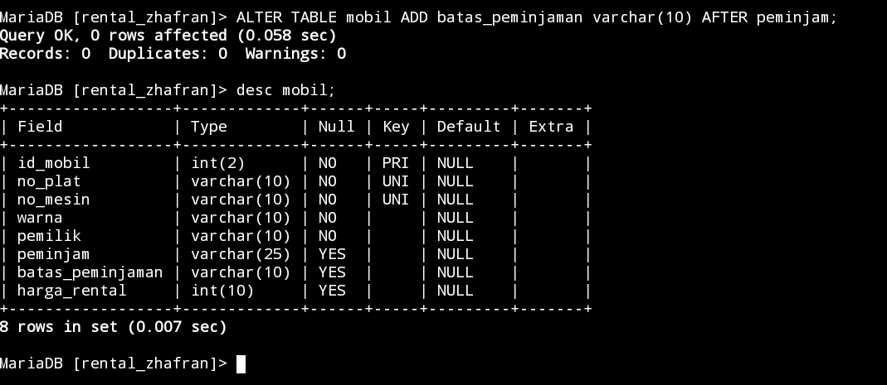
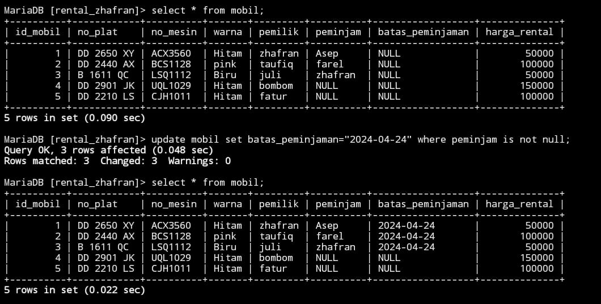
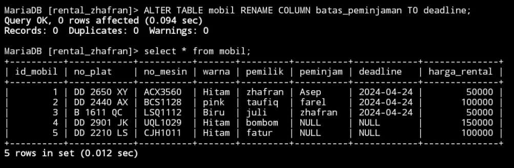
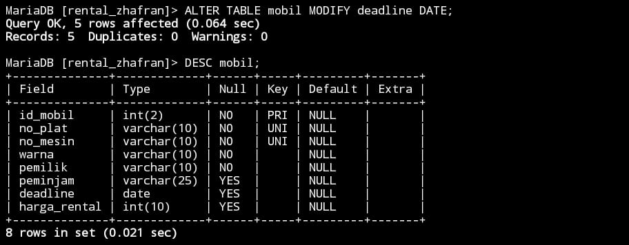
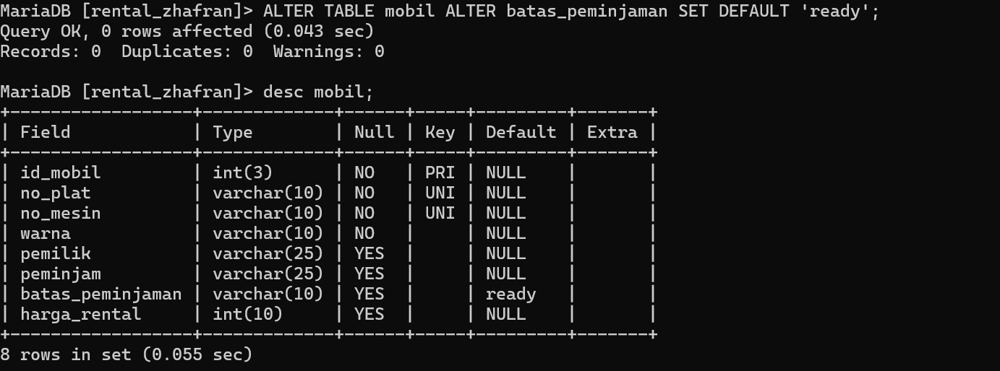
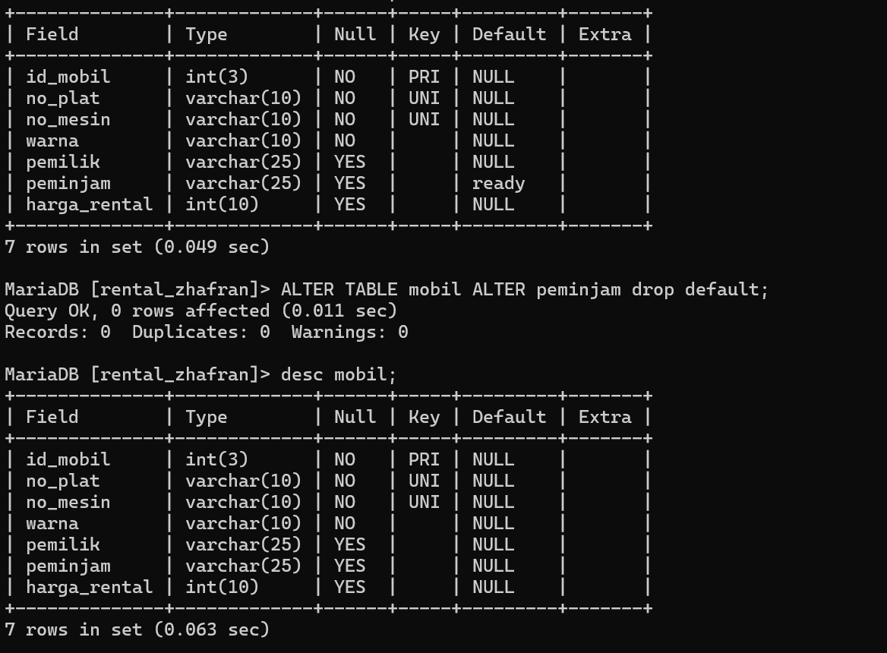
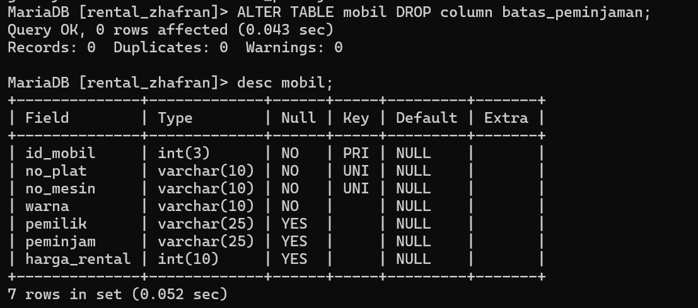
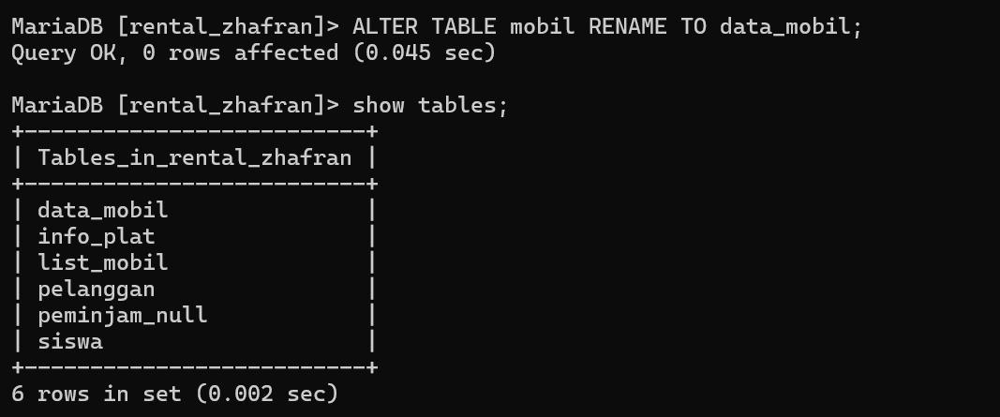

# Menambahkan kolom

## struktur query
```
ALTER TABLE nama_tabel ADD batas_peminjaman varchar(10) AFTER nama_kolom;
```
## contoh query
```sql
ALTER TABLE mobil ADD batas_peminjaman varchar(10) AFTER peminjam;
```
## hasil


## analisis
- `ALTER TABLE`: Ini menunjukkan bahwa kita sedang memodifikasi struktur dari tabel yang sudah ada.
- `mobil`: Ini adalah nama tabel yang akan kita ubah.
-  `ADD batas_peminjam varchar(10)`: Ini berarti kita akan menambahkan kolom baru bernama `batas_peminjam` ke tabel `mobil`, dan kolom tersebut akan memiliki tipe karakter variabel dengan panjang maksimum 10 karakter.
- `AFTER peminjam`: Ini menunjukkan bahwa kolom baru `batas_peminjam` akan ditambahkan setelah kolom yang sudah ada yaitu `peminjam` di dalam tabel.
## kesimpulan
Pernyataan SQL tersebut menambahkan kolom baru dengan nama `batas_peminjam` ke tabel `mobil`dengan tipe data karakter variabel dan panjang maksimum 10 karakter, yang akan ditempatkan setelah kolom `peminjam` yang sudah ada di dalam tabel.

# Tambahan
### struktur query
```
Update nama_tabel set batas_peminjaman = "2024-04-24" where kolom_tabel;
```
### contoh query
```sql
Update mobil set batas_peminjaman = "2024-04-24" where peminjam is not null;
```
### hasil

### analisis
- `UPDATE`: Ini adalah kata kunci yang menunjukkan bahwa kita akan memperbarui data dalam sebuah tabel.
- `mobil`: Ini adalah nama tabel yang akan diperbarui.
- `set`: Ini adalah kata kunci yang menunjukkan bahwa kita akan menetapkan nilai baru untuk kolom tertentu.
- `batas_peminjaman`: Ini adalah nama kolom yang akan diperbarui.
- `"2024-04-24"`: Ini adalah nilai baru yang akan ditetapkan untuk kolom "batas_peminjaman". Dalam hal ini, nilai ini adalah tanggal yang diatur menjadi 24 April 2024.
- `where`: Ini adalah klausa yang digunakan untuk memfilter baris mana yang akan diperbarui.
- `peminjam is not null`: Ini adalah kondisi yang memberi tahu database bahwa kita hanya ingin memperbarui nilai kolom "batas_peminjaman" di baris-baris di mana kolom "peminjam" tidak kosong (tidak null).
### kesimpulan
pernyataan SQL ini akan memperbarui nilai kolom "batas_peminjaman" menjadi "2024-04-24" hanya untuk baris-baris di mana kolom "peminjam" memiliki nilai yang tidak kosong.
# Mengubah nama kolom
### struktur query
```
ALTER TABLE nama_tabel RENAME COLUMN nama_kolom TO nama_kolom baru;
```
### contoh query
```sql
ALTER TABLE mobil RENAME COLUMN batas_peminjaman TO deadline;
```
### hasil

### analisis
- `ALTER TABLE`: Ini menunjukkan bahwa kita sedang memodifikasi struktur dari sebuah tabel.
- `mobil`: Ini adalah nama tabel yang akan kita ubah.
- `RENAME COLUMN batas_peminjam TO deadline`: Ini berarti kita akan mengubah nama kolom yang sudah ada dari `batas_peminjam` menjadi `deadline` di dalam tabel `mobil`.
### kesimpulan
Pernyataan SQL tersebut mengubah nama kolom yang sudah ada dari `batas_peminjam` menjadi `deadline` di dalam tabel `mobil`.

# Mengubah tipe data kolom
### struktur query
```
ALTER TABLE nama_tabel MODIFY deadline DATE;
```
### contoh query
```sql
ALTER TABLE mobil MODIFY deadline DATE;
```
### hasil

### analisis
- `ALTER TABLE`: Ini adalah kata kunci yang menunjukkan bahwa kita akan melakukan perubahan pada struktur tabel.
- `mobil`: Ini adalah nama tabel yang akan diubah.
- `MODIFY`: Ini adalah kata kunci yang menunjukkan jenis perubahan yang akan dilakukan pada tabel. Dalam konteks ini, kita akan mengubah tipe data kolom.
- `deadline`: Ini adalah nama kolom yang akan diubah tipe datanya.
- `DATE`: Ini adalah tipe data baru yang akan diberikan kepada kolom "deadline". Dalam hal ini, tipe data DATE digunakan, yang cocok untuk menyimpan nilai tanggal.
### kesimpulan
pernyataan ALTER TABLE ini akan mengubah tipe data kolom "deadline" dalam tabel "mobil" menjadi DATE, yang akan memungkinkan kolom tersebut untuk menyimpan nilai tanggal.
# Menambahkan constraint
### struktur query
```
ALTER TABLE nama_table ALTER SET DEFAULT 'ready';
```
### contoh query
```sql
ALTER TABLE mobil ALTER batas_peminjaman SET DEFAULT 'ready';
```
### hasil

### analisis
- `ALTER TABLE`: Ini adalah perintah SQL yang digunakan untuk mengubah struktur tabel.
- `mobil`: Ini adalah nama tabel yang ingin Anda ubah strukturnya.
- `ALTER batas_peminjaman SET DEFAULT READY`: Ini adalah bagian yang melakukan perubahan. Perintah ini mengatur nilai default untuk kolom "`deadline`" dalam tabel "`mobil`" menjadi `READY`. PIni berarti bahwa jika baris baru ditambahkan ke tabel tanpa nilai yang ditentukan untuk kolom "`batas_peminjaman`", maka nilainya akan secara otomatis diatur menjadi '`READY`'.
### kesimpulan
Perintah `ALTER TABLE mobil ALTER deadline SET DEFAULT 'READY';` mengatur nilai default untuk kolom "`batas_peminjaman`" dalam tabel "`mobil`" menjadi '`READY`'. Ini akan membuat '`READY`' menjadi nilai default untuk kolom "`deadline`" jika tidak ada nilai yang ditentukan saat penambahan baris baru. Pastikan nilai default tersebut sesuai dengan kebutuhan aplikasi Anda sebelum menjalankan perintah ini.
# mengahapus constraint 
## struktur query
```
ALTER TABLE nama_tabel ALTER nama_kolom DROP default;
```
## contoh query
```sql 
ALTER TABLE mobil ALTER peminjam DROP default;
```
## hasil

## analisis
- `ALTER TABLE`: Ini adalah perintah SQL yang digunakan untuk mengubah struktur tabel.
- `mobil`: Ini adalah nama tabel yang ingin Anda ubah strukturnya.
- `ALTER batas_peminjaman DROP DEFAULT`: Ini adalah bagian yang melakukan perubahan. Perintah ini menghapus nilai default dari kolom "`batas_peminjaman`" dalam tabel "`mobil`". Ini berarti bahwa setelah perintah ini dijalankan, jika baris baru ditambahkan ke tabel tanpa nilai yang ditentukan untuk kolom "`batas_peminjaman`", kolom tersebut tidak akan memiliki nilai default.
## kesimpulan
Perintah `ALTER TABLE mobil ALTER batas_peminjaman DROP DEFAULT;` menghapus nilai default dari kolom "`batas_peminjaman`" dalam tabel "`mobil`". Setelah perintah ini dijalankan, kolom tersebut tidak akan memiliki nilai `default`. Pastikan hal ini sesuai dengan kebutuhan aplikasi Anda sebelum menjalankan perintah tersebut.

# menghapus kolom 
### struktur query
```
ALTER TABLE nama_tabel DROP COLUMN;
```
### contoh query
```sql
ALTER TABLE mobil DROP COLUNM batas_peminjaman;
```
### hasil

### analisis
- `ALTER TABLE`: Ini adalah perintah SQL yang digunakan untuk mengubah struktur tabel.
- `mobil`: Ini adalah nama tabel yang ingin Anda ubah strukturnya.
- `DROP COLUMN batas_peminjaman`: Ini adalah bagian yang melakukan perubahan. Perintah ini menghapus kolom "`batas_peminjaman`" dari tabel "`mobil`". Ini berarti bahwa setelah perintah ini dijalankan, kolom "`batas_peminjaman`" beserta semua data yang ada di dalamnya akan dihapus dari tabel "`mobil`".
## kesimpulan
Perintah `ALTER TABLE mobil DROP COLUMN batas_peminjaman;` menghapus kolom "`batas_peminjaman`" dari tabel "`mobil`". Ini akan menghapus semua data yang terkait dengan kolom tersebut. Pastikan untuk membuat pencadangan data sebelum menjalankan perintah ini dan pastikan bahwa penghapusan kolom tersebut sesuai dengan kebutuhan apk anda.

# mengubah nama tabel
### struktur query
```
ALTER TABLE nama_tabel RENAME TO nama_kolom
```
### contoh query
```
ALTER TABLE mobil RENAME TO data_mobil;
```
### hasil

### analisis
- `ALTER TABLE`: Ini adalah perintah SQL yang digunakan untuk mengubah struktur tabel.
- `mobil`: Ini adalah nama tabel yang ingin Anda ubah.
- `RENAME TO data_mobil`: Ini adalah bagian yang melakukan perubahan. Perintah ini mengubah nama tabel "`mobil`" menjadi "`data_mobil`"..
## kesimpulan
Perintah `ALTER TABLE mobil RENAME TO data_mobil;` mengubah nama tabel "`mobil`" menjadi "`data_mobil`". Pastikan untuk memperbarui kode atau query yang menggunakan nama tabel lama setelah menjalankan perintah ini.
