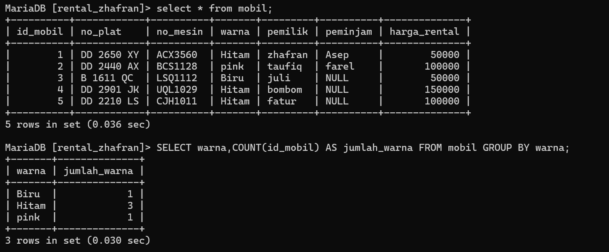
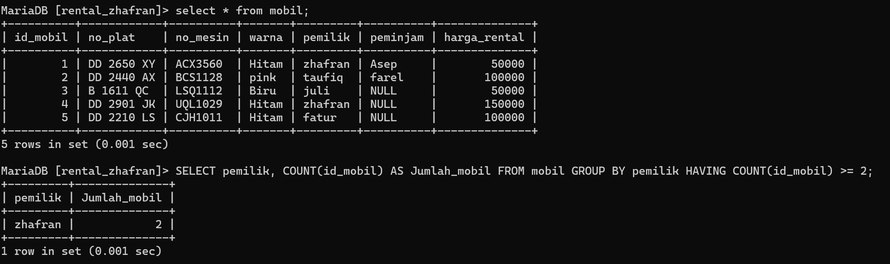
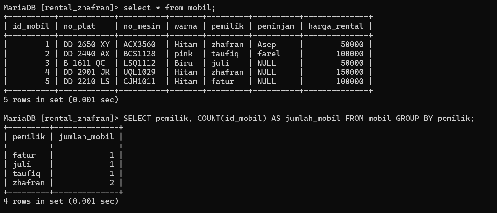
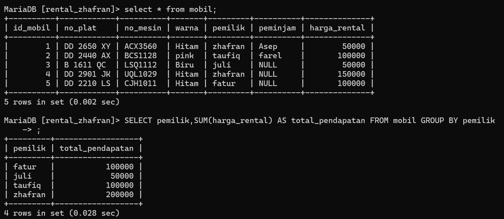
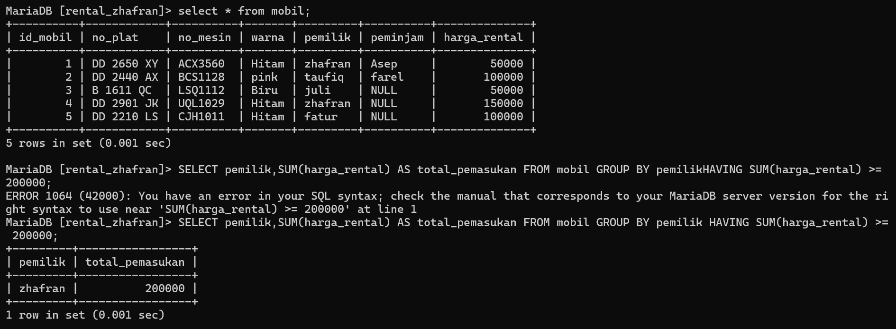
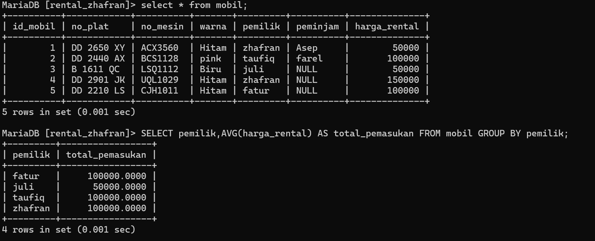
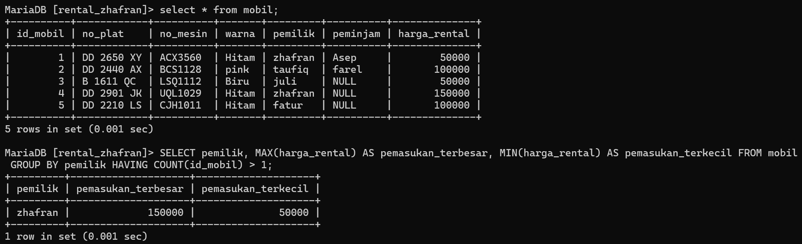

# 1. Tampilkan jumlah data mobil dan kelompokkan berdasarkan warna nya sesuai dengan tabel mobil kalian
## Struktur Query 
```
SELECT [nama_kolom],COUNT([nama_kolom]) AS [nama_alias] FROM [nama_tabel] GROUP BY [nama_kolom]
```
## Contoh 
```mysql
SELECT warna,COUNT(id_mobil) AS jumlah_warna FROM mobil GROUP BY warna;
```
## Hasil



## Analisis 
- `SELECT warna`: Memilih kolom `warna` dari tabel `mobil`.
- `COUNT(id_mobil) AS jumlah_warna`: Menghitung jumlah baris (mobil) untuk setiap warna yang unik dan memberikan nama alias `jumlah_warna` pada hasil hitung tersebut.
- `FROM mobil`: Menentukan tabel sumber data, yaitu `mobil`.
- `GROUP BY warna`: Mengelompokkan hasil berdasarkan kolom `warna`, sehingga setiap warna yang unik akan dihitung jumlahnya.
## Kesimpulan 
Query seperti ini sangat berguna untuk menganalisis distribusi data dalam kategori tertentu.

---
# 2. Berdasarkan query ini tampilkan yang lebih besar dari 3 atau sama dengan 3 pemilik mobil nya
## Struktur Query 
```
SELECT [nama_kolom],COUNT[(nama_kolom)] AS [nama_alias] FROM [nama_tabel] GROUP BY [nama_kolom] HAVING COUNT([nama_kolom]) >= nilai;
```
## Contoh 
```mysql
SELECT pemilik, COUNT(id_mobil) AS Jumlah_mobil FROM mobil GROUP BY pemilik HAVING COUNT(id_mobil) >= 2;
```
## Hasil

## Analisis 
- `SELECT pemilik`: Memilih kolom `pemilik` dari tabel `mobil`.
- `COUNT(id_mobil) AS Jumlah_mobil`: Menghitung jumlah baris (mobil) untuk setiap pemilik dan memberikan nama alias `Jumlah_mobil` pada hasil hitung tersebut.
- `FROM mobil`: Menentukan tabel sumber data, yaitu `mobil`.
- `GROUP BY pemilik`: Mengelompokkan hasil berdasarkan kolom `pemilik`, sehingga setiap pemilik yang unik akan dihitung jumlah mobilnya.
- `HAVING COUNT(id_mobil) >= 2`: Menyaring hasil grup sehingga hanya pemilik yang memiliki dua mobil atau lebih yang akan ditampilkan.
## Kesimpulan 
Query ini berguna untuk menganalisis data kepemilikan mobil dengan mengidentifikasi pemilik yang memiliki jumlah mobil yang signifikan (dua atau lebih).

---
# 3. Tampilkan semua pemilik dengan jumlah mobilnya yang memiliki atau sama dengan 3 mobil
## Struktur Query 
```
SELECT [nama_kolom],COUNT[(nama_kolom)] AS [nama_alias] FROM [nama_tabel] GROUP BY [nama_kolom];
```
## Contoh 
```mysql
SELECT pemilik, COUNT(id_mobil) AS jumlah_mobil FROM mobil GROUP BY pemilik;
```
## Hasil

## Analisis 
- `SELECT pemilik`: Memilih kolom `pemilik` dari tabel `mobil`.
- `COUNT(id_mobil) AS jumlah_mobil`: Menghitung jumlah baris (mobil) untuk setiap pemilik dan memberikan nama alias `jumlah_mobil` pada hasil hitung tersebut.
- `FROM mobil`: Menentukan tabel sumber data, yaitu `mobil`.
- `GROUP BY pemilik`: Mengelompokkan hasil berdasarkan kolom `pemilik`, sehingga setiap pemilik yang unik akan dihitung jumlah mobilnya.

## Kesimpulan 
Query ini sangat berguna untuk melakukan agregasi data berdasarkan pemilik dan menghitung jumlah entitas (mobil) yang dimiliki oleh setiap entitas (pemilik).

---
# 4. Berdasarkan query yang ada pada praktikum 5 bagian 7 tampilkan data pada table mobil dengan mengelompokan berdasarkan pemiliknya.hitung menggunakan sum total pendapatan pemilik berdasarkan harga rental

## Struktur Query 
```
SELECT [nama_kolom],SUM[(nama_kolom)] AS [nama_alias] FROM [nama_tabel] GROUP BY [nama_kolom];
```
## Contoh 
```Mysql
SELECT pemilik,SUM(harga_rental) AS total_pendapatan FROM mobil GROUP BY pemilik
```
## Hasil

## Analisis 
- `SELECT pemilik`: Memilih kolom `pemilik` dari tabel `mobil`.
- `SUM(harga_rental) AS total_pendapatan`: Menjumlahkan nilai dari kolom `harga_rental` untuk setiap pemilik dan memberikan nama alias `total_pendapatan` pada hasil jumlah tersebut.
- `FROM mobil`: Menentukan tabel sumber data, yaitu `mobil`.
- `GROUP BY pemilik`: Mengelompokkan hasil berdasarkan kolom `pemilik`, sehingga setiap pemilik yang unik akan dihitung total pendapatan dari harga rental mobilnya.
## Kesimpulan 
Query ini sangat berguna untuk melakukan agregasi data berdasarkan pemilik dan menghitung total pendapatan dari harga rental mobil yang diperoleh oleh setiap pemilik.

---
# 5. Berdasarkan praktikum 5 query no 8 tampilkan jumlah pemasukan pemilik berdasarkan harga rental kelompokkan berdasarkan pemiliknya dan seleksi yang total pemasukannya atau harga rentalnya mencapai lebih besar atau sama dengan 200k

## Struktur Query 
```
SELECT [nama_kolom],SUM[(nama_kolom)] AS [nama_alias] FROM [nama_tabel] GROUP BY [nama_kolom] HAVING SUM([nama_kolom]) >= nilai;
```
## Contoh 
```Mysql
SELECT pemilik,SUM(harga_rental) AS total_pemasukan FROM mobil GROUP BY pemilik HAVING SUM(harga_rental) >= 200000;
```
## Hasil

## Analisis 
- `SELECT pemilik`: Memilih kolom `pemilik` dari tabel `mobil`.
- `SUM(harga_rental) AS total_pemasukan`: Menjumlahkan nilai dari kolom `harga_rental` untuk setiap pemilik dan memberikan nama alias `total_pemasukan` pada hasil jumlah tersebut.
- `FROM mobil`: Menentukan tabel sumber data, yaitu `mobil`.
- `GROUP BY pemilik`: Mengelompokkan hasil berdasarkan kolom `pemilik`, sehingga setiap pemilik yang unik akan dihitung total pemasukan dari harga rental mobilnya.
- `HAVING SUM(harga_rental) >= 200000`: Menyaring hasil grup sehingga hanya pemilik yang memiliki total pemasukan dari harga rental sebesar 200000 atau lebih yang akan ditampilkan.
## Kesimpulan 
Query ini sangat berguna untuk melakukan agregasi data berdasarkan pemilik dan menghitung total pendapatan dari harga rental mobil yang diperoleh oleh setiap pemilik, kemudian menyaring hanya pemilik yang memiliki pendapatan minimal 200.000.

---
# 6. Berdasarkan praktikum 6 no 12 tampilkan rata rata pemasukan pemilik mobil kelompokkan berdasarkan pemiliknya

## Struktur Query 
```
SELECT [nama_kolom],AVG[(nama_kolom)] AS [nama_alias] FROM [nama_tabel] GROUP BY [nama_kolom];
```
## Contoh 
```Mysql
SELECT pemilik,AVG(harga_rental) AS total_pemasukan FROM mobil GROUP BY pemilik;
```
## Hasil

## Analisis 
- `SELECT pemilik`: Memilih kolom `pemilik` dari tabel `mobil`.
- `AVG(harga_rental) AS total_pemasukan`: Menghitung rata-rata nilai dari kolom `harga_rental` untuk setiap pemilik dan memberikan nama alias `total_pemasukan` pada hasil rata-rata tersebut.
- `FROM mobil`: Menentukan tabel sumber data, yaitu `mobil`.
- `GROUP BY pemilik`: Mengelompokkan hasil berdasarkan kolom `pemilik`, sehingga setiap pemilik yang unik akan dihitung rata-rata harga rental mobilnya.
## Kesimpulan 
Query ini sangat berguna untuk melakukan agregasi data berdasarkan pemilik dan menghitung rata-rata harga rental mobil yang diperoleh oleh setiap pemilik. 

---
# 7. Berdasarkan praktikum 5 no 16 tampilkan pemasukan  terbesar dan pemasukan terkecil kelompokkan berdasarkan pemiliknya dan seleksi data pemilik yg tampil atau memiliki jumlah mobil lebih besar dari 1

## Struktur Query 
```
SELECT [nama_kolom], MAX[(nama_kolom)] AS [nama_alias],MIN[(nama_kolom)] AS [nama_alias] FROM [nama_tabel] GROUP BY [nama_kolom] HAVING SUM([nama_kolom]) >= nilai;
```

## Contoh 
```Mysql
SELECT pemilik, MAX(harga_rental) AS pemasukan_terbesar, MIN(harga_rental) AS pemasukan_terkecil FROM mobil GROUP BY pemilik HAVING COUNT(id_mobil) > 1;
```
## Hasil


## Analisis 
- `SELECT pemilik`: Memilih kolom `pemilik` dari tabel `mobil`.
- `MAX(harga_rental) AS pemasukan_terbesar`: Menghitung nilai maksimum dari kolom `harga_rental` untuk setiap pemilik dan memberikan nama alias `pemasukan_terbesar` pada hasil nilai maksimum tersebut.
- `MIN(harga_rental) AS pemasukan_terkecil`: Menghitung nilai minimum dari kolom `harga_rental` untuk setiap pemilik dan memberikan nama alias `pemasukan_terkecil` pada hasil nilai minimum tersebut.
- `FROM mobil`: Menentukan tabel sumber data, yaitu `mobil`.
- `GROUP BY pemilik`: Mengelompokkan hasil berdasarkan kolom `pemilik`, sehingga setiap pemilik yang unik akan dihitung nilai maksimum dan minimum dari harga rental mobilnya.
- `HAVING COUNT(id_mobil) > 1`: Menyaring hasil grup sehingga hanya pemilik yang memiliki lebih dari satu mobil yang akan ditampilkan.
## Kesimpulan 
Query ini sangat berguna untuk melakukan analisis agregasi berdasarkan pemilik dan menghitung nilai maksimum dan minimum dari harga rental yang diperoleh oleh setiap pemilik yang memiliki lebih dari satu mobil. 
