# Definisi Basis Data
## Basis
Dapat di artikan sebagai markas atau gudang, tempat bersarang atau berkumpul
## Data
Representasi fakta dunia nyata yang mewakili suatu objek seperti manusia, barang, hewan, peristiwa, dan sebagainya. Data direkam dalam bentuk angka, huruf, simbol, teks, gambar, bunyi. 
## Fungsi Basis Data
Peranan basis data dapat Memudahkan identifikasi data. Menghindari data ganda yang tersimpan. Memudahkan akses, simpan, pembaruan, dan penghapusan data. Menjadi penyimpanan data dari aplikasi atau situs web.
## Kesimpulan
Dari kedua pengertian tersebut, maka dapat ditarik kesimpulan bahwa pengertian dari basis data adalah kumpulan informasi yang disimpan di dalam komputer secara sistematik sehingga dapat diperiksa menggunakan suatu program komputer untuk memperoleh informasi dari basis data tersebut.
## Peran Basis Data
Contoh peranan basis data di RUMAH SAKIT. 
Pengelolaan data rumah sakit biasanya dilakukan oleh tim administrasi rumah sakit, dan tenaga medis yang terlibat dalam rekam medis pasien. 
- Data masuk & keluar pasien
	Data masuk dan keluar pasien di rumah sakit umumnya dikelola oleh tim administrasi rumah sakit, staf pendaftaran, dan petugas rekam medis. Proses ini melibatkan pencatatan informasi pribadi, riwayat medis, serta catatan kesehatan selama pasien berada di rumah sakit.
- Dosis Obat
	Data dosis obat biasanya disimpan dalam rekam medis pasien oleh tim perawatan kesehatan, termasuk dokter dan perawat. Sistem informasi rumah sakit juga dapat digunakan untuk menyimpan informasi dosis obat secara terkomputerisasi.

# Struktur/Hirarki Database

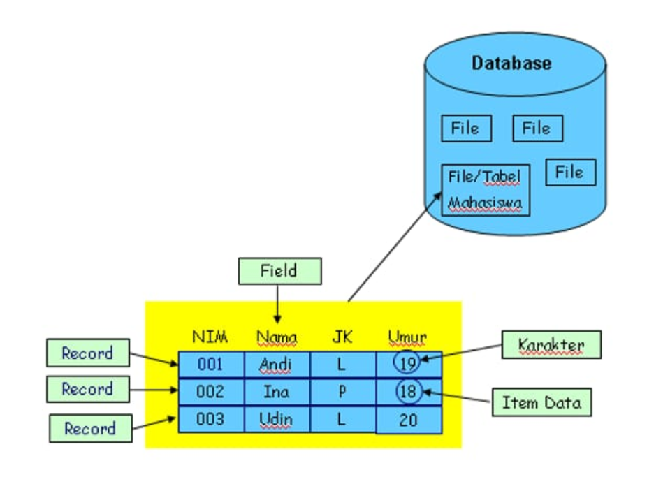
# Instalasi MySQL
## menggunakan termux

1. Buka termux
2. Ketik termux-setup-storage lalu Berikan akses termux ke memori internal
3. Muncul pop-up untuk meminta izin akses ke memori internal klik izinkan/allow acces
4. Lakukan update dan sekaligus upgrade paket dengan mengetik **pkg update && upgrade** lalu klik y
5. Jika ada konfirmasi untuk melanjutkan instalasi. Silahkan **klik y dan enter**
6. Instal aplikasi mariadb dengan mengetik  **pkg install mariadb**
7. Memberikan akses aman ke MySQL dengan mengetik **mysql_safe**
8. Hentikan proses dengan **CTRL+Z**
9. Masuk kedalam admin dengan mengetik **MySQL -u root**
## referensi video YouTube

https://youtu.be/ez3nx3xH-y4?si=T4saycipqfBcqL1c

---
# penggunaan awal MySQL
## Query

```
MySQL -u root
```

 
### hasil:
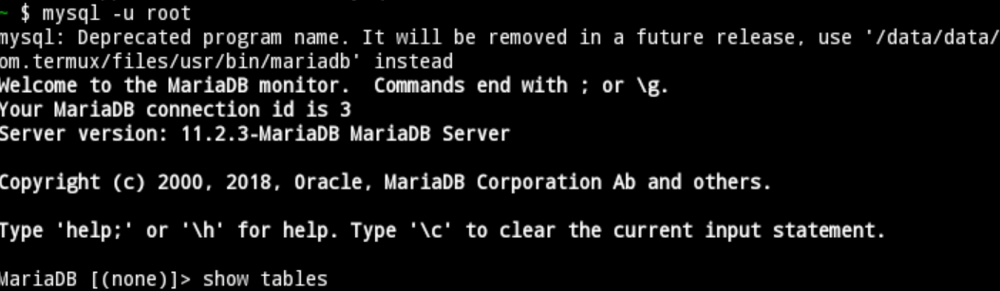

### analisis

**MySQL** adalah perintah untuk mengakses Shell MySQL, yaitu antarmuka command line untuk berinteraksi dengan server MySQL

**"-u root"** adalah opsi yang digunakan saat Anda mengakses MySQL dari baris perintah (command line). Di sini, "-u" adalah singkatan dari "user", dan "root" adalah nama pengguna. Dengan menggunakan "-u root", Anda masuk ke MySQL sebagai pengguna "root", yang biasanya memiliki hak akses penuh ke semua fungsi MySQL. Pengguna "root" sering digunakan untuk melakukan tugas administratif dan konfigurasi yang memerlukan tingkat akses tertinggi.

### kesimpulan 

 **MySQL -u root** adalah bahwa Anda mengakses server MySQL dengan menggunakan opsi "-u" untuk menentukan pengguna (dalam hal ini, "root" yang merupakan pengguna dengan hak akses tertinggi). Dengan menggunakan "root", Anda memiliki kemampuan untuk melakukan tugas administratif dan konfigurasi yang memerlukan tingkat akses penuh ke server MySQL.

# DataBase
## Buat database

Untuk membuat database di MySQL, Anda dapat menggunakan perintah SQL `CREATE DATABASE [nama_database].`Gantilah "nama_database" dengan nama yang ingin Anda berikan pada database tersebut. 

### Hasil
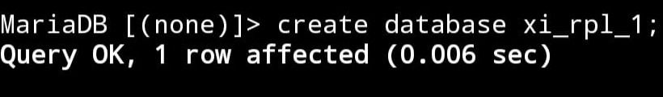

## tampilkan database 

Untuk menampilkan semua database yang ada di MySQL, Anda dapat menggunakan perintah **databases**, Perintah ini akan menampilkan daftar semua database yang telah Anda buat atau yang sudah ada dalam server MySQL. 
### Hasil:
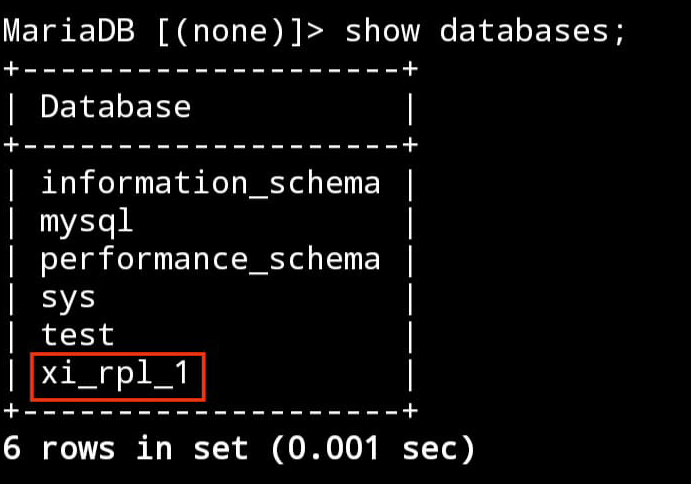

## hapus database

Untuk menghapus database di MySQL, Anda dapat menggunakan perintah **DROP DATABASE**. Gantilah "nama_database" dengan nama database yang ingin Anda hapus. Pastikan Anda memiliki izin yang cukup untuk menjalankan perintah ini.
### Hasil:
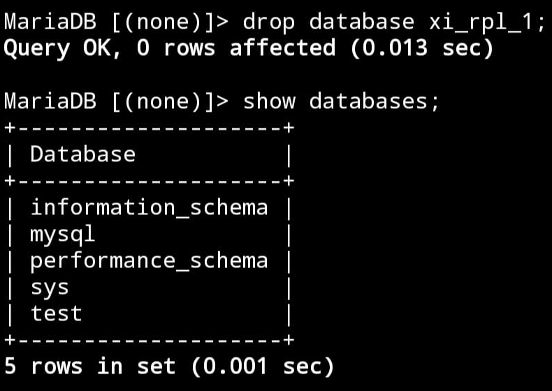
## gunakan/memilih database

Untuk memilih atau beralih ke suatu database tertentu dalam MySQL, Anda menggunakan perintah USE. Gantilah "nama_database" dengan nama database yang ingin Anda pilih. Setelah menjalankan perintah ini, Anda akan beralih ke database tersebut, dan semua operasi database selanjutnya akan berlaku untuk database yang dipilih. Perintah USE ini berguna saat Anda ingin bekerja dengan tabel atau data di dalam database tertentu. Misalnya, jika Anda ingin menjalankan perintah SELECT untuk mengambil data dari tabel di suatu database, Anda perlu menggunakan perintah USE terlebih dahulu untuk memilih database tersebut

### Hasil
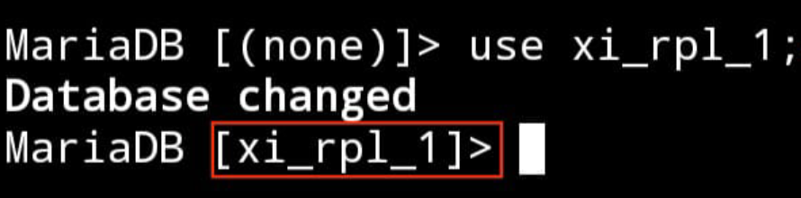
# tipe data
## angka

-  INT: Untuk menyimpan nilai bilangan bulat (integer). Misalnya, INT dapat digunakan untuk menyimpan angka seperti 1, 100, -10, dan sebagainya.

 - DECIMAL: Digunakan untuk menyimpan nilai desimal presisi tinggi, cocok untuk perhitungan finansial atau keuangan.
 
 - FLOAT dan DOUBLE: Digunakan untuk menyimpan nilai desimal dengan presisi floating-point. DOUBLE memiliki presisi lebih tinggi dibandingkan FLOAT.
 
 - TINYINT, SMALLINT, MEDIUMINT, dan BIGINT: Tipe data ini menyimpan bilangan bulat dengan ukuran yang berbeda-beda.
 


---
## teks

- CHAR(N) Menyimpan string karakter tetap dengan panjang N. Contoh: CHAR(10) akan menyimpan string dengan panjang tepat 10 karakter.

- VARCHAR(N): Menyimpan string karakter dengan panjang variabel maksimal N. Misalnya, VARCHAR(255) dapat menyimpan string hingga 255 karakter, tetapi sebenarnya hanya menyimpan panjang yang diperlukan plus beberapa overhead.

- TEXT: Digunakan untuk menyimpan teks dengan panjang variabel, tanpa batasan panjang tertentu. Cocok untuk data teks yang panjangnya tidak terduga.

- ENUM: Memungkinkan Anda mendefinisikan set nilai yang mungkin dan membatasi kolom hanya dapat mengambil salah satu dari nilai tersebut.

- SET: Mirip dengan ENUM, namun dapat menyimpan satu atau lebih nilai dari himpunan yang telah ditentukan.

### Contoh
```mysql
CREATE TABLE zhafran_tabel (
    nama CHAR(50),
    alamat VARCHAR(100),
    catatan TEXT,
    status ENUM('Aktif', 'Non-Aktif')
);
```
### Hasil


Dalam contoh tersebut, **nama** menggunakan tipe data **char** dengan panjang tetap, **alamat** menggunakan tipe data **VARCHAR** dengan panjang variabel, **catatan** menggunakan tipe data **TEXT** untuk menyimpan teks yang mungkin panjangnya bervariasi, dan **status** menggunakan tipe data **ENUM** untuk membatasi nilai yang mungkin.

---
## tanggal

- DATE :  Menyimpan nilai tanggal dengan format YYYY-MM-DD.

- TIME: Menyimpan nilai waktu dengan format HH:MM:SS.

- DATETIME: Menggabungkan nilai tanggal dan waktu dengan format YYYY-MM-DD HH:MM:SS.

- TIMESTAMP: Sama seperti DATETIME, tetapi dengan kelebihan diatur secara otomatis saat data dimasukkan atau diubah.


# Boolean
BOOL,BOOLEAN,TINYINT:
Digunakan untuk menyimpan nilai boolean, yang dapat mewakili kebenaran atau kesalahan. Representasi nilai benar adalah 1, sedangkan nilai salah direpresentasikan sebagai 0. Meskipun nilai selain 0 dianggap benar, secara umum, ketiganya seringkali digunakan secara bergantian. Seringkali, ketika Anda mendeklarasikan kolom sebagai BOOL atau BOOLEAN, MySQL mengonversinya secara otomatis menjadi TINYINT(1), yang juga dapat digunakan untuk menyimpan nilai boolean dengan 0 untuk false dan 1 untuk true.

# Tabel

## Buat tabel
### query
```
CREATE TABLE [nama_tabel] ( 
Nama_kolom1 tipe_data(ukuran) (tipe_constrait) ,
Nama_kolom2 tipe_data(ukuran) (tipe_constrait) ,
Nama_kolom3 tipe_data(ukuran) (tipe_constrait) ,
);
```

### Contoh
```mysql
Create table pelanggan (id_pelanggan int(4) PRIMAY KEY NOT NULL,nama_depan varchar(25) NOT NULL,nama_belakang varchar(25)NOT NULL,no_telp char(12)UNIQUE);
```

### hasil
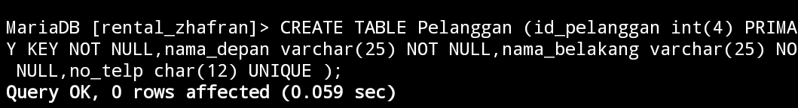

### analisis
1.`CREATE TABLE pelanggan (` : 
perintah untuk membuat sebuah tabel dengan nama "pelanggan".

2.`id_pelanggan int(4) PRIMARY KEY NOT NULL`: `id_pelanggan`sebagai nama kolom bilangan bulat dengan panjang maksimum 4 digit, `PRYMARY KEY` ditetapkan sebagai kunci utama  dan `NOT NULL`tidak boleh nol 

3.`nama_depan varchar(25) NOT NULL`: 
`nama_depan` sebagai nama/judul kolom `varchar`  variabel dengan panjang maksimum 25 karakter,`NOT NULL` tidak boleh kosong.

4.`nama_belakang varchar(25) NOT NULL` :
`nama_belakang` sebagai nama/judul kolom`varchar` Kolom karakter variabel dengan panjang maksimum 25 karakter,`NOT NULL`tidak boleh kosong. 

5.`no_telp char(12) UNIQUE` : 
Ini mendefinisikan kolom `no_telp` sebagai tipe data char (karakter) dengan panjang tepat 12 karakter. Kata kunci `UNIQUE` menandakan bahwa nilai di kolom ini harus unik untuk setiap baris dalam tabel.

### kesimpulan
Perintah-perintah tersebut digunakan untuk membuat tabel yang bernama `pelanggan` dalam basis data. Tabel ini memiliki kolom-kolom: `id_pelanggan` sebagai kunci utama dengan panjang maksimum 4 digit, `nama_depan` dengan panjang maksimum 25 karakter, `nama_belakang` dengan panjang maksimum 25 karakter, dan `no_telp` dengan panjang tepat 12 karakter yang harus unik  karena nomor pelanggan pasti berbeda.

## Tampilkan Struktur Tabel
### struktur query:
```mysql
DESC nama_tabel;
```

### Contoh query:
```mysql
DESC Pelanggan;
```

### hasil:
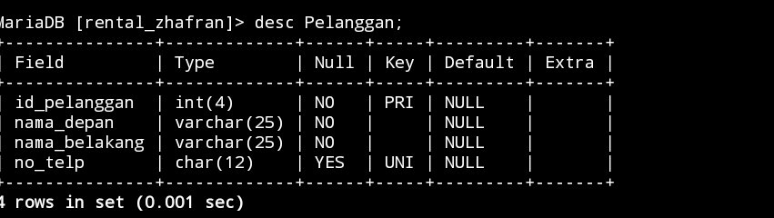

### analisis:
Kode "DESC pelanggan;" digunakan untuk mendapatkan deskripsi atau struktur dari tabel "pelanggan". Ini memberikan informasi tentang kolom-kolom dalam tabel beserta tipe data, dan constraint (jika ada).
### kesimpulan:
Kesimpulan dari kode "DESC pelanggan;" adalah bahwa perintah tersebut bertujuan untuk menampilkan deskripsi atau struktur dari tabel dengan nama "pelanggan". Ini memberikan informasi tentang kolom-kolom yang ada dalam tabel, seperti nama kolom, tipe data, dan konstrain yang mungkin diterapkan.

## Menampilkan Daftar Tabel

### struktur query:
```mysql
SHOW TABLES;
```

### Contoh query:
```mysql
SHOW TABLES;
```

### hasil:
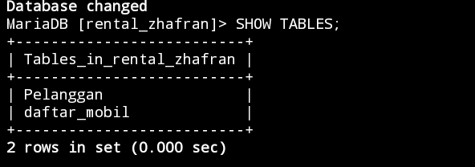

### analisis:
Kode "SHOW TABLES;" digunakan untuk menampilkan daftar semua tabel yang ada dalam database yang sedang digunakan. Ini membantu pengguna untuk melihat tabel-tabel mana yang telah dibuat atau tersedia dalam database tersebut

### kesimpulan:
Kesimpulan dari "SHOW TABLES;" adalah perintah tersebut digunakan untuk menampilkan daftar semua tabel yang ada dalam database yang sedang digunakan.

## QnA

>[!faq]- Mengapa hanya kolom id_pelanggan yang menggunakan constraint PRIMARY KEY?
>untuk mencegah adanya id_pelanggan yang duplikat oleh karena itu PRIMARY KEY berguna untuk sebuah id_pelanggan
>

>[!faq]- Mengapa pada kolom no_telp yang menggunakan tipe data chat bukan varchar?
>karena setiap pengguna no_telp harus berbeda, tidak boleh sama atau duplikat

>[!faq]- Mengapa Hanya kolom no_telp yang menggunakan constraint UNIQUE?
>karena setiap pelanggan memiliki no_telp yang unik tidak ada yang duplikat.

>[!faq]- Mengapa kolom no_telp tidak memakai constraint NOT NULL, sementara kolom lainnya Menggunakan constraint tersebut?
>Karena NOT NULL berfungsi untuk Yang harus diisi.Mungkin Karena No_hp tidak harus di isi jadi tidak di kasih NOT NULL

>[!faq]- Perbedaan antara primary key dan unique
>`Primary key` adalah sebuah kolom atau kumpulan kolom yang digunakan untuk secara unik mengidentifikasi setiap baris dalam tabel. `Unique` adalah sebuah konstrain yang digunakan untuk memastikan bahwa nilai-nilai dalam suatu kolom atau kumpulan kolom adalah unik. Perbedaan utama antara unique dan primary key adalah bahwa unique dapat memungkinkan nilai NULL, sedangkan primary key tidak dapat.

# insert
## insert 1 data
### struktur query
```
insert into [nama_tabel] values(data1, "data 2","data 3", data 4);
```
### contoh query
```sql
insert into Pelanggan values(2,"taufik","asep","089765747299");
```
### hasil

### analisis
- `insert into Pelanggan` digunakan untuk menambahkan data ke dalam tabel " Pelanggan"
- `values(2,"taufik","asep","089765747299");` ini adalah nilai yang akan di masukkan ke dalam tabel. Urutannya sesuai dengan kolom pada tabel. 
### kesimpulan
Kode di atas adalah perintah untuk memasukkan baris data ke dalam tabel "Pelanggan"

## insert >1 data
### struktur query
```
insert into [nama_tabel] values(data 1,"data 2","data 3",data 4),(data 1,"data 2","data 3",data 4);
```
### contoh query
```sql
insert into Pelanggan values(3,"ahsan","putra","089965880259"),(4,"alfahrezi","raihan","087865232266"),(5,"fatur","rahman","083452678299");
![[Insert1.png]]```
### hasil

### analisis
- `insert into Pelanggan` digunakan untuk menambahkan data ke dalam tabel " Pelanggan"
-  `values(3,"ahsan","putra","089965880259"),(4,"alfahrezi","raihan","087865232266"),(5,"fatur","rahman","083452678299");` ini adalah nilai yang akan di masukkan ke dalam tabel. Urutannya sesuai dengan kolom pada tabel. 
### kesimpulan
Kode di atas adalah perintah yang menyisipkan lebih dari 1 data atau 3 sekaligus ke dalam tabel

# Menyebut kolom
### struktur query
```
insert into Pelanggan (id_pelanggan,nama_depan,nama_belakang) values (data 1,"data 2","data 3");
```
### contoh query
```sql
	insert into Pelanggan (id_pelanggan,nama_depan,nama_belakang) values (6,"taufiq","adiguna");
```
### hasil

### analisis
- `insert into Pelanggan`: Ini adalah perintah untuk memasukkan baris data ke dalam tabel "Pelanggan".
- `(id_pelanggan,nama_depan,nama_belakang)`:yang diberikan nilai, sedangkan kolom lainnya akan diisi dengan nilai default jika diperbolehkan atau NULL jika tidak diizinkan.
- `values (6,"taufq","adiguna")`:Ini adalah nilai yang akan dimasukkan ke dalam tabel "Pelanggan". Urutannya sesuai dengan kolom-kolom pada tabel tersebut.
### kesimpulan
Kode tersebut bertujuan untuk menyisipkan sebuah rekaman baru ke dalam tabel " Pelanggan"
# select
### struktur query
```
select * from [nama_tabel];
```
### contoh query
```sql
select * from Pelanggan;
```
### hasil
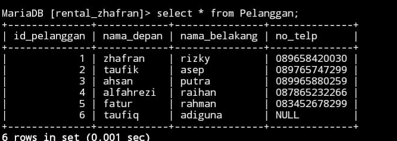
### analisis
- `SELECT` adalah kata kunci yang digunakan untuk memilih data dari database.
- `*`  yang berarti memilih semua kolom yang ada dalam tabel.
- `FROM` adalah kata kunci yang digunakan untuk menentukan tabel mana yang akan diambil datanya.
-  `Pelanggan` adalah nama dari tabel dalam database yang ingin Anda ambil datanya.
### kesimpulan
Perintah `SELECT * FROM Pelanggan` menampilkan keseluruhan  data yang tersimpan dalam tabel "Pelanggan"

## Klausa where

### Struktur query:
```
select kondisi from [nama_tabel];
```
### contoh query:
```sql
select nama_belakang from Pelanggan;
```
### hasil:
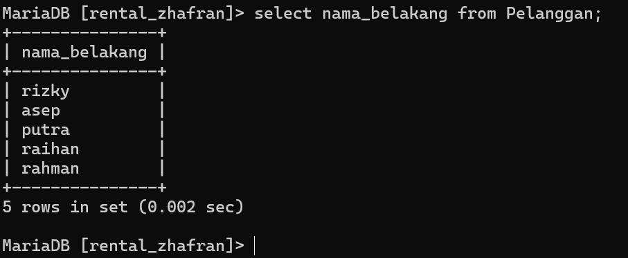
### analisis
-  `SELECT` adalah kata kunci yang digunakan untuk memilih data dari database.
-  `nama_belakang` adalah nama kolom yang ingin Anda ambil datanya dari tabel `Pelanggan`.
-  `FROM` adalah kata kunci yang digunakan untuk menentukan tabel mana yang akan diambil datanya.
-  `Pelanggan` adalah nama tabel dalam database yang menyimpan data "Pelanggan".
### kesimpulan
Perintah Ini akan mengembalikan semua nilai yang ada di kolom "nama_depan" untuk setiap catatan dalam tabel "Pelanggan".

## Update
### struktur query:
```
update [nama tabel] set kondisi where kondisi;
```
### contoh query:
```sql
update Pelanggan set no_telp="088705872069" where id_pelanggan="3";
```
### hasil:![[Screenshot_2024-02-13-14-11-36-725_com.termux.png]]
### analisis:
- `UPDATE` adalah kata kunci yang digunakan untuk memperbarui data yang ada dalam tabel.
- `Pelanggan` adalah nama tabel yang datanya akan diperbarui.
- `SET` adalah kata kunci yang digunakan untuk menentukan kolom mana yang akan diubah dan nilai baru yang akan ditetapkan.
- `no_telp="088705872069"` berarti kolom `no_telp` akan diperbarui dengan nilai baru `"088705872069"`.
- `WHERE` adalah kata kunci yang digunakan untuk menetapkan kondisi yang harus dipenuhi oleh baris-baris yang akan diperbarui.
- `id_pelanggan="3"` adalah kondisi yang harus dipenuhi. Hanya baris dengan `id_pelanggan` bernilai `"3"` yang akan diperbarui.
### kesimpulan:
Perintah ini memastikan hanya data pada baris yang memenuhi kondisi tertentu yang akan diubah.
## delete baris data

### struktur query:
```
Delete from [nama_tabel] where kondisi;
```
### contoh query:
```sql
Delete from Pelanggan where id_pelanggan="3";
```
### Hasil:![[Screenshot_2024-02-13-14-15-35-607_com.termux.png]]

### analisis:
- `DELETE` adalah kata kunci yang digunakan untuk menghapus data dari tabel.
- `FROM` diikuti oleh nama tabel (`Pelanggan`) menunjukkan dari tabel mana data akan dihapus.
- `Pelanggan` adalah nama tabel dari mana data akan dihapus.
- `WHERE` adalah kata kunci yang digunakan untuk menetapkan kondisi yang harus dipenuhi agar baris-baris tersebut dihapus.
- `id_pelanggan="3"` adalah kondisi yang harus dipenuhi. Hanya baris dengan `id_pelanggan` bernilai `"3"` yang akan dihapus.
### kesimpulan:
Kode perintah Ini akan menghapus satu atau lebih baris yang memenuhi kondisi tersebut dari tabel "pelanggan".

# Delete Tabel
### struktur query
```
drop table [nama_tabel];
```
### contoh query
```sql
drop table contoh;
```
### hasil
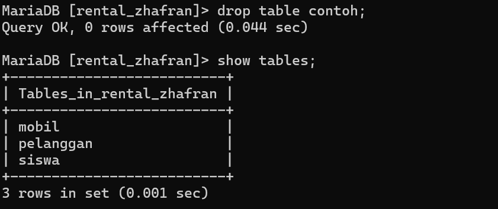
### analisis
- `DROP TABLE` adalah perintah yang digunakan untuk menghapus tabel dari database.
- `contoh` adalah nama tabel yang akan dihapus dari database.
### kesimpulan
Kode `drop table contoh` merupakan perintah SQL yang digunakan untuk menghapus tabel yang disebut "contoh" dari basis data. Hal ini akan menghapus seluruh struktur tabel beserta data yang terkandung di dalamnya secara permanen.