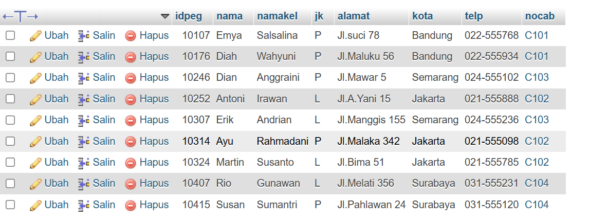
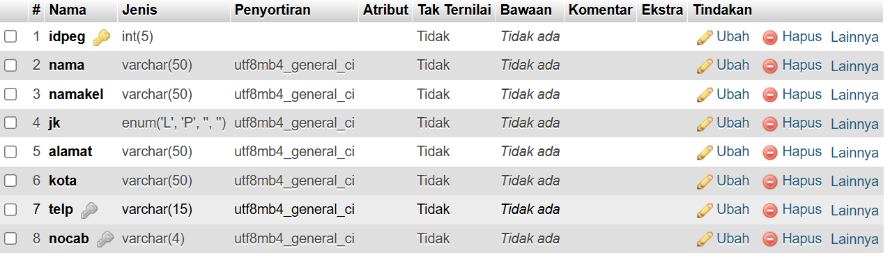
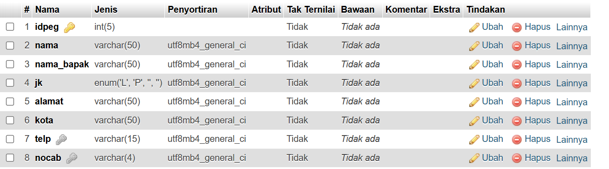
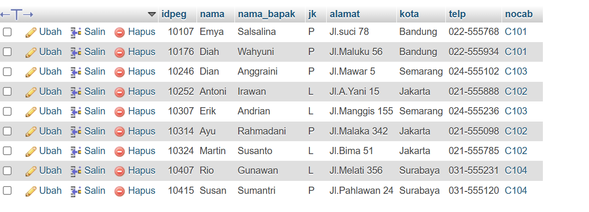
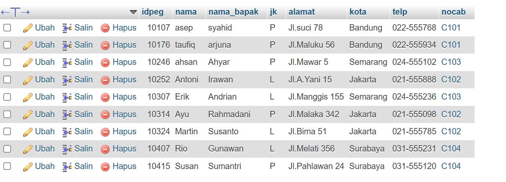
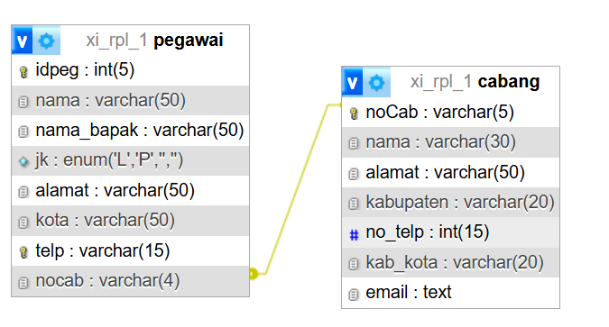
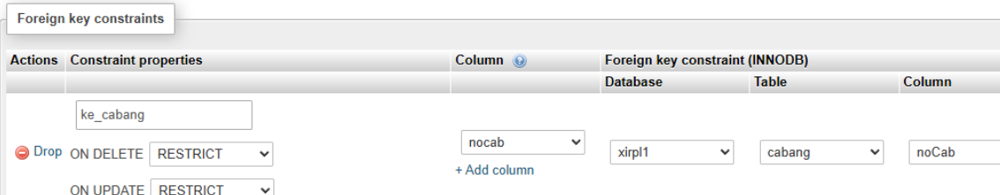

# Data Tabel Pegawai

Berikut data-data yang ada pada tabel pegawai

---
# Perubahan Struktur Tabel

## Before 

## After

perubahan nama kolom ke 3 yang sebelumnya namakel menjadi nama_bapak

---
# Perubahan Data Tabel Pegawai 
## Pegawai
### Before

### After

perubahan isi data pada kolom nama_bapak

---
# Hasil Relasi (Designer)

---
# Query Relasi dan Hasil
## Query

## Hasil
