## AND
### Struktur query
```
select warna,pemilik from mobil where warna="" AND pemilik="";
```
### Contoh query
```sql
select warna,pemilik from mobil where warna="Biru" AND pemilik="juli";
```
### Hasil
![[Screenshot_2024-02-20-15-15-14-705_com.termux.png]]
### Analisis
- `WHERE` digunakan untuk menyaring baris-baris dalam tabel berdasarkan kondisi yang ditentukan.
- `warna = "Biru"`, yang berarti hanya baris dengan nilai kolom `warna` yang sama dengan "Biru" yang akan dipertimbangkan.
- `AND` digunakan untuk menggabungkan kedua kondisi ini, yang berarti hanya baris-baris yang memenuhi kedua kondisi tersebut (warna "Biru" dan pemilik "juli") yang akan disertakan dalam hasil query.
- `pemilik = "juli"`, yang berarti hanya baris dengan nilai kolom `pemilik` yang sama dengan "juli" yang akan dipertimbangkan.
### Kesimpulan
Perintah SQL ini akan menghasilkan sekumpulan data yang hanya berisi kolom `warna` dan `pemilik` dari tabel `mobil`, dengan ketentuan Kolom `warna` harus memiliki nilai "Biru". Kolom `pemilik` harus memiliki nilai "juli". Jika tidak ada baris yang memenuhi kedua kondisi tersebut, maka hasil query akan kosong.

---
## OR
### Struktur query
```
select data 1,data 2 from [nama_tabel] where data 1="nilai 1" OR data 2="nilai 2";
```
### Contoh query
```sql
select warna,pemilik from mobil where warna="Hitam" OR pemilik="taufiq";
```
### Hasil
![[Screenshot_2024-02-20-15-15-36-958_com.termux.png]]
### Analisis
- `warna` dan `pemilik` dari tabel yang ditentukan. Artinya, hanya data dari kolom-kolom ini yang akan ditampilkan dalam hasil query.
- `mobil` sebagai sumber data. Jadi, query ini akan mencari data dalam tabel "mobil".
- `WHERE` digunakan untuk menyaring baris-baris dalam tabel berdasarkan kondisi yang ditentukan.
- `warna = "Hitam"`, yang berarti hanya baris dengan nilai kolom `warna` yang sama dengan "Hitam" yang akan dipertimbangkan.
- `pemilik = "taufiq"`, yang berarti hanya baris dengan nilai kolom `pemilik` yang sama dengan "taufiq" yang akan dipertimbangkan.
- `OR` digunakan untuk menggabungkan kedua kondisi ini, yang berarti baris-baris yang memenuhi salah satu atau kedua kondisi tersebut (warna "Hitam" atau pemilik "taufiq") akan disertakan dalam hasil query.
### Kesimpulan
Perintah SQL ini akan menghasilkan sekumpulan data yang hanya berisi kolom `warna` dan `pemilik` dari tabel `mobil`, dengan ketentuan Kolom `warna` harus memiliki nilai "Hitam". Kolom `pemilik` harus memiliki nilai "taufiq". Baris-baris yang akan disertakan dalam hasil query adalah yang memenuhi salah satu atau kedua kondisi tersebut. Jika sebuah baris memiliki `warna` "Hitam", atau `pemilik` "taufiq", atau keduanya, maka baris tersebut akan muncul dalam hasil query. Jika tidak ada baris yang memenuhi salah satu dari kedua kondisi tersebut, maka hasil query akan kosong.

---
## BETWEEN
### Struktur query
```
select * from [nama_tabel] where data 1 BETWEEN nilai 1 AND nilai 2;
```
### Contoh query
```sql
select * from mobil where harga_rental BETWEEN 100000 AND 200000;
```
### Hasil
![[Screenshot_2024-02-20-15-16-13-684_com.termux.png]]
### Analisis
- `select` Perintah ini digunakan untuk memilih semua kolom dari tabel yang ditentukan. Artinya, semua data dalam baris yang memenuhi syarat akan ditampilkan dalam hasil query.
- `FROM mobil` Bagian ini menentukan tabel `mobil` sebagai sumber data. Jadi, query ini akan mencari data dalam tabel `mobil`.
- `WHERE` digunakan untuk menyaring baris-baris dalam tabel berdasarkan kondisi yang ditentukan.
- `harga_rental BETWEEN 100000 AND 200000` berarti hanya baris-baris dengan nilai `harga_rental` yang berada dalam rentang antara 100000 dan 200000 (inklusif) yang akan disertakan dalam hasil query.
- `BETWEEN` digunakan untuk menentukan rentang nilai, dan mencakup batas bawah dan batas atas dari rentang tersebut.
### Kesimpulan
Perintah SQL ini akan menghasilkan sekumpulan data yang berisi semua kolom dari tabel `mobil`, dengan ketentuan Kolom `harga_rental` harus memiliki nilai yang berada dalam rentang 100000 hingga 200000, termasuk kedua nilai batas tersebut. Jika ada baris yang memenuhi syarat `harga_rental` antara 100000 dan 200000, baris-baris tersebut akan muncul dalam hasil query dengan semua kolom yang tersedia dalam tabel `mobil`. Jika tidak ada baris yang memenuhi syarat tersebut, maka hasil query akan kosong.

---
## NOT BETWEEN
### Struktur query
```
select * from [nama_tabel] where data 1 NOT BETWEEN nilai 1 AND nilai 2;
```
### Contoh query
```sql
select * from mobil where harga_rental NOT BETWEEN 100000 AND 200000;
```
### Hasil
![[Screenshot_2024-02-20-15-16-33-924_com.termux.png]]
### Analisis
- `select` Perintah ini digunakan untuk memilih semua kolom dari tabel yang ditentukan. Artinya, semua data dalam baris yang memenuhi syarat akan ditampilkan dalam hasil query.
- `FROM mobil` Bagian ini menentukan tabel `mobil` sebagai sumber data. Jadi, query ini akan mencari data dalam tabel `mobil`.
- `WHERE` digunakan untuk menyaring baris-baris dalam tabel berdasarkan kondisi yang ditentukan.
- `harga_rental NOT BETWEEN 100000 AND 200000` berarti hanya baris-baris dengan nilai `harga_rental` yang berada di luar rentang antara 100000 dan 200000 yang akan disertakan dalam hasil query.
- `NOT BETWEEN` digunakan untuk menentukan nilai yang tidak berada dalam rentang tertentu. Rentang ini eksklusif, sehingga nilai-nilai yang berada antara 100000 dan 200000 (inklusif) tidak akan disertakan dalam hasil query.
### Kesimpulan
Perintah SQL ini akan menghasilkan sekumpulan data yang berisi semua kolom dari tabel `mobil`, dengan ketentuan Kolom `harga_rental` harus memiliki nilai yang berada di luar rentang 100000 hingga 200000. Artinya, nilai `harga_rental` harus kurang dari 100000 atau lebih dari 200000. Jika ada baris yang memenuhi syarat `harga_rental` di luar rentang 100000 hingga 200000, baris-baris tersebut akan muncul dalam hasil query dengan semua kolom yang tersedia dalam tabel `mobil`. Jika tidak ada baris yang memenuhi syarat tersebut, maka hasil query akan kosong.

---
## <=
### Struktur query
```
select * from [nama_tabel] where data 1 < = nilai 1;
```
### Contoh query
```sql
select * from mobil where harga_rental < = 100000;
```
### Hasil
![[Screenshot_2024-02-20-15-16-52-691_com.termux.png]]
### Analisis
- `select` Perintah ini digunakan untuk memilih semua kolom dari tabel yang ditentukan. Artinya, semua data dalam baris yang memenuhi syarat akan ditampilkan dalam hasil query.
- `FROM mobil` Bagian ini menentukan tabel `mobil` sebagai sumber data. Jadi, query ini akan mencari data dalam tabel `mobil`.
- `WHERE` digunakan untuk menyaring baris-baris dalam tabel berdasarkan kondisi yang ditentukan.
- Kondisi `harga_rental < = 100000` berarti hanya baris-baris dengan nilai `harga_rental` yang kurang dari atau sama dengan 100000 yang akan disertakan dalam hasil query.
### Kesimpulan
Perintah SQL ini akan menghasilkan sekumpulan data yang berisi semua kolom dari tabel `mobil`, dengan ketentuan Kolom `harga_rental` harus memiliki nilai yang kurang dari atau sama dengan 100000. Jika ada baris yang memenuhi syarat `harga_rental` kurang dari atau sama dengan 100000, baris-baris tersebut akan muncul dalam hasil query dengan semua kolom yang tersedia dalam tabel `mobil`. Jika tidak ada baris yang memenuhi syarat tersebut, maka hasil query akan kosong.

---
## >=
### Struktur query
```
select * from [nama_tabel] where data 1 > = nilai 1;
```
### Contoh query
```sql
select * from mobil where harga_rental > = 100000;
```
### Hasil
![[Screenshot_2024-02-20-15-17-08-829_com.termux.png]]
### Analisis
- `select` Perintah ini digunakan untuk memilih semua kolom dari tabel yang ditentukan. Artinya, semua data dalam baris yang memenuhi syarat akan ditampilkan dalam hasil query.
- `FROM mobil` Bagian ini menentukan tabel `mobil` sebagai sumber data. Jadi, query ini akan mencari data dalam tabel `mobil`.
- `WHERE` digunakan untuk menyaring baris-baris dalam tabel berdasarkan kondisi yang ditentukan.
-  Kondisi `harga_rental > = 100000` berarti hanya baris-baris dengan nilai `harga_rental` yang kurang dari atau sama dengan 100000 yang akan disertakan dalam hasil query.
### Kesimpulan
Perintah SQL ini akan menghasilkan sekumpulan data yang berisi semua kolom dari tabel `mobil`, dengan ketentuan Kolom `harga_rental` harus memiliki nilai yang kurang dari atau sama dengan 100000. Jika ada baris yang memenuhi syarat `harga_rental` kurang dari atau sama dengan 100000, baris-baris tersebut akan muncul dalam hasil query dengan semua kolom yang tersedia dalam tabel `mobil`. Jika tidak ada baris yang memenuhi syarat tersebut, maka hasil query akan kosong.

---
## <>
### Struktur query
```
select * from [nama_tabel] where data 1 <> nilai 1;
```
### Contoh query
```sql
select * from mobil where harga_rental <> 100000;
```
### Hasil
![[Screenshot_2024-02-20-15-17-55-591_com.termux.png]]
### Analisis
- `select` Perintah ini digunakan untuk memilih semua kolom dari tabel yang ditentukan. Artinya, semua data dalam baris yang memenuhi syarat akan ditampilkan dalam hasil query.
- `FROM mobil` Bagian ini menentukan tabel `mobil` sebagai sumber data. Jadi, query ini akan mencari data dalam tabel `mobil`.
- `WHERE` digunakan untuk menyaring baris-baris dalam tabel berdasarkan kondisi yang ditentukan.
- `<>` digunakan untuk menyatakan "tidak sama dengan".
- Kondisi `harga_rental <> 100000` berarti hanya baris-baris dengan nilai `harga_rental` yang tidak sama dengan 100000 yang akan disertakan dalam hasil query.
### Kesimpulan
Perintah SQL ini akan menghasilkan sekumpulan data yang berisi semua kolom dari tabel `mobil`, dengan ketentuan Kolom `harga_rental` harus memiliki nilai yang tidak sama dengan 100000. Jika ada baris yang memenuhi syarat `harga_rental` tidak sama dengan 100000, baris-baris tersebut akan muncul dalam hasil query dengan semua kolom yang tersedia dalam tabel `mobil`. Jika semua baris dalam tabel `mobil` memiliki `harga_rental` yang sama dengan 100000, maka hasil query akan kosong.

---
## !=
### Struktur query
```
select * from [nama_tabel] where data 1 != nilai 1;
```
### Contoh query
```sql
select * from mobil where harga_rental != 100000;
```
### Hasil
![[Screenshot_2024-02-20-15-18-37-868_com.termux.png]]
### Analisis
- `select` Perintah ini digunakan untuk memilih semua kolom dari tabel yang ditentukan. Artinya, semua data dalam baris yang memenuhi syarat akan ditampilkan dalam hasil query.
- `FROM mobil` Bagian ini menentukan tabel `mobil` sebagai sumber data. Jadi, query ini akan mencari data dalam tabel `mobil`.
- `WHERE` digunakan untuk menyaring baris-baris dalam tabel berdasarkan kondisi yang ditentukan.
- Operator `!=` digunakan untuk menyatakan "tidak sama dengan".
- Kondisi `harga_rental != 100000` berarti hanya baris-baris dengan nilai `harga_rental` yang tidak sama dengan 100000 yang akan disertakan dalam hasil query.
### Kesimpulan
Perintah SQL ini akan menghasilkan sekumpulan data yang berisi semua kolom dari tabel `mobil`, dengan ketentuan Kolom `harga_rental` harus memiliki nilai yang tidak sama dengan 100000. Jika ada baris yang memenuhi syarat `harga_rental` tidak sama dengan 100000, baris-baris tersebut akan muncul dalam hasil query dengan semua kolom yang tersedia dalam tabel `mobil`. Jika semua baris dalam tabel `mobil` memiliki `harga_rental` yang sama dengan 100000, maka hasil query akan kosong.

---
## TANTANGAN LOGIN
### Struktur query
```
select data1 from nama_tabel where data2='admin' and data3='12345';
```
### Contoh query
```sql
select nama from tantangan_login where username='admin' and password='12345';
```
### Hasil
![[tntL.png]]
### Analisis
Kode tersebut adalah perintah SQL yang digunakan untuk mengambil data dari tabel "tantangan_akun" di mana nilai kolom "nama" adalah "githa". Dengan kata lain, perintah tersebut akan mengembalikan semua baris dari tabel "tantangan_login" di mana nama akun yang ingin di seleksi adalah "githa"
### Kesimpulan
Kesimpulan dari kode tersebut adalah bahwa kita ingin seleksi data akun yang dimiliki oleh seseorang dengan nama "githa".

---

## IN

### Struktur query
```
select * from nama_tabel where data IN('nilai 1','nilai 2');
```
### contoh query
```sql
select * from mobil where warna in ("pink","biru");
```
### hasil
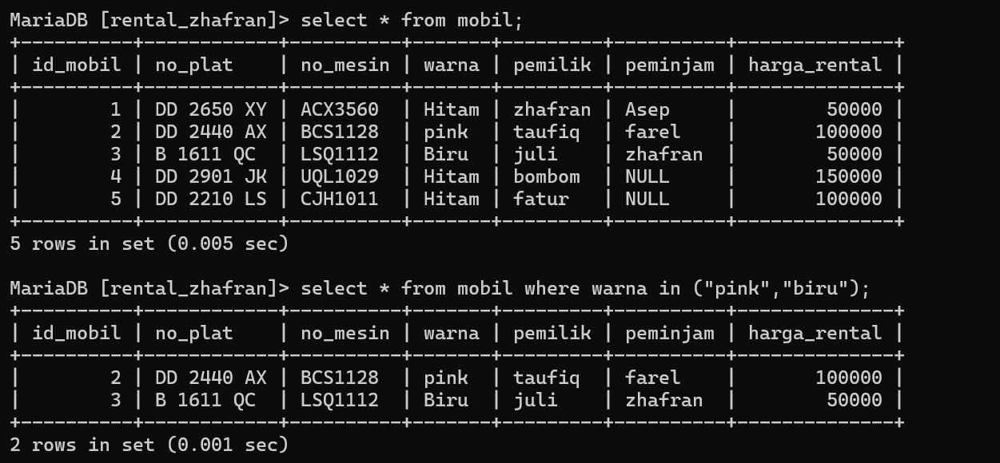
### analisis
- `select` Perintah ini digunakan untuk memilih semua kolom dari tabel yang ditentukan. Artinya, semua data dalam baris yang memenuhi syarat akan ditampilkan dalam hasil query.
- `FROM mobil` Bagian ini menentukan tabel `mobil` sebagai sumber data. Jadi, query ini akan mencari data dalam tabel `mobil`.
- `WHERE` digunakan untuk menyaring baris-baris dalam tabel berdasarkan kondisi yang ditentukan.
- Operator `IN` digunakan untuk memeriksa apakah nilai kolom `warna` ada dalam daftar nilai yang diberikan.
- Kondisi `warna IN ("pink", "biru")` berarti hanya baris-baris dengan nilai `warna` yang termasuk dalam daftar ("pink", "biru") yang akan disertakan dalam hasil query.
### kesimpulan
Perintah SQL ini akan menghasilkan sekumpulan data yang berisi semua kolom dari tabel `mobil`, dengan ketentuan Kolom `warna` harus memiliki nilai yang termasuk dalam daftar "pink" atau "biru" Jika ada baris yang memenuhi syarat `warna` adalah "pink" atau "biru", baris-baris tersebut akan muncul dalam hasil query dengan semua kolom yang tersedia dalam tabel `mobil`

---
## IN + AND
### Struktur query
```
select * from nama_tabel where data IN('nilai 1','nilai 2')AND data 2=nilai 1;
```
### contoh query
```sql
select * from mobil where warna IN('Hitam','Biru')AND harga_rental=50000;
```
### Hasil
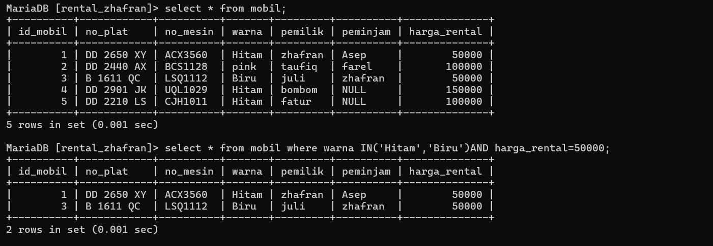
### Analisis
- `select` Perintah ini digunakan untuk memilih semua kolom dari tabel yang ditentukan. Artinya, semua data dalam baris yang memenuhi syarat akan ditampilkan dalam hasil query.
- `FROM mobil` Bagian ini menentukan tabel `mobil` sebagai sumber data. Jadi, query ini akan mencari data dalam tabel `mobil`.
- `WHERE` digunakan untuk menyaring baris-baris dalam tabel berdasarkan kondisi yang ditentukan.
- Kondisi `warna IN ('Hitam', 'Biru')` berarti hanya baris-baris dengan nilai `warna` yang sama dengan "Hitam" atau "Biru" yang akan dipertimbangkan.
- Kondisi `harga_rental = 50000` berarti hanya baris-baris dengan nilai `harga_rental` yang sama dengan 50000 yang akan dipertimbangkan.
- Operator `AND` digunakan untuk menggabungkan kedua kondisi ini, yang berarti hanya baris-baris yang memenuhi kedua kondisi tersebut yang akan disertakan dalam hasil query.
### Kesimpulan
Perintah SQL ini akan menghasilkan sekumpulan data yang berisi semua kolom dari tabel `mobil`, dengan ketentuan Kolom `warna` harus memiliki nilai "Hitam" atau "Biru". Kolom `harga_rental` harus memiliki nilai 50000. Jika ada baris yang memenuhi syarat kedua kondisi tersebut (warna "Hitam" atau "Biru" dan harga_rental 50000), baris-baris tersebut akan muncul dalam hasil query dengan semua kolom yang tersedia dalam tabel `mobil`. Jika tidak ada baris yang memenuhi kedua syarat tersebut, maka hasil query akan kosong.

---
## IN + OR
### Struktur query
```
select * from nama_tabel where data IN('nilai 1','nilai 2')OR data 2=nilai 1;
```
### contoh query
```sql
select * from mobil where warna IN('pink','Biru')OR harga_rental=150000;
```
### Hasil
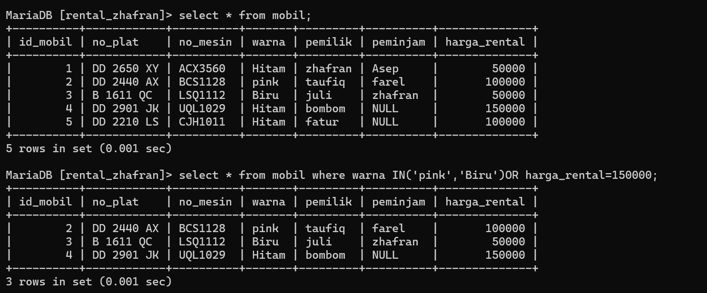
### Analisis
- `select` Perintah ini digunakan untuk memilih semua kolom dari tabel yang ditentukan. Artinya, semua data dalam baris yang memenuhi syarat akan ditampilkan dalam hasil query.
- `FROM mobil` Bagian ini menentukan tabel `mobil` sebagai sumber data. Jadi, query ini akan mencari data dalam tabel `mobil`.
- `WHERE` digunakan untuk menyaring baris-baris dalam tabel berdasarkan kondisi yang ditentukan.
- Kondisi `warna IN ('Hitam', 'Biru')` berarti hanya baris-baris dengan nilai `warna` yang sama dengan "Hitam" atau "Biru" yang akan dipertimbangkan.
- Kondisi `harga_rental = 150000` berarti hanya baris-baris dengan nilai `harga_rental` yang sama dengan 150000 yang akan dipertimbangkan.
- Operator `OR` digunakan untuk menggabungkan kedua kondisi ini, yang berarti baris-baris yang memenuhi salah satu atau kedua kondisi tersebut (warna "Hitam" atau "Biru", atau harga_rental 150000) akan disertakan dalam hasil query.
### Kesimpulan
Perintah SQL ini akan menghasilkan sekumpulan data yang berisi semua kolom dari tabel `mobil`, dengan ketentuan Kolom `warna` harus memiliki nilai "Hitam" atau "Biru" Atau kolom`harga_rental` harus memiliki nilai 150000. Jika ada baris yang memenuhi salah satu dari kedua syarat tersebut (warna "Hitam" atau "Biru", atau harga_rental 150000), baris-baris tersebut akan muncul dalam hasil query dengan semua kolom yang tersedia dalam tabel `mobil`.

---
## IN + AND + OPERATOR

### Struktur query

```
select * from nama_tabel where data IN('nilai 1','nilai 2')AND data 2<nilai 1;
```
### contoh query
```sql
 select * from mobil where warna IN('pink','Biru')AND harga_rental<100000;
```
### Hasil
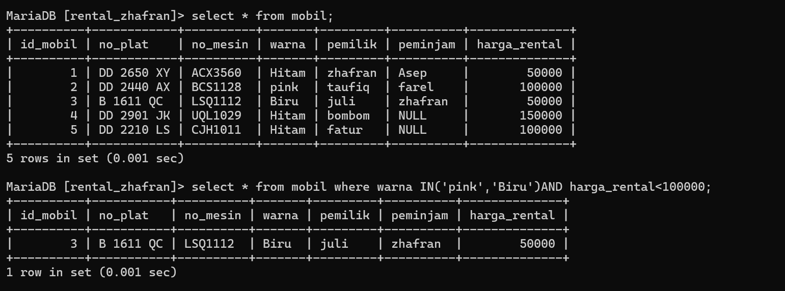
### Analisis
- `select` Perintah ini digunakan untuk memilih semua kolom dari tabel yang ditentukan. Artinya, semua data dalam baris yang memenuhi syarat akan ditampilkan dalam hasil query.
- `FROM mobil` Bagian ini menentukan tabel `mobil` sebagai sumber data. Jadi, query ini akan mencari data dalam tabel `mobil`.
- `WHERE` digunakan untuk menyaring baris-baris dalam tabel berdasarkan kondisi yang ditentukan.
- Kondisi `warna IN ('pink', 'Biru')` berarti hanya baris-baris dengan nilai `warna` yang sama dengan "pink" atau "Biru" yang akan dipertimbangkan.
- Operator `AND` digunakan untuk menggabungkan kedua kondisi ini, yang berarti hanya baris-baris yang memenuhi kedua kondisi tersebut yang akan disertakan dalam hasil query.
- Kondisi `harga_rental < 100000` berarti hanya baris-baris dengan nilai `harga_rental` yang kurang dari 100000 yang akan dipertimbangkan. Warna pink tidak akan tampil karena `harga_rental` harus kurang dari 100000.
### Kesimpulan
Perintah SQL ini akan menghasilkan sekumpulan data yang berisi semua kolom dari tabel `mobil`, dengan ketentuan Kolom `warna` harus memiliki nilai "pink" atau "Biru" Kolom `harga_rental` harus memiliki nilai kurang dari 100000 Jika ada baris yang memenuhi kedua syarat tersebut (warna "pink" atau "Biru" dan harga_rental kurang dari 100000), baris-baris tersebut akan muncul dalam hasil query dengan semua kolom yang tersedia dalam tabel `mobil`.

---
# MATERI LIKE
## Like (mencari awalan)
### Struktur query
```
select * from nama_tabel where data LIKE 'n%';
```
### contoh query
```sql
select * from mobil where pemilik LIKE 'z%';
```
### Hasil
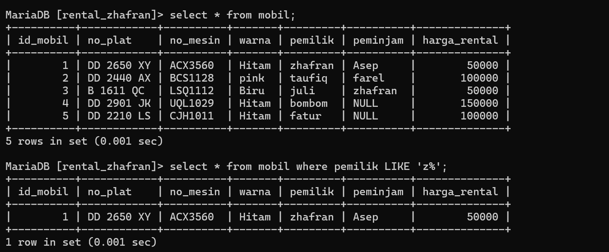
### Analisis
- `select` Perintah ini digunakan untuk memilih semua kolom dari tabel yang ditentukan. Artinya, semua data dalam baris yang memenuhi syarat akan ditampilkan dalam hasil query.
- `FROM mobil` Bagian ini menentukan tabel `mobil` sebagai sumber data. Jadi, query ini akan mencari data dalam tabel `mobil`.
- `WHERE` digunakan untuk menyaring baris-baris dalam tabel berdasarkan kondisi yang ditentukan.
- Kondisi `pemilik LIKE 'z%'` menggunakan operator `LIKE` untuk memeriksa apakah nilai dalam kolom `pemilik` dimulai dengan huruf 'z'. Simbol '%' digunakan sebagai wildcard yang cocok dengan nol atau lebih karakter. Dengan demikian, kondisi ini akan mencocokkan semua nilai dalam kolom `pemilik` yang dimulai dengan huruf 'z', diikuti oleh nol atau lebih karakter lainnya.
### Kesimpulan
Perintah SQL ini akan menghasilkan sekumpulan data yang berisi semua kolom dari tabel `mobil`, di mana nilai dalam kolom `pemilik` dimulai dengan huruf 'z'. Jika ada baris yang memenuhi syarat tersebut, baris-baris tersebut akan muncul dalam hasil query dengan semua kolom yang tersedia dalam tabel `mobil`

## Like (mencari akhir)
### struktur query
```
select * from nama_tabel where data LIKE '%';
```
### contoh query
```sql
select * from mobil where pemilik LIKE '%m';
```
### hasil
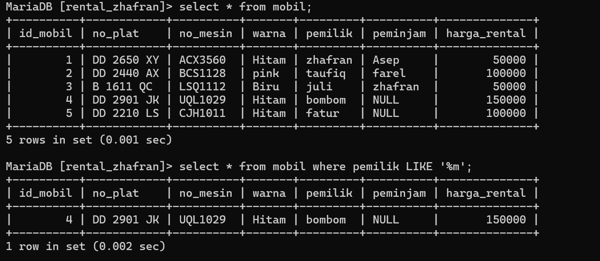
### analisis
- `select` Perintah ini digunakan untuk memilih semua kolom dari tabel yang ditentukan. Artinya, semua data dalam baris yang memenuhi syarat akan ditampilkan dalam hasil query.
- `FROM mobil` Bagian ini menentukan tabel `mobil` sebagai sumber data. Jadi, query ini akan mencari data dalam tabel `mobil`.
- `WHERE` digunakan untuk menyaring baris-baris dalam tabel berdasarkan kondisi yang ditentukan.
- Kondisi `pemilik LIKE '%m'` menggunakan operator `LIKE` untuk memeriksa apakah nilai dalam kolom `pemilik` berakhir dengan huruf 'm'. Simbol `%` digunakan sebagai wildcard yang cocok dengan nol atau lebih karakter sebelum 'm'. Dengan demikian, kondisi ini akan mencocokkan semua nilai dalam kolom `pemilik` yang berakhir dengan huruf 'm'.
### kesimpulan
Perintah SQL ini akan menghasilkan sekumpulan data yang berisi semua kolom dari tabel `mobil`, di mana nilai dalam kolom `pemilik` berakhir dengan huruf 'm'. Jika ada baris yang memenuhi syarat tersebut, baris-baris tersebut akan muncul dalam hasil query dengan semua kolom yang tersedia dalam tabel `mobil`.

## Like (mencari awalan/akhir)

### struktur query
```
select * from nama_tabel where data LIKE 'z%n';
```
### contoh query
```sql
select * from mobil where pemilik LIKE 'z%n';
```
### hasil
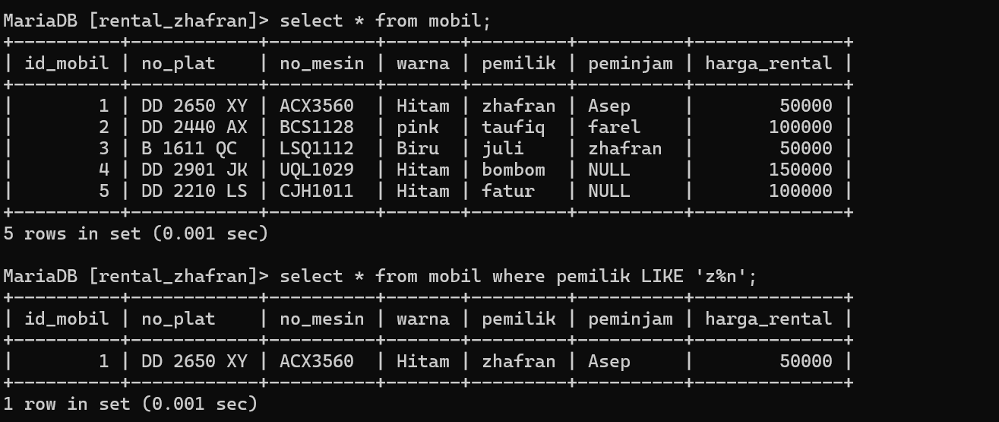
### analisis
- `select` Perintah ini digunakan untuk memilih semua kolom dari tabel yang ditentukan. Artinya, semua data dalam baris yang memenuhi syarat akan ditampilkan dalam hasil query.
- `FROM mobil` Bagian ini menentukan tabel `mobil` sebagai sumber data. Jadi, query ini akan mencari data dalam tabel `mobil`.
- `WHERE` digunakan untuk menyaring baris-baris dalam tabel berdasarkan kondisi yang ditentukan.
- `pemilik LIKE 'z%n'` menggunakan operator `LIKE` untuk memeriksa apakah nilai dalam kolom `pemilik` dimulai dengan huruf 'z', diikuti oleh nol atau lebih karakter, dan diakhiri dengan huruf 'n'. Simbol "%" digunakan sebagai wildcard yang cocok dengan nol atau lebih karakter di antara 'z' dan 'n'. Dengan demikian, kondisi ini akan mencocokkan semua nilai dalam kolom `pemilik` yang dimulai dengan huruf 'z', diikuti oleh nol atau lebih karakter, dan diakhiri dengan huruf 'n'.
### kesimpulan
Perintah SQL ini akan menghasilkan sekumpulan data yang berisi semua kolom dari tabel `mobil`, di mana nilai dalam kolom `pemilik` dimulai dengan huruf 'z', diikuti oleh nol atau lebih karakter lainnya, dan diakhiri dengan huruf 'n'. Jika ada baris yang memenuhi syarat tersebut, baris-baris tersebut akan muncul dalam hasil query dengan semua kolom yang tersedia dalam tabel `mobil`.

## Like (mencari total karakter)
### struktur query
```
select * from nama_tabel where data LIKE 'n';
```
### contoh query
```sql
select * from mobil where pemilik LIKE 'juli';
```
### hasil
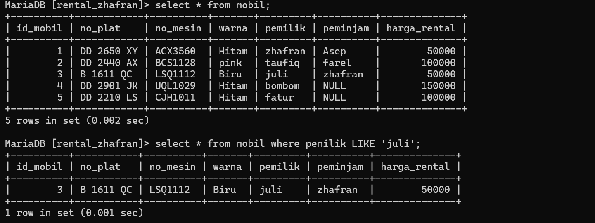
### analisis
- `SELECT *`: Memilih semua kolom dari tabel yang diinginkan.
- `FROM mobil`: Menunjukkan tabel yang akan diambil data.
- `WHERE pemilik LIKE 'juli'`: Menetapkan kriteria pencarian di mana nilai kolom "pemilik" cocok dengan kata "juli". Penggunaan kata kunci `LIKE` menunjukkan pencocokan pola, dan `juli` diikuti oleh tanda `%` akan mencocokkan semua nilai yang dimulai dengan "juli"
### kesimpulan
kode SQL ini adalah untuk mengambil semua baris dari tabel "mobil" di mana nama pemiliknya adalah 'juli'. Ini akan mengembalikan baris yang memiliki pemilik dengan nama 'juli' secara tepat, tanpa memperhitungkan karakter lain sebelum atau sesudahnya.

## Like (Kombinasi)
### struktur query
```
select * from nama_tabel where data LIKE '_%';
```
### contoh query
```sql
select * from mobil where pemilik LIKE 'fatur%';
```
### hasil
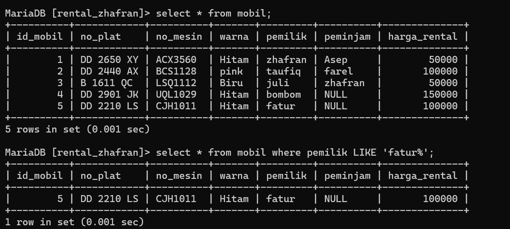
### analisis
- `SELECT *`: Memilih semua kolom dari tabel yang diinginkan.
- `FROM mobil`: Menunjukkan tabel yang akan diambil data.
- `WHERE pemilik LIKE 'fatur%'`: Menetapkan kriteria pencarian di mana nilai kolom "pemilik" dimulai dengan kata "fatur" dan diikuti oleh apa pun (tanda `%` menunjukkan wildcard untuk nol atau lebih karakter apa pun setelah "fatur").
### kesimpulan
kode SQL ini adalah untuk mengambil semua baris dari tabel "mobil" di mana nama pemiliknya dimulai dengan 'fatur'. Ini berguna jika Anda ingin mencari mobil yang dimiliki oleh seseorang dengan awalan 'fatur'.

# MATERI NOT LIKE
## Not Like
### struktur query
```
select * from nama_tabel where data NOT LIKE '_%';
```
### contoh query
```sql
select * from mobil where peminjam NOT LIKE 'A%';
```
### hasil
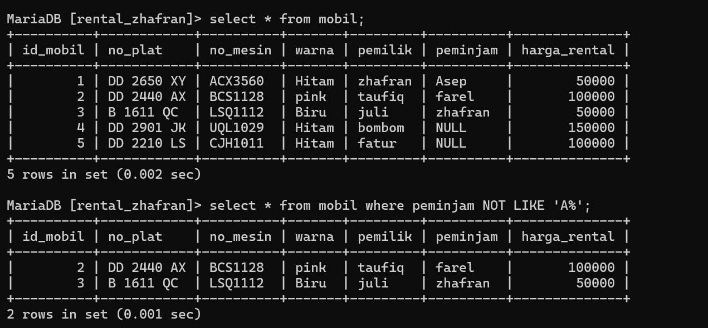
### analisis
-  `SELECT * FROM mobil`:  ini adalah klausa SELECT yang digunakan untuk memilih semua kolom dari tabel "mobil".
- `WHERE peminjam NOT LIKE 'A%'` Ini adalah klausa WHERE yang digunakan untuk menerapkan kondisi. Kondisi yang diterapkan di sini adalah "peminjam" tidak diawali dengan huruf 'A'. Operator LIKE digunakan untuk mencocokkan pola teks. '%A' adalah pola yang digunakan di sini. '%' adalah wildcard yang berarti nol atau lebih karakter apa pun, sehingga 'A%' akan mencocokkan nilai yang dimulai dengan 'A' diikuti oleh nol atau lebih karakter apa pun. Karena kita menggunakan NOT LIKE, itu akan mengembalikan baris di mana nilai pada kolom "peminjam" tidak dimulai dengan 'A'.
### kesimpulan
kode SQL ini adalah untuk mengambil semua baris dari tabel "mobil" di mana nilai kolom "peminjam" tidak dimulai dengan huruf 'A'. Ini berguna jika Anda ingin mencari mobil yang belum dipinjam oleh seseorang dengan awalan 'A'.

# Materi NULL & NOTNULL
## NULL
### struktur query
```
select * from nama_tabel where kolom_tabel IS NULL;
```
### contoh query
```sql
select * from mobil where peminjam IS NULL;
```
### hasil
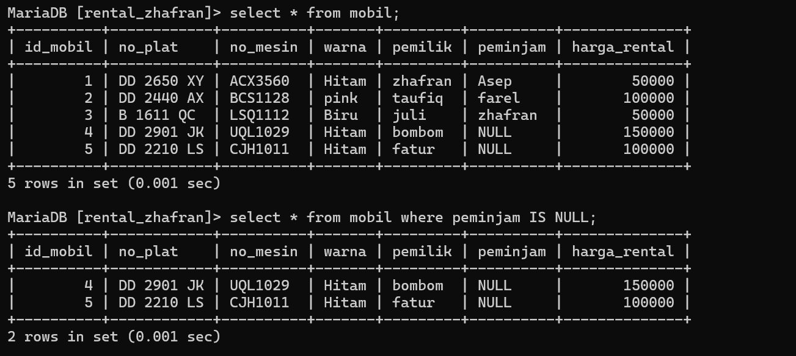
### analisis
- `SELECT * FROM mobil`: Ini adalah klausa SELECT yang digunakan untuk memilih semua kolom dari tabel "mobil".
- `WHERE peminjam IS NULL` Ini adalah klausa WHERE yang menerapkan kondisi. Kondisi yang diterapkan di sini adalah "peminjam" IS NULL, yang berarti hanya baris-baris di mana nilai pada kolom "peminjam" adalah NULL yang akan dipilih.
### kesimpulan
kode SQL ini adalah untuk mengambil semua baris dari tabel "mobil" di mana nilai kolom "peminjam" tidak diisi atau kosong. Ini berguna jika Anda ingin mencari mobil yang belum dipinjam oleh siapapun.

## NOT NULL
### struktur query
```
select * from nama_tabel where kolom_tabel IS NOT NULL;
```
### contoh query
```sql
select * from mobil where peminjam IS NOT NULL;
```
### hasil
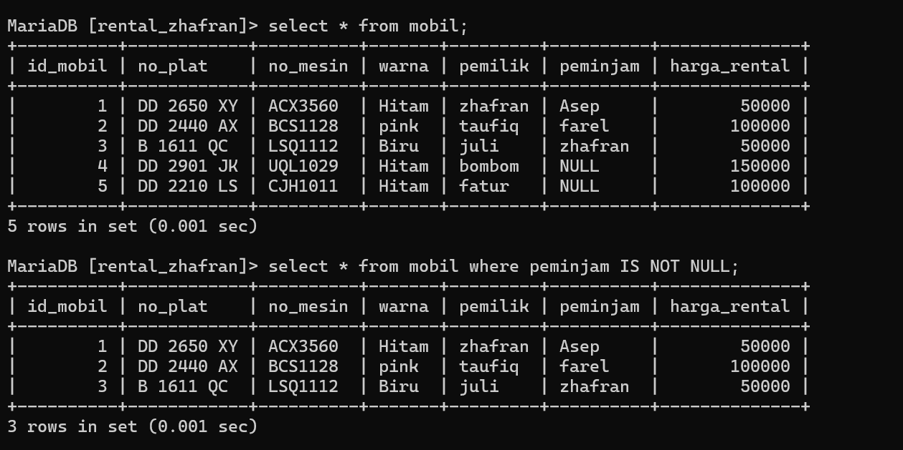
### analisis
- `SELECT * FROM mobil`: Ini adalah klausa SELECT yang digunakan untuk memilih semua kolom dari tabel "mobil".
- `WHERE peminjam IS NOT NULL`: Ini adalah klausa WHERE yang menerapkan kondisi. Kondisi yang diterapkan di sini adalah "peminjam" IS NOT NULL, yang berarti hanya baris-baris di mana nilai pada kolom "peminjam" tidak NULL yang akan dipilih.
### kesimpulan
kode SQL ini adalah bahwa kita ingin melihat data tentang mobil yang sedang dipinjamkan atau sedang digunakan, dan mungkin akan menggunakan informasi tersebut untuk pengelolaan inventaris atau analisis penggunaan mobil dalam suatu periode waktu tertentu.

---
# ORDER BY & Limit
### struktur query
```
select * from nama_tabel ORDER BY kolom_tabel ASC;
```
### contoh query
```sql
select * from mobil ORDER BY pemilik ASC
```
### hasil
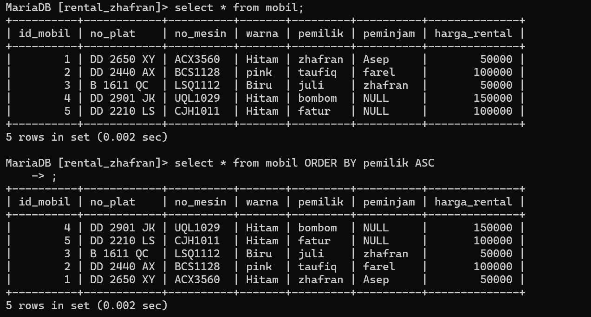
### analisis
- `SELECT * FROM mobil`: Ini adalah klausa SELECT yang digunakan untuk memilih semua kolom dari tabel "mobil".
- `ORDER BY pemilik ASC`: Ini adalah klausa ORDER BY yang digunakan untuk mengurutkan hasil berdasarkan kolom "pemilik" secara ascending (ASC). Ini berarti hasilnya akan disusun secara alfabetis berdasarkan nilai pada kolom "pemilik", dimulai dari nilai terkecil ke nilai terbesar.
### kesimpulan
kode SQL ini adalah bahwa kita ingin melihat data tentang mobil berdasarkan pemiliknya dan mengurutkannya secara alfabetis berdasarkan nama pemilik. Ini mungkin digunakan untuk melihat distribusi mobil antara berbagai pemilik atau untuk melakukan analisis berdasarkan kepemilikan mobil.

## Limit
### struktur query
```
SELECT * FROM nama_tabel WHERE nama_data = ”data” ORDER BY nama_data ASC LIMIT 2;
```
### contoh query
```sql
SELECT * FROM mobil WHERE warna = ”Hitam” ORDER BY harga_rental ASC LIMIT 2;
```
### hasil
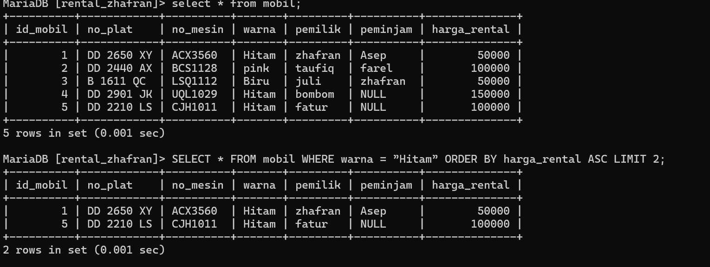
### analisis
- `SELECT * FROM mobil WHERE warna = 'Hitam'`: Ini adalah klausa SELECT yang digunakan untuk memilih semua kolom dari tabel "mobil" di mana nilai pada kolom "warna" adalah 'Hitam'.
- `ORDER BY harga_rental ASC`: Ini adalah klausa ORDER BY yang digunakan untuk mengurutkan hasil berdasarkan kolom "harga_rental" secara ascending (ASC). Ini berarti hasilnya akan disusun secara numerik dari harga rental terendah ke tertinggi.
- `LIMIT 2`: Ini adalah klausa LIMIT yang digunakan untuk membatasi jumlah baris hasil query menjadi hanya dua baris.
### kesimpulan
Query tersebut adalah sebuah perintah SQL yang digunakan untuk mengambil data dari tabel "mobil" dimana nilai kolom "warna" adalah "Hitam". Hasilnya akan diurutkan berdasarkan kolom "harga" secara menaik (ASC) dan hanya akan menampilkan 2 baris data pertama yang memenuhi kriteria tersebut.

---
# DISTINCT
### struktur query
```
Select DISTINCT (kolom_tabel) from nama_tabel;
```
### contoh query
```sql
select distinct (pemilik) from mobil;
```
### hasil
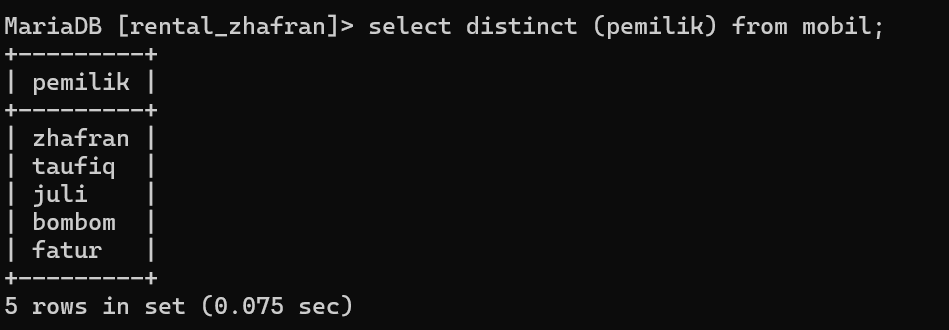
### analisis
- `SELECT`: Klausa ini digunakan untuk menentukan kolom yang akan diambil dari tabel.
- `DISTINCT`: Kata kunci ini digunakan untuk memastikan hanya nilai-nilai unik yang dipilih, menghilangkan duplikat.
- `(pemilik)`: Ini adalah kolom dari mana nilai-nilai unik akan diambil.
- `FROM mobil`: Klausa ini menentukan tabel dari mana data akan diambil.
### kesimpulan
Query ini akan menampilkan semua nama peminjam yang ada pada tabel mobil.

---
# Concat & Concat_WS,AS
# Menggabung kolom tanpa pemisah
### struktur query
```
SELECT CONCAT(data 1,data 2) FROM nama_tabel;
```
### contoh query
```sql
SELECT CONCAT(pemilik,warna) FROM mobil;
```
### hasil
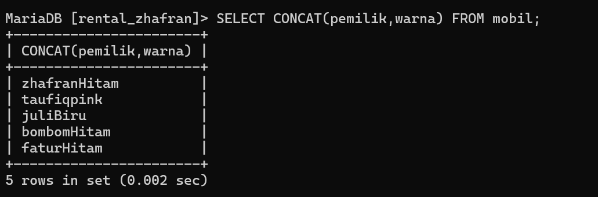
### analisis
- `SELECT`: Klausa ini digunakan untuk menentukan kolom atau ekspresi yang akan diambil dari tabel.
- `CONCAT(pemilik, warna)`: Fungsi `CONCAT` digunakan untuk menggabungkan dua atau lebih string. Dalam hal ini, menggabungkan nilai dari kolom `pemilik` dan `warna`.
- `FROM mobil`: Klausa ini menentukan tabel `mobil` dari mana data akan diambil.
### kesimpulan
Query ini digunakan untuk menggabungkan nilai-nilai dari kolom `pemilik` dan `warna` dalam tabel `mobil`.

## Menggabung kolom dengan pemisah (WS)
### struktur query
```
SELECT CONCAT_WS("-",data 1,data 2,data 3) FROM nama_tabel;
```
### contoh query
```sql
SELECT CONCAT_WS("-",no_plat,no_mesin,id_mobil) FROM mobil;
```
### hasil
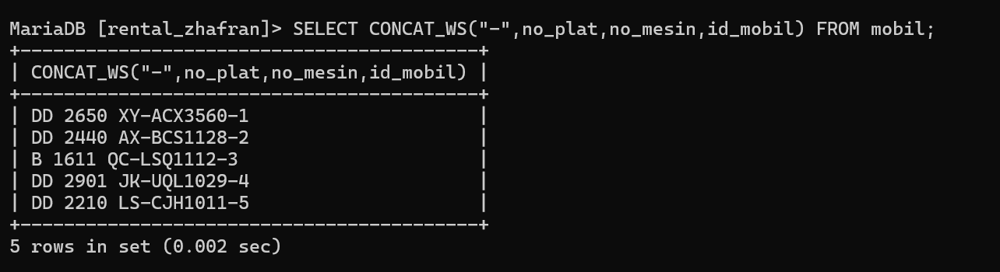
### analisis
- `SELECT`: Klausa ini digunakan untuk menentukan kolom atau ekspresi yang akan diambil dari tabel.
- `CONCAT_WS("-", no_plat, no_mesin, id_mobil)`: Fungsi `CONCAT_WS` (Concatenate With Separator) digunakan untuk menggabungkan dua atau lebih string dengan pemisah yang ditentukan. Dalam hal ini, pemisahnya adalah tanda hubung ("-").
- `FROM mobil`: Klausa ini menentukan tabel `mobil` dari mana data akan diambil.
### kesimpulan
Kesimpulannya Pada query ini, `SELECT CONCAT_WS("-", no_plat, no_mesin, id_mobil) FROM mobil;`, dilakukan seleksi data dari tabel "mobil" dengan menggabungkan antara kolom no_plat, no_mesin, dan id_mobil menggunakan pemisah - (dash).

# View
### struktur query
```
CREATE VIEW nama_tabel AS SELECT data 1, data 2, data 3,data 4 FROM mobil WHERE pemilik = "Ibrahim";
```
### contoh query
```sql
Create View list_mobil AS select id_mobil,no_plat,pemilik,peminjam from mobil where pemilik ="zhafran";
```
### hasil
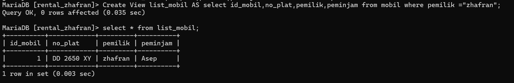
### analisis
- `CREATE VIEW list_mobil`: Ini adalah perintah untuk membuat sebuah view bernama `list_mobil`.
- `AS`: Digunakan untuk menentukan query yang akan digunakan untuk mendefinisikan isi dari view.
- `SELECT id_mobil, no_plat, pemilik, peminjam`: Mengambil kolom-kolom `id_mobil`, `no_plat`, `pemilik`, dan `peminjam` dari tabel `mobil`.
- `FROM mobil`: Menentukan bahwa data diambil dari tabel `mobil`.
- `WHERE pemilik = "zhafran"`: Menerapkan kondisi bahwa hanya baris-baris dengan nilai `pemilik` sama dengan "zhafran" yang akan dimasukkan ke dalam view.
### kesimpulan
Query ini membuat sebuah view bernama list_mobil yang menampilkan kolom-kolom id_mobil, no_plat, pemilik, dan peminjam dari tabel data_mobil dimana nilai kolom pemilik adalah "zhafran". Dengan membuat view ini, pengguna dapat dengan mudah melihat informasi mobil-mobil yang dimiliki oleh pemilik dengan nama "zhafran".

## Tantangan

1.Buatkan tabel virtual dan tampilkan datanya yang mana peminjamannya itu tidak ada (NULL).
### query
```sql
CREATE VIEW peminjam_NULL AS SELECT id_mobil,no_plat, peminjam, harga_rental FROM mobil WHERE peminjam IS NULL;
```
### hasil
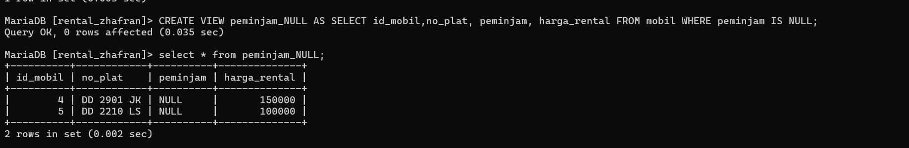

2.update atau ganti salah satu data peminjam dari tabel mobil dengan nilai NULL, tampilkan isi data pada tabel
### query
```sql
Update mobil SET peminjam=NULL WHERE id_mobil=3;
```
### hasil
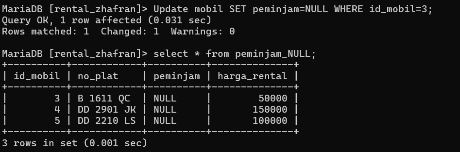

3.Berikan Kesimpulan mengapa tabel virtual ini dibuat
Tabel Virtual ini dibuat untuk menyediakan informasi tentang mobil yang saat ini tidak dipinjam (peminjamnya NULL), sehingga memudahkan pengelolaan dan pelacakan mobil yang tersedia untuk disewakan. Dengan demikian, orang dapat dengan mudah melihat daftar mobil yang tersedia untuk disewa tanpa harus memeriksa satu per satu dalam database.

---

# AGRESI
## SUM

### struktur query
```
SELECT SUM(nama_kolom) AS total FROM nama_tabel
WHERE kondisi_opsional;
```
### contoh query
```sql
SELECT SUM(harga_rental) AS total FROM mobil;
```
### Hasil
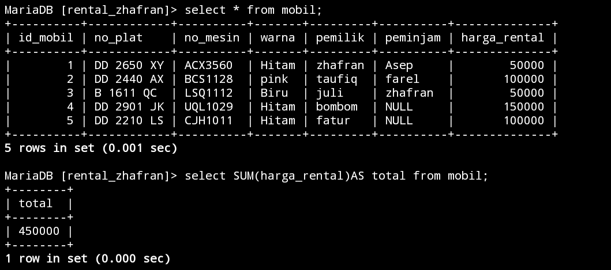
### Analisis
- SELECT SUM(harga_rental): Ini adalah bagian dari pernyataan SELECT yang mengambil nilai total dari kolom harga_rental. SUM digunakan untuk menjumlahkan nilai-nilai dalam kolom tertentu.
- FROM mobil: Ini menunjukkan bahwa tabel yang digunakan dalam query ini adalah mobil. Anda mengambil nilai dari kolom harga_rental di dalam tabel ini.
### Kesimpulan
Query ini menghitung jumlah total harga sewa dari semua mobil yang terdaftar dalam tabel `mobil`. Dengan menggunakan fungsi agregat `SUM()`, perhitungan jumlah menjadi sederhana dan efisien.

---
## COUNT
### struktur query
```
SELECT COUNT(*)AS jumlah FROM nama_tabel WHERE kondisi_opsional
```
### contoh query
```sql
select COUNT(pemilik) from mobil;
```
### Hasil
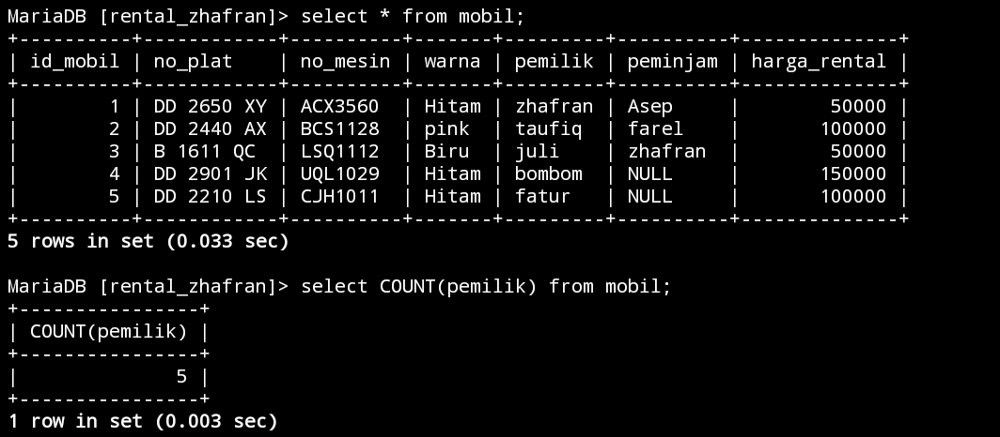
### Analisis
SELECT COUNT(pemilik) adalah nama kolomnya FROM mobil; adalah nama tabelnya, perintah ini akan menghitung jumlah baris dalam tabel mobil di mana kolom pemilikmemiliki nilai yang tidak NULL. Ini akan memberikan jumlah total entitas mobil yang memiliki nilai yang valid dalam kolom pemilik. jika tabel mobil berisi lima baris dan hanya tiga baris memiliki nilai yang tidak null dalam kolom pemilik, maka perintah ini akan hanya menampilkan nilai yang tidak NULL.
### Kesimpulan
Kesimpulannya, ketika kita mau menghitung jumlah peminjam yang ada di tabel mobil yang memiliki nilai yang valid (NULL) dan sebaliknya tidak akan menampilkan nilai yang tidak valid (NOT NULL)

---
## MIN
### struktur query
```
SELECT MIN(nama_kolom) AS nilai_minimum FROM nama_tabel WHERE kondisi_opsional;
```
### contoh query
```sql
select MIN(harga_rental) AS minimal from mobil;
```
### Hasil
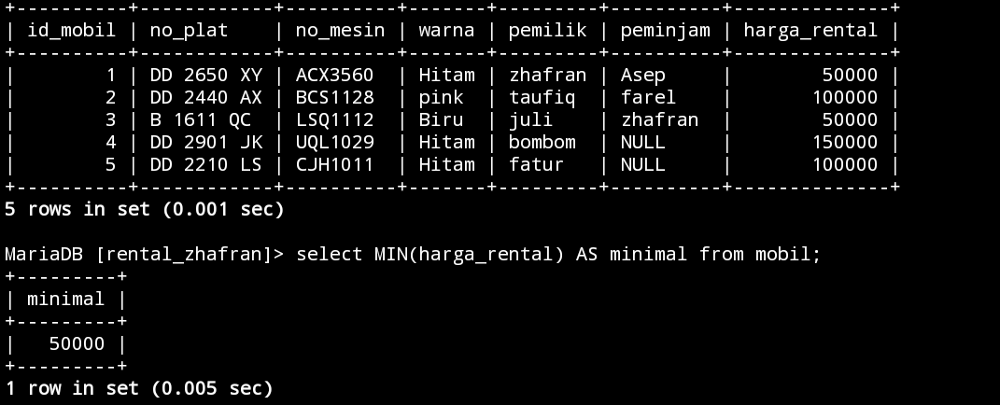
### Analisis
SELECT MIN(harga_rental) ini nama kolom yang akan di tampilkan AS MINIMAL FROM mobil; nama tabelnya, ini akan mengambil nilai terkecil dari kolom harga_rental dalam tabel mobil dan memberikan hasilnya dengan nama kolom MINIMAL.disini hasilnya yang tampil adalah 5000 karena 5000 adalah nilai yang paling rendah dari nilai lainnya.
### Kesimpulan
MIN ini akan menampilkan nilai yang paling rendah dalam sebuah kolom dari sebuah tabel.

---
## MAX
### struktur query
```
SELECT MAX(nama_kolom) AS nilai_maksimum FROM nama tabel
WHERE kondisi_opsional;
```
### contoh query
```sql
select MAX(harga_rental) AS minimal from mobil;
```
### Hasil
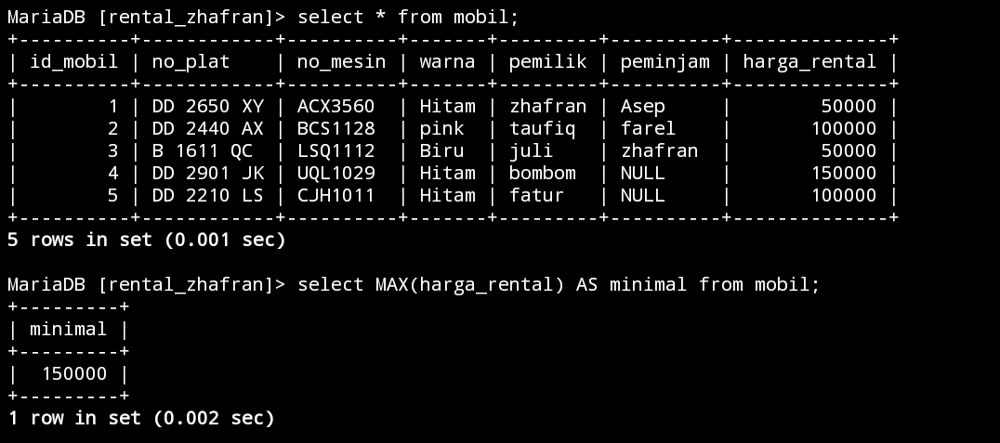
### Analisis
SELECT MAX (harga_rental) ini nama kolom yang akan di tampilkan AS MAXIMAL FROM mobil; nama tabelnya, ini akan mengambil nilai terkecil dari kolom harga_rental dalam tabel mobil dan memberikan hasilnya dengan nama kolom MINIMAL.disini hasilnya yang tampil adalah 15000 karena 15000 adalah nilai yang paling rendah dari nilai lainnya.
### Kesimpulan
MAX ini akan menampilkan nilai yang paling tinggi dalam sebuah kolom dari sebuah tabel.

---
## AVG
### struktur query
```
SELECT AVG(nama_kolom) AS rata_rata FROM nama_tabel
WHERE kondisi_opsional;

```
### contoh query
```sql
select AVG(harga_rental) AS RATA_RATA from mobil;
```
### Hasil
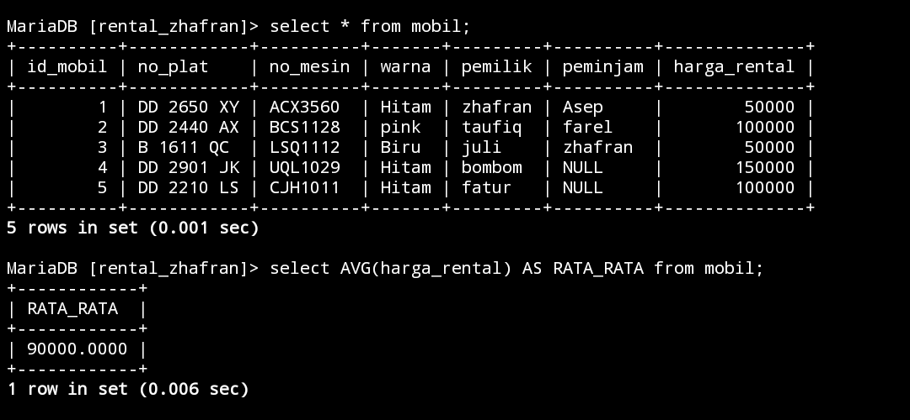
### Analisis
Select AVG (harga_rental) adalah nama kolom yang akan dihitung rata-rata harga rentalnya.Dengan menggunakan AVG kita dapat menghasilkan rata-rata harga rental mobil dari tabel mobil. Perintah SELECT AVG(harga_rental) menghitung nilai rata-rata dari kolom harga_rental. Hasil dari query ini akan memberikan rata-rata harga rental mobil di tabel mobil.hasil dari rata-rata harga mobil adalah 90000.0000.
### Kesimpulan
Kesimpulannya,akan menampilkan hasil dari rata-rata harga mobil pada kolom harga_rental.

---


