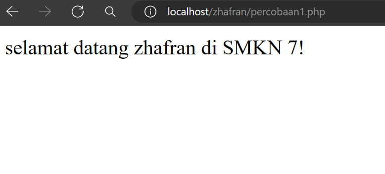
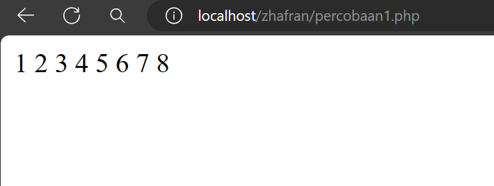

# Web Dinamis
Web dinamis adalah jenis situs web yang menghasilkan konten secara dinamis, berbeda dengan situs web statis yang menampilkan konten yang sama untuk semua pengguna. Situs web dinamis menggunakan bahasa pemrograman server-side seperti PHP, Python, atau Ruby untuk menghasilkan konten yang disesuaikan dengan permintaan pengguna atau kondisi tertentu.

Keuntungan utama dari situs web dinamis adalah kemampuan untuk menyesuaikan konten dengan pengguna atau kondisi tertentu, seperti informasi pengguna yang masuk atau waktu lokal pengguna. Ini memungkinkan untuk pembuatan aplikasi web yang lebih interaktif dan responsif.
# Percobaan pertama PHP
```php
<?php 
//dibawah ini berfungsi untuk menampilkan
/*
ini
komentar
multi baris
*/


$meja = 30;
$tk_kelas = "XI";
$ketua_kelas = "july";
$wali_kelas = "saleh";
$ketua_gang = "bombom";
const KEPSEK = "HERWELISS";
define('kelas', 'RPL 1');
echo 'jumlah meja di kelas: ' .$meja. ' buah';
echo "<br>";
echo "sholat dlu, nabilang pak $ketua_kelas dan pak $wali_kelas";
echo "<br>";
echo "kalo tidak, diracca sama ketua gang na $ketua_gang";
echo "<br>";
echo 'Kepseknya ' . KEPSEK;
echo "<br>";
echo "kelasnya ". $tk_kelas . ' ' . kelas;
?>
```
# PHP Dasar
# Echo & Komentar
`echo` adalah perintah yang digunakan untuk menampilkan teks atau nilai dari ekspresi tertentu ke dalam halaman web atau output PHP lainnya. Ini sangat berguna untuk menampilkan pesan, variabel, atau hasil operasi matematika langsung ke pengguna.

```php
$nama = "Zhafran";
  echo "Halo, " . $nama . "!";
```


"komentar' digunakan untuk menambahkan catatan atau penjelasan di dalam kode PHP. Komentar ini tidak akan dieksekusi oleh server web, sehingga mereka tidak mempengaruhi keluaran yang dihasilkan oleh skrip PHP.

```php
 $nama = "Zhafran";
  echo "Halo, " . $nama . "!"; //ini adalah contoh komentar
```
# Variabel & Konstanta
Variabel dalam PHP digunakan untuk menyimpan dan memanipulasi data. Di PHP, variabel dapat dideklarasikan dengan menggunakan tanda dollar ($) diikuti dengan nama variabelnya.

```php
$meja = 30;
$tk_kelas = "XI";
$ketua_kelas = "july";
$wali_kelas = "saleh";
$ketua_gang = "bombom";
```

"konstanta" adalah nilai yang tidak berubah sepanjang waktu eksekusi skrip. Mereka mirip dengan variabel, tetapi nilainya tidak dapat diubah setelah dideklarasikan sekali. Konstanta biasanya digunakan untuk menyimpan nilai-nilai yang tidak boleh berubah, seperti nilai-nilai konfigurasi, konstanta matematis, atau pengaturan aplikasi yang penting.

```php
const KEPSEK = "HERWELISS";
define('kelas', 'RPL 1');
```

---
# Operator
## Aritmatika

### Penjelasan
- Program ini menggunakan operator aritmatika dasar seperti penjumlahan, pengurangan, perkalian, pembagian, sisa bagi, dan pangkat.
- Nilai $a dan $b diinisialisasi dengan nilai masing-masing.
- Kemudian, operasi aritmatika dilakukan menggunakan operator yang sesuai.
- Hasil dari setiap operasi ditampilkan ke layar.
### Struktur
```php
<?php
// Program Operator Aritmatika dalam PHP
// 1. Inisialisasi Variabel Input
$a = 200;
$b = 25;
// 2. Operasi Aritmatika
$penjumlahan = $a + $b;
$pengurangan = $a - $b;
$perkalian = $a * $b;
$pembagian = $a / $b;
$sisa_bagi = $a % $b;
$pangkat = $a ** $b;
// 3. Output Hasil
echo "Hasil Penjumlahan: " . $penjumlahan . "\n";
echo "Hasil Pengurangan: " . $pengurangan . "\n";
echo "Hasil Perkalian: " . $perkalian . "\n";
echo "Hasil Pembagian: " . $pembagian . "\n";
echo "Sisa Bagi: " . $sisa_bagi . "\n";
echo "Hasil Pangkat: " . $pangkat . "\n";
?>
```
### Program
```php
$a = 200;
$b = 25;
$penjumlahan = $a + $b;
$pengurangan = $a - $b;
$perkalian = $a * $b;
$pembagian = $a / $b;
$sisa_bagi = $a % $b;
$pangkat = $a ** $b;
echo "Hasil Penjumlahan: " . $penjumlahan . "\n";
echo "Hasil Pengurangan: " . $pengurangan . "\n";
echo "Hasil Perkalian: " . $perkalian . "\n";
echo "Hasil Pembagian: " . $pembagian . "\n";
echo "Sisa Bagi: " . $sisa_bagi . "\n";
echo "Hasil Pangkat: " . $pangkat . "\n";
?>

```
### Hasil

### Analisis
- Program ini sangat sederhana dan hanya menggunakan operator aritmatika dasar.
- Input nilai $a dan $b dapat diubah sesuai kebutuhan.
- Operasi aritmatika dilakukan secara berurutan dengan operator yang sesuai.
- Tidak ada penanganan kesalahan (error handling) atau validasi input dalam program ini.
- Output ditampilkan langsung ke layar tanpa penyisipan pesan atau format tambahan.
### Kesimpulan Program
- Program ini merupakan contoh sederhana dari penggunaan operator aritmatika dalam PHP.
- Meskipun sederhana, program ini mencakup operasi dasar seperti penjumlahan, pengurangan, perkalian, dan lain-lain, yang merupakan fondasi bagi pemrograman komputer.
- Kekurangan dari program ini adalah kurangnya penanganan kesalahan dan validasi input, yang dapat menyebabkan program gagal jika input tidak sesuai.
- Program ini dapat dijadikan sebagai dasar untuk memahami cara menggunakan operator aritmatika dalam PHP dan dapat diperluas dengan penanganan kesalahan atau validasi input sesuai kebutuhan.

---
## Perbandingan
### Penjelasan
perbandingan adalah operasi yang digunakan untuk membandingkan dua nilai. Perbandingan ini bisa dilakukan dengan berbagai operator perbandingan yang tersedia dalam bahasa pemrograman PHP
### Struktur
```php
$a = 5;

$b = 10;
// 2. Fungsi untuk membandingkan dua angka

function compare($x, $y) {

// 3. Logika perbandingan

 if ($x > $y) {
   return "$x lebih besar dari $y";
    } elseif ($x < $y) {
     return "$x lebih kecil dari $y";
    } else {
   return "$x sama dengan $y";}
}
// 4. Pemanggilan fungsi dan output
echo compare($a, $b);


```
### Program
```php
$a = 5;
$b = 10;
function compare($x, $y) {
    if ($x > $y) {
        return "$x lebih besar dari $y";
    } elseif ($x < $y) {
        return "$x lebih kecil dari $y";
    } else {
        return "$x sama dengan $y";
    }
}
echo compare($a, $b);

```
### Hasil

### Analisis
- Dua variabel $a dan $b dideklarasikan dengan nilai 5 dan 10.
Variabel ini digunakan untuk menyimpan nilai yang akan dibandingkan.
- Fungsi compare:
Fungsi ini menerima dua parameter, $x dan $y, yang mewakili nilai yang akan dibandingkan.
- Fungsi ini mengandung logika perbandingan menggunakan operator perbandingan:
untuk memeriksa apakah $x lebih besar dari $y.
< untuk memeriksa apakah $x lebih kecil dari $y.
== untuk memeriksa apakah $x sama dengan $y.
Fungsi mengembalikan string yang menggambarkan hasil perbandingan.
- Pemanggilan Fungsi dan Output:
Fungsi compare dipanggil dengan parameter $a dan $b.
Hasil dari fungsi compare ditampilkan menggunakan echo.
### Kesimpulan Program
- Deklarasi variabel untuk menyimpan nilai yang akan dibandingkan.
- Definisi fungsi yang mengandung logika perbandingan.
- Pemanggilan fungsi tersebut dan penampilan hasilnya
---
## Logika
### Penjelasan
Operator logika digunakan untuk menggabungkan atau memanipulasi hasil dari pernyataan-pernyataan logis. Beberapa operator logika yang umum digunakan dalam PHP adalah:
- && (AND): Operator AND menghasilkan nilai true jika kedua pernyataan logis yang diberikan benar, dan false jika salah satu atau kedua pernyataan tersebut salah.
- || (OR): Operator OR menghasilkan nilai true jika salah satu dari kedua pernyataan logis yang diberikan benar, dan false hanya jika kedua pernyataan tersebut salah.
- ! (NOT): Operator NOT digunakan untuk membalikkan nilai dari sebuah pernyataan logis. Jika suatu pernyataan logis bernilai true, operator NOT akan mengubahnya menjadi false, dan sebaliknya.
### Struktur
```php
<?php
// 1. Inisialisasi Variabel
$umur = 25;
$status = "mahasiswa";

// 2. Pernyataan Logika dan Pernyataan Pengkondisian
if ($umur >= 18 && $status == "mahasiswa") {
    // Blok kode yang akan dieksekusi jika kedua kondisi terpenuhi
    echo "Anda adalah mahasiswa dewasa.";
} elseif ($umur < 18 || $status != "mahasiswa") {
    // Blok kode yang akan dieksekusi jika salah satu dari kondisi tersebut tidak terpenuhi
    echo "Anda bukan mahasiswa dewasa.";
}

// 3. Pesan Output (Opsional)
?>

```
### Program
```php
$umur = 20;
$status = "ANAK";
if ($umur >= 18 && $status == "ANAK") {
    echo "Anda adalah ANAK dewasa.";
} elseif ($umur < 18 || $status != "ANAK") {
    echo "Anda bukan ANAK dewasa.";
}

```
### Hasil

### Analisis
- Program di atas mengevaluasi dua kondisi: apakah seseorang berumur 18 tahun atau lebih, dan apakah statusnya adalah "mahasiswa".
- Jika kedua kondisi tersebut terpenuhi (umur lebih dari atau sama dengan 18 dan status adalah "mahasiswa"), pesan "Anda adalah mahasiswa dewasa." akan ditampilkan.
- Jika salah satu dari dua kondisi tersebut tidak terpenuhi (umur kurang dari 18 atau status bukan "mahasiswa"), pesan "Anda bukan mahasiswa dewasa." yang akan ditampilkan
### Kesimpulan Program
Program ini mengilustrasikan penggunaan operator logika dalam PHP untuk mengevaluasi kondisi-kondisi yang kompleks. Dengan menggunakan operator logika, kita dapat membuat pernyataan-pernyataan logis yang kompleks untuk membuat keputusan berdasarkan pada berbagai kondisi.

---
# Conditional Statement
## IF
### Penjelasan
`if` digunakan untuk mengontrol alur eksekusi program berdasarkan suatu kondisi. Ini memungkinkan program untuk melakukan tindakan yang berbeda tergantung pada apakah kondisi yang ditentukan benar atau salah.
### Struktur
```php
if (ekspresi) {
 // kode yang akan dieksekusi jika kondisi benar
}
```
### Program
```php
$nama = "zhafran";
  if ($nama == "zhafran") {
    echo "selamat datang zhafran di SMKN 7!";
  }
```
### Hasil

### Analisis
-  Variabel `$nama` dideklarasikan dan diisi dengan nilai string "zhafran".
-  Kondisi `if` dicek apakah nilai `$nama` sama dengan "zhafran". Kondisi ini menggunakan operator `==` untuk membandingkan nilai.
-  Jika kondisi `if` benar, maka blok kode yang terkait dengan `if` akan dieksekusi. Dalam kasus ini, blok kode tersebut menghasilkan output "selamat datang zhafran di SMKN 7!".
-  Karena nilai `$nama` adalah "zhafran" dan kondisi `if` (`$nama == "zhafran"`) benar, maka output yang dihasilkan adalah "selamat datang zhafran di SMKN 7!". 
### Kesimpulan Program
Program tersebut adalah contoh sederhana dari penggunaan struktur pengendalian `if` dalam bahasa pemrograman PHP. Tujuannya adalah untuk mengevaluasi apakah nilai dari variabel `$nama` sama dengan string "zhafran". Jika benar, maka program akan mencetak pesan "selamat datang zhafran di SMKN 7!". Kesimpulannya, program ini adalah contoh sederhana dari penggunaan kondisional dalam pemrograman untuk melakukan tindakan berdasarkan kondisi tertentu.

## IF-ELSE
### penjelasan
`if else` adalah struktur kendali yang digunakan untuk membuat keputusan berdasarkan kondisi tertentu. Ini memungkinkan program untuk melakukan tindakan berbeda tergantung pada apakah kondisi yang diberikan dinilai benar atau salah.
### struktur
```php
if (kondisi) { 
 // kode yang akan dieksekusi jika kondisi benar 
 }
else { 
  // kode yang akan dieksekusi jika kondisi salah 
  }
```
### program
```php
$a = 5; 
if ($a > 10) { 
echo "Nilai $a lebih besar dari 10"; 
} 
else { 
echo "Nilai $a kurang dari atau sama dengan 10"; 
} 
```
### hasil

### analisis
- **Variabel**: Program ini menggunakan variabel `$a` yang diinisialisasi dengan nilai 5.
- Kondisi If-Else: Program ini menggunakan struktur kontrol `if-else` untuk membandingkan nilai variabel `$a` dengan 10.
- Kondisi If: Kondisi `if` dalam program ini memeriksa apakah nilai `$a` lebih besar dari 10. Karena nilai `$a` adalah 5, maka kondisi ini tidak dipenuhi.
- Kondisi Else: Kondisi `else` dalam program ini dipenuhi karena kondisi `if` tidak dipenuhi. Program ini akan menampilkan pesan "Nilai $a kurang dari atau sama dengan 10".
- Output: Program ini akan menampilkan output "Nilai `$a` kurang dari atau sama dengan 10" karena nilai `$a` adalah 5 yang kurang dari 10`.
### kesimpulan program
- Program ini menggunakan variabel `$a` yang diinisialisasi dengan nilai 5.
- Program ini menggunakan struktur kontrol `if-else` untuk membandingkan nilai variabel `$a` dengan 10.
- Karena nilai `$a` adalah 5, maka kondisi `if` tidak dipenuhi dan program akan menampilkan pesan "Nilai `$a` kurang dari atau sama dengan 10".
- Output program ini adalah "Nilai `$a` kurang dari atau sama dengan 10".
## IF-ELSEIF-ELSE
### Penjelasan
IF-ELSEIF-ELSE dalam PHP adalah struktur logika yang digunakan untuk mengeksekusi beberapa blok kode yang berbeda tergantung pada kondisi yang diberikan.
### Struktur
```php
if (kondisi1) {
    // blok kode yang dieksekusi jika kondisi1 terpenuhi
} 
elseif (kondisi2) {
    // blok kode yang dieksekusi jika kondisi2 terpenuhi
} 
else {
    // blok kode yang dieksekusi jika tidak ada kondisi yang terpenuhi
}

```
### Program
```php
$a = 15; 
$b = 8; 
 if ($a > $b) { 
 echo "a lebih besar daripada b"; 
 } 
 elseif ($a == $b) { 
 echo "a sama besar dengan b"; 
 } 
 else { echo "a lebih kecil daripada b"; 
 }
```
### Hasil

### Analisis
- Variabel : Program ini menggunakan dua variabel `$a` dan `$b` yang diinisialisasi dengan nilai 15 dan 8 secara terpisah.
- Kondisi If-Elseif-Else : Program ini menggunakan struktur kontrol `if-elseif-else` untuk membandingkan nilai variabel `$a` dan `$b`.
-  Kondisi If : Kondisi `if` dalam program ini memeriksa apakah nilai `$a` lebih besar dari `$b`. Karena nilai `$a` adalah 15 dan `$b` adalah 8, maka kondisi ini bernilai TRUE.
- Output : Program ini akan menampilkan output "a lebih besar daripada b" karena nilai `$a` lebih besar dari `$b`.
- Kondisi Elseif : Kondisi `elseif` dalam program ini tidak dipenuhi karena kondisi `if` sudah bernilai TRUE.
- Kondisi Else : Kondisi `else` dalam program ini tidak dipenuhi karena kondisi `if` dan `elseif` sudah bernilai TRUE.
### Kesimpulan Program
Kesimpulan dari program ini adalah memberikan pesan yang sesuai berdasarkan perbandingan antara nilai variabel `$a` dan `$b`. Dalam kasus ini, karena nilai `$a` (15) lebih besar dari nilai `$b` (8), maka pesan "a lebih besar daripada b" akan ditampilkan.
## SWITCH CASE
### Penjelasan
`switch case` adalah struktur kontrol yang memungkinkan Anda mengevaluasi ekspresi dan menjalankan blok kode tertentu berdasarkan nilai ekspresi tersebut. Ini berguna ketika Anda memiliki banyak kondisi yang mungkin dan ingin mengeksekusi blok kode yang berbeda untuk setiap kondisi tersebut.
### Struktur
```php
switch (ekspresi) {
  case nilai1:
    // blok kode yang akan dijalankan jika ekspresi sama dengan nilai1
    break;
  case nilai2:
    // blok kode yang akan dijalankan jika ekspresi sama dengan nilai2
    break;
  // case lainnya...
  default:
    // blok kode yang akan dijalankan jika tidak ada case yang cocok
}

```
### Program
```php
$hobi = 1;
switch ($hobi) {
 case 1:
  echo "futsal";
    break;
    
 case 2:
  echo "bulu tangkis";
    break;

 case 3:
  echo "basket";
   break;
   
 default:
 echo "tidak valid";
}
```
### Hasil
### Analisis
- Variabel `$hobi` diinisialisasi dengan nilai 1.
- Struktur switch-case memeriksa nilai dari variabel `$hobi`.
- jika nilai `$hobi` adalah 1, maka blok kode di dalam case 1 akan dieksekusi. Dalam hal ini, program akan mencetak "futsal" menggunakan perintah `echo`.
- Setelah mencetak "futsal", perintah `break` digunakan untuk keluar dari struktur switch-case, sehingga program tidak akan mengeksekusi blok kode di case-case berikutnya.
- jika nilai `$hobi` adalah 2 atau 3, maka blok kode di dalam case-case tersebut akan diabaikan, karena tidak ada yang cocok dengan nilai `$hobi`.
- jika nilai `$hobi` tidak cocok dengan nilai dalam case-case yang ada, maka blok kode di dalam default akan dieksekusi. Dalam hal ini, program akan mencetak "tidak valid" karena tidak ada nilai yang cocok dengan case-case yang telah didefinisikan.
### Kesimpulan Program
Program ini merupakan contoh penggunaan struktur switch-case dalam bahasa pemrograman PHP untuk memeriksa nilai dari suatu variabel dan menjalankan blok kode yang sesuai dengan nilai tersebut. Dalam kasus ini, variabel yang diperiksa adalah `$hobi`, yang diinisialisasi dengan nilai 1. Program akan mencetak "futsal" karena nilai `$hobi` sesuai dengan case 1. Jika nilai `$hobi` tidak sesuai dengan nilai yang telah ditentukan dalam case-case, maka program akan mencetak "tidak valid" melalui blok kode default. Kesimpulannya, program ini memberikan contoh sederhana penggunaan switch-case untuk pengambilan keputusan berdasarkan nilai variabel yang diberikan.

---
# Array
## Array 1 dimensi
### Penjelasan
array satu dimensi adalah kumpulan nilai yang disusun dalam satu baris. Setiap nilai dalam array memiliki indeks numerik yang dimulai dari nol. Ini memungkinkan Anda untuk menyimpan beberapa nilai dalam satu variabel dan mengaksesnya dengan mudah menggunakan indeksnya.
### Struktur
```php
$namaArray = array(nilai1, nilai2, nilai3, ...)
```
### Program
```php
$a = ['honda','yamaha','suzuki'] ;
 echo $a [0]
```
### Hasil

### Analisis
- `$a = ['honda','yamaha','suzuki'];`: Baris ini mendeklarasikan sebuah array dengan nama `$a` yang memiliki tiga elemen string: 'honda', 'yamaha', dan 'suzuki'. Ini adalah sintaks untuk mendeklarasikan dan menginisialisasi sebuah array di PHP.
- Ketika kode dieksekusi, PHP akan mencari elemen dengan indeks `0` dalam array `$a`.
- Elemen dengan indeks `0` adalah `'honda'`.
- `echo` akan mencetak `'honda'` ke layar/output.
### Kesimpulan Program
- Kode tersebut dengan benar mendeklarasikan sebuah array dan mengakses elemen pertama dari array tersebut. Saat kode dieksekusi, output yang dihasilkan adalah `honda`.
## Array Asosiatif
### Penjelasan
array asosiatif adalah tipe array yang menggunakan kunci sebagai referensi untuk setiap nilai yang disimpan. Ini memungkinkan Anda untuk mengakses nilai berdasarkan kunci tertentu, bukan hanya menggunakan indeks numerik seperti dalam array biasa.
### Struktur
```php
$namaArray = array(
 "kunci1" => nilai1,
 "kunci2" => nilai1,
 "kunci3" => nilai1,
);
```
### Program
```php

$a = [
 'indonesia' => 'nasi padang',
 'malaysia' => 'nasi lemak',
 'amerika' => 'steak',
 'korea' => 'kimchi',
 ];
echo "makanan khas " . $a['amerika'];
```
### Hasil

### Analisis
- Kunci (key) adalah nama negara seperti 'indonesia', 'malaysia', 'amerika', dan 'korea'.
- Nilai (value) adalah makanan khas dari masing-masing negara tersebut.
- Perintah mengakses elemen dengan kunci `'amerika'` dari array `$a`.
- `echo` digunakan untuk mencetak string gabungan dari "makanan khas " dan nilai dari elemen array yang diakses, yaitu `'steak'`.
### Kesimpulan Program
Kode PHP yang Anda berikan adalah contoh yang benar dan efisien dari penggunaan array asosiatif untuk menyimpan dan mengakses data. Berikut adalah
## Array Multidimensi 
### Penjelasan
Array multidimensi dalam PHP adalah struktur data yang dapat menyimpan beberapa array lain didalamnya, sehingga memungkinkan pengaksesan elemen-elemen dengan menggunakan dua indeks: baris dan kolom. Array multidimensi ini sangat berguna ketika diperlukan untuk mengorganisasi dan mengakses data yang kompleks dan memiliki struktur hierarkis.
### Struktur
```php
$namaArray = array(
  array(nilai1, nilai2, nilai3,...),
  array(nilai4, nilai5, nilai6,...),
  ...
)
```
### Program
```php
$angka = array(
    array(1, 2, 3),
    array(4, 5, 6),
    array(7, 8, 9)
);

echo "angka:<br>";
foreach ($angka as $baris) {
    foreach ($baris as $nilai) {
        echo $nilai . " ";
    }
    echo "<br>";
}

```
### Hasil

### Analisis
- Variabel $matriks adalah variabel yang menyimpan array multidimensi.
- Setiap elemen array dalam $matriks adalah array sendiri yang merepresentasikan baris dalam matriks.
### Kesimpulan Program
Array multidimensi di PHP memungkinkan kita untuk menyimpan data dalam struktur data yang lebih kompleks seperti matriks atau tabel.
# Var_dump
## penjelasan
- Fungsi var_dump mengambil satu atau lebih variabel sebagai argumen dan mencetak informasi tentang tipe dan nilai dari setiap variabel tersebut.
- Informasi yang dicetak mencakup tipe data (misalnya, integer, string, array), panjang (jika berlaku), dan nilai variabel.
## struktur
```php
// 1. Inisialisasi Variabel
$angka = ;
$kata = " ";
$array = array(1, 2, 3);

// 2. Pemanggilan var_dump
var_dump($angka);
var_dump($kata);
var_dump($array);

// 3. Pesan Output (Opsional)
echo "Ini adalah contoh penggunaan var_dump";

```
## program
```php
<?php
$angka = 10;
$kata = "Hello";
$array = array(1, 2, 3);

var_dump($angka);
var_dump($kata);
var_dump($array);
echo "Ini adalah contoh penggunaan var_dump";
?>

```
## hasil
## analisis
## kesimpulan
# Looping (Perulangan)

## For
### Penjelasan
"for" digunakan untuk membuat sebuah perulangan (loop). Ini memungkinkan Anda untuk menjalankan serangkaian pernyataan secara berulang berdasarkan kondisi tertentu.
### Struktur
```php
for (inisialisasi; kondisi; perubahan) {
  // kode yang akan diulang
}

```
### Program
```php
for ($i = 1; $i <= 8; $i++) {
  echo $i . " ";
}
```
### Hasil

### Analisis
- Inisialisasi: Variabel `$i` diinisialisasi dengan nilai 1.
- Kondisi: Loop akan terus berjalan selama nilai `$i` kurang dari atau sama dengan 8.
- Perubahan: Setiap kali loop selesai dieksekusi, nilai `$i` akan ditambah satu.
- Hasilnya akan mencetak angka 1 sampai 8, dipisahkan oleh spasi.
### Kesimpulan Program
Program menggunakan perulangan "for" dalam PHP untuk mencetak angka dari 1 hingga 8 ke layar. Variabel `$i` diinisialisasi dengan nilai 1, dan loop akan terus berjalan selama nilai `$i` kurang dari atau sama dengan 8. Setiap iterasi loop, nilai `$i` akan ditambah satu. Hasilnya adalah pencetakan angka 1 sampai 5 ke layar, dipisahkan oleh spasi.
## While 
### Penjelasan
"while" adalah salah satu jenis struktur kontrol yang digunakan untuk melakukan iterasi atau perulangan berdasarkan kondisi tertentu. Struktur while mengevaluasi ekspresi logika dan menjalankan blok kode selama ekspresi tersebut menghasilkan nilai true.
### Struktur
```php
while (kondisi) {
    // Blok kode yang akan dieksekusi selama kondisi bernilai true
}

```
### Program
```php
$counter = 0;
while ($counter < 5) {
 echo "Nilai counter: $counter <br>";
  $counter++;
}
echo "Perulangan selesai!";
```
### Hasil

### Analisis
- Inisialisasi Variabel: Program dimulai dengan inisialisasi variabel `$counter` dengan nilai 0. Variabel ini akan digunakan untuk mengontrol perulangan.
- Loop While: Ada sebuah loop while yang memiliki kondisi `$counter < 5`. Ini berarti loop akan terus berjalan selama nilai `$counter` lebih kecil dari 5. Pada setiap iterasi, program akan mencetak nilai `$counter` ke layar dengan menggunakan pernyataan `echo`.
- Iterasi: Di dalam loop, pernyataan `echo` akan mencetak nilai `$counter` ke layar, diikuti dengan string "Nilai counter:". Kemudian nilai `$counter` akan diincrement menggunakan operator `++`, sehingga nilai `$counter` akan bertambah satu setiap iterasi.
- Perulangan Selesai: Setelah loop selesai (yaitu ketika nilai `$counter` mencapai 5), pernyataan `echo` di luar loop akan mencetak "Perulangan selesai!" ke layar.
### Kesimpulan Program
Program tersebut merupakan contoh penggunaan loop while dalam bahasa pemrograman PHP untuk melakukan iterasi sejumlah tertentu. Dalam program tersebut, variabel `$counter` digunakan sebagai penghitung iterasi. Loop while akan terus berjalan selama nilai `$counter` kurang dari 5. Pada setiap iterasi, nilai `$counter` akan dicetak ke layar, dan kemudian diincrement. Setelah loop selesai, pesan "Perulangan selesai!" akan ditampilkan. Kesimpulannya, program tersebut melakukan iterasi dan mencetak nilai counter dari 0 hingga 4, kemudian memberi tahu bahwa perulangan telah selesai.
## Do-while
### Penjelasan
Do-while dalam PHP adalah jenis perulangan (looping) yang mirip dengan while loop, tetapi dengan perbedaan utama bahwa blok kode dieksekusi sekurang-kurangnya satu kali sebelum kondisi diuji. Artinya, pernyataan atau blok kode di dalam do-while akan dijalankan sekali sebelum pengecekan kondisi, dan kemudian dieksekusi kembali jika kondisi terpenuhi.
### Struktur
```php
do {
    // blok kode yang akan dieksekusi
} while (kondisi);

```
### Program
```php
$angka = 1;
do {
 echo $angka . " ";
  $angka++;
} while ($angka <= 5);
```
### Hasil

### Analisis
- `$angka = 1;`: Baris ini menginisialisasi variabel `$angka`dengan nilai 1.
- `do { ... } while ($angka <= 5);`: Ini adalah perulangan do-sementara. Artinya blok kode di dalam kurung kurawal `{ ... }`akan dieksekusi minimal satu kali, kemudian kondisi di dalam tanda kurung `($angka <= 5)`akan diperiksa. Jika kondisinya benar, maka perulangan akan berulang.
- `echo $angka . " ";`: Di dalam loop, ia mencetak nilai `$angka`, diikuti dengan spasi.
- `$angka++;`: Baris ini menambah nilai `$angka`sebesar 1 di setiap iterasi loop.
### Kesimpulan Program
rogram menggunakan perulangan do-while dalam PHP. Itu mencetak nomor dari 1 hingga 5. Perulangan menjalankan blok kode minimal satu kali. Variabel digunakan untuk mengontrol iterasi perulangan. Keluaran program tergantung pada kondisi perulangan. Saat kondisi tidak terpenuhi, perulangan berakhir. Perulangan do-while cocok saat blok kode harus dijalankan minimal sekali
## Foreach
### Penjelasan
`foreach` adalah struktur kendali yang digunakan untuk melakukan iterasi (perulangan) melalui elemen-elemen dari sebuah array atau objek. Ini memudahkan untuk mengakses setiap elemen array atau properti objek tanpa harus mengkhawatirkan indeks atau kunci yang terkait.
### Struktur
```php
foreach ($array as $nilai) {
    // Blok kode yang akan dieksekusi untuk setiap elemen dalam array
}

```
### Program
```php
$buah = array("Apel", "Pisang", "Jeruk");

foreach ($buah as $nama_buah) {
    echo $nama_buah . "<br>";
}

```
### Hasil

### Analisis
- nisialisasi Array : Script dimulai dengan mendefinisikan sebuah array bernama yang mengandung tiga elemen: "Apel", "Pisang", dan "Jeruk". Array ini mewakili kumpulan buah-buahan.`$buah`
- foreach Loop : Skrip kemudian menggunakan loop untuk mengulangi setiap elemen dalam array. Loop adalah konstruksi PHP yang kuat yang memungkinkan Anda mengeksekusi blok kode untuk setiap item dalam array.`foreach``$buah``foreach`
- Penugasan Variabel : Di dalam loop, skrip menugaskan setiap elemen array ke variabel bernama . Variabel ini digunakan untuk mewakili buah yang sedang diproses.`$nama_buah`
- Mencetak Nama Buah : Script kemudian menggunakan pernyataan untuk mencetak nama buah saat ini, diikuti dengan pemisah baris ( ). Ini secara efektif mencetak nama setiap buah pada baris baru.`echo``<br>`
### Kesimpulan Program
Skrip PHP yang disediakan mendefinisikan array yang berisi tiga nama buah: "Apel", "Pisang", dan "Jeruk". Kemudian menggunakan loop untuk mengulangi setiap elemen dalam array. Untuk setiap iterasi, nama buah saat ini ditetapkan ke variabel, dan kemudian dicetak ke output menggunakan garis putus-putus .`$buah``foreach``$buah``$nama_buah``echo``<br>`.

---
# Function
## penjelasan
Fungsi dalam PHP adalah blok kode yang dapat dipanggil berulang kali di dalam program untuk melakukan tugas tertentu. Fungsi memungkinkan untuk mengorganisir kode secara lebih baik, mengurangi duplikasi kode, dan membuat kode lebih mudah dipahami.

## struktur
```php
// Fungsi untuk mengecek apakah sebuah bilangan adalah genap
function isEven($number) {
    return $number % 2 == 0;
}
// Menggunakan fungsi untuk mengecek beberapa bilangan
$numbers = [1, 2, 3, 4, 5, 6, 7, 8, 9, 10];
foreach ($numbers as $num) {
    if (isEven($num)) {
        echo "$num adalah bilangan genap\n";
    } else {
        echo "$num adalah bilangan ganjil\n";
    }
}

```
## program
```php
function isEven($number) {
    return $number % 2 == 0;
}
$numbers = [1, 2, 3, 4, 5, 6, 7, 8, 9, 10];
foreach ($numbers as $num) {
    if (isEven($num)) {
        echo "$num adalah bilangan genap\n";
    } else {
        echo "$num adalah bilangan ganjil\n";
    }
}

```
## hasil

## anlisis
1. **Fungsi isEven**:
- Fungsi ini mengecek apakah sebuah bilangan adalah genap dengan memeriksa apakah sisa hasil bagi bilangan tersebut dengan 2 adalah 0. Jika iya, fungsi mengembalikan true, menandakan bilangan tersebut adalah genap.
2. *Array Bilangan*:
- Array $numbers berisi daftar bilangan yang akan dicek apakah masing-masing bilangan adalah genap atau ganjil.
3. **Perulangan foreach**:
- Perulangan ini mengiterasi setiap elemen dalam array $numbers. Pada setiap iterasi, fungsi isEven digunakan untuk mengecek apakah bilangan saat ini adalah genap.
- Jika bilangan tersebut genap, pesan bilangan adalah bilangan genap" dicetak. Jika tidak, pesan bilangan adalah bilangan ganjil" dicetak.
4. Output:
- Program ini akan mencetak hasil pengecekan genap atau ganjil untuk setiap bilangan dalam array, dengan format yang mudah dibaca.

## kesimpulan
1. *Pemisahan Logika ke dalam Fungsi*:
- Fungsi isEven secara efektif memisahkan logika pengecekan bilangan genap dari logika utama program. Ini membuat kode lebih modular, terorganisir, dan mudah untuk digunakan kembali.
2. *Efisiensi Pengecekan*:
- Fungsi isEven menggunakan operator modulus (%) untuk menentukan apakah sebuah bilangan adalah genap. Ini adalah metode yang sederhana dan efisien untuk melakukan pengecekan ini.
3. **Penggunaan Perulangan foreach**:
- Perulangan foreach digunakan untuk mengiterasi array $numbers. Ini membuat kode lebih bersih dan lebih mudah dibaca dibandingkan dengan menggunakan perulangan for tradisional, terutama ketika bekerja dengan array.
4. *Output yang Jelas dan Terstruktur*:
- Program ini mencetak hasil pengecekan dalam format yang jelas dan mudah dibaca, menunjukkan apakah masing-masing bilangan adalah genap atau ganjil.
5. *Kemudahan Pengembangan dan Pemeliharaan*:
- Struktur program yang modular dan terorganisir mempermudah pengembangan lebih lanjut dan pemeliharaan kode. Misalnya, fungsi isEven dapat dengan mudah diperluas atau dimodifikasi tanpa mengubah logika utama program.
6. *Contoh Praktis Penggunaan Fungsi*:
- Program ini adalah contoh praktis bagaimana fungsi dapat digunakan untuk tugas-tugas spesifik dalam pemrograman PHP, memberikan gambaran yang baik tentang bagaimana memanfaatkan fungsi untuk membuat kode lebih terstruktur dan modular.

# PHPForm
## GET Method
### Penjelasan
Metode GET adalah salah satu dari dua metode HTTP yang umum digunakan untuk mengirimkan data dari klien ke server. Ketika metode GET digunakan, data dikirim sebagai bagian dari URL. Ini adalah metode yang sering digunakan untuk mengambil data dari server, misalnya, ketika mengirimkan data formulir seperti dalam contoh program di atas.
### Struktur
```php
<!DOCTYPE html>
<html lang="en">
<head>
    <meta charset="UTF-8">
    <meta name="viewport" content="width=device-width, initial-scale=1.0">
    <title>GET Method</title>
</head>
<body>
    <h2>GetMethod</h2>
    <form action="php.php" method="get">
        <label for="name">Name:</label><br>
        <input type="text" id="name" name="name"><br>
        <label for="email">Email:</label><br>
        <input type="text" id="email" name="email"><br><br>
        <input type="submit" value="Submit">
    </form>
    <?php
    // Mengecek apakah ada data yang dikirim melalui metode GET
    if (isset($_GET['name']) && isset($_GET['email'])) {
        $name = $_GET['name'];
        $email = $_GET['email'];
        echo "<h2>Proses Data</h2>";
        echo "Name: $name <br>";
        echo "Email: $email";
    } else {
        echo "<p>Tidak ada data</p>";
    }
    ?>
</body>
</html>

```
### Program
```php
<!DOCTYPE html>
<html lang="en">
<head>
    <meta charset="UTF-8">
    <meta name="viewport" content="width=device-width, initial-scale=1.0">
    <title>GET Method</title>
</head>
<body>
    <h2>GetMethod</h2>
    <form action="php.php" method="get">
        <label for="name">Name:</label><br>
        <input type="text" id="name" name="name"><br>
        <label for="email">Email:</label><br>
        <input type="text" id="email" name="email"><br><br>
        <input type="submit" value="Submit">
    </form>
    <?php
    // Mengecek apakah ada data yang dikirim melalui metode GET
    if (isset($_GET['name']) && isset($_GET['email'])) {
        $name = $_GET['name'];
        $email = $_GET['email'];
        echo "<h2>Proses Data</h2>";
        echo "Name: $name <br>";
        echo "Email: $email";
    } else {
        echo "<p>Tidak ada data</p>";
    }
    ?>
</body>
</html>

```
### Hasil

### Analisis
1. Program di atas adalah halaman web sederhana yang memiliki formulir HTML dengan dua input: "Name" dan "Email".
2. Form tersebut memiliki atribut method="get", yang berarti data formulir akan dikirimkan melalui metode GET.
3. Ketika pengguna mengisi formulir dan menekan tombol "Submit", data yang dimasukkan akan dikirimkan sebagai bagian dari URL ke halaman "Php.php".
4. Di dalam kode PHP di halaman "Php.php", program memeriksa apakah ada data yang diterima melalui metode GET.
5. Jika ada data yang diterima, program akan mengambil nilai "Name" dan "Email" dari URL dan menampilkannya sebagai "Processed Data".
6. Jika tidak ada data yang diterima, program akan menampilkan pesan "No data received".

### Kesimpulan Program
Program ini adalah contoh sederhana penggunaan metode GET dalam pemrosesan formulir web. Pengguna dapat mengisi formulir dengan nama dan email, kemudian data tersebut dikirimkan melalui URL ke halaman PHP untuk diproses. Setelah itu, halaman PHP menampilkan kembali data yang telah diproses. Dengan demikian, pengguna dapat melihat kembali data yang telah mereka masukkan ke dalam formulir.


---
## POST Method
### Penjelasan
Metode POST adalah salah satu dari dua metode HTTP yang umum digunakan untuk mengirimkan data dari klien (biasanya browser web) ke server web. Ketika metode POST digunakan, data dikirimkan dalam badan permintaan HTTP, bukan sebagai bagian dari URL seperti pada metode GET. Ini membuat metode POST lebih cocok untuk mengirim data yang lebih sensitif atau data yang memiliki ukuran yang besar.
### Struktur
```php
<!DOCTYPE html>
<html lang="en">
<head>
    <meta charset="UTF-8">
    <meta name="viewport" content="width=device-width, initial-scale=1.0">
    <title>POST Method</title>
</head>
<body>
    <h2>PHP Form POST</h2>
    <form action="Php.php" method="post">
        <label for="name">Name:</label><br>
        <input type="text" id="name" name="name"><br>
        <label for="email">Email:</label><br>
        <input type="text" id="email" name="email"><br><br>
        <input type="submit" value="Submit">
    </form>
    <?php
    // Mengecek apakah ada data yang dikirim melalui metode POST
    if ($_SERVER["REQUEST_METHOD"] == "POST") {
        if (!empty($_POST['name']) && !empty($_POST['email'])) {
            $name = $_POST['name'];
            $email = $_POST['email'];
            echo "<h2>Processed Data</h2>";
            echo "Name: $name <br>";
            echo "Email: $email";
        } else {
            echo "<p>Please fill in all fields</p>";
        }
    }
    ?>
</body>
</html>

```
### Program
```php
<!DOCTYPE html>
<html lang="en">
<head>
    <meta charset="UTF-8">
    <meta name="viewport" content="width=device-width, initial-scale=1.0">
    <title>POST Method</title>
</head>
<body>
    <h2>PHP Form POST</h2>
    <form action="Php.php" method="post">
        <label for="name">Name:</label><br>
        <input type="text" id="name" name="name"><br>
        <label for="email">Email:</label><br>
        <input type="text" id="email" name="email"><br><br>
        <input type="submit" value="Submit">
    </form>
    <?php
    // Mengecek apakah ada data yang dikirim melalui metode POST
    if ($_SERVER["REQUEST_METHOD"] == "POST") {
        if (!empty($_POST['name']) && !empty($_POST['email'])) {
            $name = $_POST['name'];
            $email = $_POST['email'];
            echo "<h2>Processed Data</h2>";
            echo "Name: $name <br>";
            echo "Email: $email";
        } else {
            echo "<p>Please fill in all fields</p>";
        }
    }
    ?>
</body>
</html>

```
### Hasil

### Analisis
1. Fungsionalitas: Program ini berfungsi sebagai halaman web yang memungkinkan pengguna untuk mengisi formulir dengan nama dan email. Setelah pengguna mengisi formulir dan mengirimkannya, program akan memproses data yang dikirimkan dan menampilkannya kembali sebagai "Processed Data" jika formulir diisi dengan benar.
    
2. Kode HTML: Program menggunakan HTML untuk membangun struktur halaman web dan formulir. Formulir tersebut memiliki atribut action yang menunjuk ke halaman Php.php, yang artinya data akan dikirimkan ke halaman tersebut untuk diproses. Penggunaan tag <`label`> dan `<input>` membuat formulir lebih mudah dipahami oleh pengguna.
    
3. Metode Pengiriman Data: Program menyediakan dua versi: satu dengan metode GET dan satu dengan metode POST. Metode GET mengirimkan data sebagai bagian dari URL, sementara metode POST mengirimkan data dalam badan permintaan HTTP. Penggunaan metode POST lebih disukai untuk mengirim data sensitif seperti kata sandi karena data tidak terlihat di URL.
    
4. Kode PHP: Di dalam kode PHP, program melakukan pemeriksaan terhadap data yang diterima. Jika data yang diterima valid, program akan menampilkan kembali data tersebut sebagai "Processed Data". Namun, jika ada input yang kosong, program akan menampilkan pesan kesalahan yang sesuai.
    
5. Validasi Data: Program melakukan validasi sederhana untuk memastikan bahwa kedua input, yaitu nama dan email, tidak kosong sebelum memprosesnya. Ini membantu memastikan bahwa data yang dikirimkan ke server valid sebelum diproses lebih lanjut.
    
6. Tampilan Responsif: Program juga memiliki tampilan yang responsif dengan menggunakan tag `<meta name="viewport" content="width=device-width, initial-scale=1.0">`. Ini membantu agar halaman web dapat ditampilkan dengan baik di berbagai perangkat.
    
7. Keamanan: Penggunaan metode POST untuk mengirim data membantu meningkatkan keamanan formulir karena data tidak terlihat langsung di URL. Namun, program ini tidak memberikan perlindungan penuh terhadap serangan seperti SQL injection atau cross-site scripting (XSS), sehingga diperlukan tindakan tambahan untuk melindungi formulir dari serangan tersebut.
### Kesimpulan Program
Program ini adalah contoh penggunaan metode POST dalam formulir web untuk mengumpulkan dan memproses data dari pengguna. Dengan menggunakan metode POST, data formulir dikirimkan secara aman dan tidak terlihat langsung di URL. Ini meningkatkan keamanan formulir, terutama jika data yang dikirimkan sensitif seperti kata sandi.


