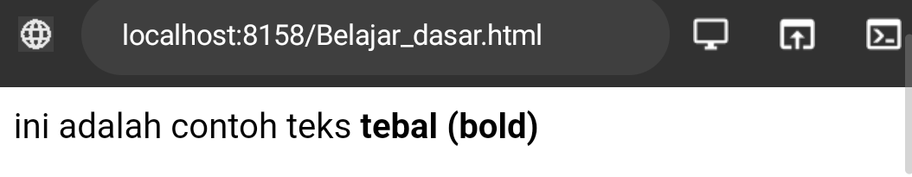

## Contoh HTML
```html
<!DOCTYPE html>
<html>
<head>
<title>ini adalah judul</title>
</head>
<body>
<p>ini adalah paragraf yang di tampilkan di browser</p>
</body>
</html> 
```

```html

<!DOCTYPE html>
<html>
<head>
<title>ini adalah judul</title>
</head>
<body>
<p>pilihan hanya ada 2, tempe dan tahu</p>
<p>kesuksesan itu seperti banyak nya tempe</p>
<p>tidak ada yang tau</p>
</body>
</html>
```


•==Tag== <!DOCTYPE html> memberitahukan web browser bahwa dokumen HTML adalah versi 5

• ==Tag== pembuka <html> menandai awal sebuah dokumen HTML sampai dengan tag penutup </html>

• ==Tag== pembuka` <head> `berisi informasi tentang halaman HTML sampai dengan tag penutup` <body>`,biasanya dalam tag head terdapat tag `<title>`untuk memberikan informasi judul halaman HTML tag yang berada di antara tag pembuka  sampai dengan tag penutup `<body> `akan tampil di web browser.

**Hasil program:**


---
## Anatomi Elemen
**Elemen** adalah suatu kesatuan dan sebuah Tag yang dimulai dari ==Tag pembuka== hingga ke ==Tag penutup==. **ELEMEN** HTML secara garis besar terdiri atas tiga bagian yaitu **Tag**, **konten/Isi tag**, dan tag **penutup**

**kode program:**
```html

<a href="https://www.instagram.com/m.zfran?igsh=bmgxcnpsaXF2a3Yz"> Klik ini ke profile saya ! </a>

```

**Hasil:**


## Tag pembuka & penutup
`<a` adalah tag pembuka
`<a href="https://www.instagram.com/m.zfran?igsh=bmgxcnpsaXF2a3Yz"> Klik ini ke profile saya ! </a>` ini tag pembuka untuk elemen anchor atau tautan. 

**Tag Penutup:**
/a> Ini adalah tag penutup
`</a>` Tag penutup oleh tautan yang di akhiri

## Atribut Tag

### Nama Atribut
`href`adalah nama atribut mengacu pada kata kunci yang menentukan jenis tautan atau sumber daya yang akan terhubung.`href, href=""`: atribut href digunakan untuk menentukan URL atau alamat yang akan ditautkan. Isi dari tanda kutip ganda akan berisi URL atau path kehalaman atau sumber eksternal. 

### Nilai atribut
Nilai atribut. Sebagai URL atau alamat web yang menunjuk ke halaman login instagram. Dengan menentukan URL ini dalam atribut href tag HTML `<a>` tautan tersebut akan membuka halaman login instagram ketika di klik. 
[Klik instagram](https://www.instagram.com/m.zfran?igsh=bmgxcnpsaXF2a3Yz) 

`klik instagram` adalah konten atau isi tag. Ini berfungsi sebagai deskripsi atau petunjuk bagi pengguna untuk mengetahui bahwa tautan tersebut akan membawa mereka ke halaman login instagram ketika di klik. 

### Konten Tag
Pada konten tag akan muncul `klik instagram` sebagai tautan dan ketika seorang pengguna mengklik tautan tersebut. Pengguna akan di arahkan ke URL yang di tentukan oleh atribut `href`.

### Tag Dasar
 `Heading`
 `<h1>` sampai `<h6>`
 Tag dasar `h1`hingga `h6` digunakan dalam HTML untuk membuat heading atau judul pada halaman web. Semakin tinggi level heading, semakin kecil ukuran teksnya secara default... 
 Contohnya:
 
```
</h1>: Heading Lvl 1
</h2>: Heading Lvl 2
</h3>: Heading Lvl 3
</h4>: Heading Lvl 4
</h5>: Heading Lvl 5
</h6>: Heading Lvl 6
```


```html
<p><h1>ini heading pertama</h1></p>
<p><h2>ini heading kedua</h2></p>
<p><h3>ini heading ketiga</h3></p>
<p><h4>ini heading keempat</h4></p>
<p><h5>ini heading kelima</h5></p>
<p><h6>ini heading keenam</h6></p>
```

**Hasil program:**


## paragraf

### `<p>`
`<p>` tag ini berguna membuat paragraf dalam dokumen html singkatnya,tag ini berguna. mengelompokkan sejumlah teks menjadi paragraf
`</p>` berguna sebagai penutup paragraf dalam html. 
**Kode program:**
```html
<p>pilihan hanya dua,tempe dan tahu</p>
<p>kesuksesan seperti banyaknya tempe</p>
<p>tidak ada yang tahu</p>
```

**Hasil Program:**


### `<b>`
Dalam bahasa html tag `<b>` berguna memberi penekanan atau membuat teks menjadi tebal. Dalam bahasa HTML, ketika tag `<b>` digunakan, teks di dalamnya akan di tampilkan dengan tebal di dalam halaman web. 

**Kode program:**
```html

<p>ini adalah contoh teks <b>tebal (bold)<b></p>
```

**Hasil program:**

### `<u>`
Pada tag `<u>` digunakan untuk memberi garis bawah pada teks,ketika tag ini digunakan,teks di dalamnya akan di tampilkan dengan garis bawah dalam web.

**Kode Program:**
```html
<p>Ini adalah contoh teks <u>bergaris bawah</u>.</p>
```

**Hasil program:**
 

### `<i>`
Dalam bahasa HTML, tanda `<i>` digunakan untuk menandai teks yang ingin di jadikan miring (italic). Teks yang dikelilingi tanda `<i>` akan di tampilkan dengan gaya miring oleh browser web. 

**Kode program:**
```html
<p>ini adalah contoh teks <i>MIRING</i><p/>
```

**Hasil program:**


### `<br>`
Dalam bahasa HTML, tanda `<br>` digunakan untuk membuat baris baru (line break) di dalam teks atau konten. Tanda `<br>` tidak membutuhkan tag penutup dan hanya berfungsi sebagai elemen tunggal yang menandai titik pemisahan antara baris yang satu dengan baris yang lain.

**KODE PROGRAM:**
```html
<p>ini adalah teks barisan pertama</p><br> 
<p>ini adalah teks barisan kedua</p>
```

**Hasil program:**
 


---
## Atribut `align`

**Penjelasan**

Atribut `align` berguna untuk mengontrol penempatan atau perataan elemen dalam sebuah dokumen atau tampilan halaman web.
`align="left"` akan membuat paragraf menjadi rata kiri.
`align="right"` akan membuat paragraf menjadi rata kanan.
`Align="center"` akan membuat paragraf menjadi rata tengah.
`align="justify"`akan membuat paragraf rata kanan dan kiri.


**Kode program** 

```html
<h3>Belajar Menggunakan Elemen Tag HTML p</h3>
<p align="left">
Sebuah rumah yang berisikan satu keluarga yaitu,ayah,ibu,dan 3 anaknya.<\p>
<p align="right">
Sebuah rumah yang berisikan satu keluarga yaitu,ayah,ibu,dan 3 anaknya.</p>
<p align="center">
Sebuah rumah yang berisikan satu keluarga yaitu,ayah,ibu,dan 3 anaknya.</p>
<p align="justify">
Sebuah rumah yang berisikan satu keluarga yaitu,ayah,ibu,dan 3 anaknya.</n>

```

**Hasil dari Program:**


## **Komentar** 

Html juga mempunyai Tag khusus untuk komentar.Untuk membuat komentar di HTML kita menggunakan awalan `<!--` dan penutup 
`-->`.

> [!faq]-  Komentar tidak akan di tampilkan pada halaman website namun programmer biasanya menggunakan komentar untuk memperjelas kode program


**Kode program:**
```html
<!-- ini komentar,tidak akan tampil di browser -->
<p>ini bukan komputer, dan akan tampil di browser</p>
```

**Hasil dari Program:**


## List
List adalah fungsi dalam HTML yang digunakan untuk menampilkan daftar dari sesuatu.Tag HTML terdiri dari 2 jenis ,`<ol>` ordered list (berurutan),dan `<ul> `urdered list (tidak berurutan). oredered list `<ol>` akan ditampilkan dengan angka atau huruf sedangkan undered list `<ul>`dengan bulatan atau kotak ataupun simbol lainnya.

>[!faq] !! Untuk menampilkan list dalam HTML dapat menggunakan tag `<ol>`...`<\ol>` atau` <ul>`...`</ul>`namun perlu dengan menyisipkan elemen `<li>` untuk membuat daftar list


**Kode program:**

```html
Orderet list

<h1>nama negara</h1>
<ul>
<li>indonesia</Li>
<li>malaysia</Li>
<li>jepang</Li>
<li>thailand</Li>
<li>australia</Li>
</ul>
```


```html

Urdered list

<h1>list Kalimat</h1>
<ol>
<li>Ini kalimat pertama</Li>
<li>ini kalimat kedua</Li>
<li>ini kalimat ketiga</Li>
<li>ini kalimat ke empat</Li>
<li>ini kalimat ke lima</Li>
</ol>


```


**Hasil Program:**

**Orderet List:**
 


**Undered list:**
 


## Link
Link Dapat ditemukan dihampir semua halaman link/tautan memungkinkan sebuah teks yang ketika di-klik akan pindah ke halaman lainnya HTML menggunakan tag `<a>` untuk keperluan ini. Link ditulis dengan  `<a>`yang merupakan singkatan cari anchor (jangkar)

>[!info]- Setiap tag `<a>`setidaknya memiliki sebuah atribut href dimana href berisi alamat yang dulu href adalah singkatan dari hypertext

Atribut penting lainnya dari tag `<a>` adalah target atribut target menentukan tempat untuk membuka dokumen yang ditautkan atribut target memiliki beberapa nilai salah `satunya_blank` yang berfungsi untuk membuka tautan ditab baru

**Kode program:**
```html
<h3> menggunakan tag anchor </h3>

<a

href="https://www.instagram.com/m.zfran?igsh=bmgxcnpsaXF2a3Yz "> Klik Instagram! </a> <br>

<a

href="https://wa.me/qr/TUYB3CUV2DFEC1"> Klik Membuka WhatsApp!</a>
```

**Hasil Program**


## multimedia
### Gambar
Dalam html gambar didefinisikan tag ``
Tag `` adalah tag kosong. 
>[!warning]- Atribut `src` setidaknya mesti ada dalam tag ini menentukan url (alamatweb)dari gambar login yang akan di tampilkan

Atribut `alt` menyediakan teks alternatif untuk gambar, jika pengguna karena beberapa alasan tidak dapat melihatnya (karena koneksi lambat, kesalahan pada atribut `src`, atau jika web browser telah disetting untuk tidak menampilkan gambar). Jika browser tidak dapat menemukan gambar, maka akan muncul nilai pada atribut alt

Dalam tag ``terdapat juga atribut width dan height untuk mengatur ukuran gambar, pada versi HTML standar satuan ukuran gambar adalah pixel.

• Misalnya dalam folder root terdapat file gambar bernama logo.png. Untuk menampilkan gambar tersebut kita hanya perlu mengisi nama gambar beserta jenis ekstensi file gambar ke dalam atribut src, contohnya `src` "`logo.png`"

Untuk menampilkan gambar dari internet carilah link gambar yang akan ditampilkan lalu masukkan dalam nilai atribut `src`, contohnya:
https://namasitus.com/gambar.png

**kode program**
```html

```

**Hasil Program:**


**Screenshot folder:**


### Vidio
Fitur HTML 5 mencakup dukungan audio dan video asli tanpa memerlukan flash. tag `<audio>` dan `<vidio>` pada HTML 5 mempermudah penambahan media ke dalam halaman web. Yang penting untuk diatur pada tag ini adalah atribut `src` yang berfungsi untuk mengidentifikasi sumber media. Selain itu, terdapat pula atribut `controls`agar pengguna dapat memutar dan menjeda media.

**Contoh** :
```html
<video src="Vidio.mp4" controls width="380" Height="470" ></video>
```
**hasil program**


### Audio

Seperti yang telah dibahas sebelumnya bahwasanya tag `<audio>` merupakan bagian fitur HTML5 untuk menampilkan audio asli dihalaman web tanpa memerlukan flash sebagaimana pada HTML versi 4. Yang penting untuk diatur pada tag ini adalah atribut `src` yang berfungi untuk mengidentifikasi sumber media. Selain itu, terdapat pula atribut `controls` agar pengguna dapat memutar dan menjeda media. 

**Contoh program :** 

```html 
<audio src="Audio.mp3" controls >
  Browser anda tidak mendukung elemen 
  <audio>.</audio>
```


**hasil program:**


> [!INFO]
> Konten berupa teks "Browser anda tidak mendukung elemen `<audio>`." Pada tag `<audio>` akan ditampilkan jika browser tidak mendukung elemen tersebut. Sehingga sebenarnya bagian ini dapat dihilangkan.


###  Iframe 
 Elemen <`iframe>` dapat digunakan untuk menampilkan halaman website lain dalam suatu website. Atau menampilkan dokumen html lain dalam sebuah website. Mudahnya, bisa dibilang website dalam website

Contoh penggunaannya seperti ini. Jika kita mempunyai website sekolah, lalu di website tersebut ingin menampilkan alamat dalam google maps sekolah. Agar memudahkan pengunjung website,kita bisa langsung tampilkan saja halaman sekolah yang ada digoogle maps

Dalam tag inframe ada beberapa atribut yang penting seperti : 
- src,untuk mencari sumber halaman html atau web yang akan ditampilkan didalam frame
- width dan height, untuk mengatur ukuran panjang dan lebar dari frame.


```html

<iframe src="https://smkn7makassar.sch.id/"

width="300" height="600"</iframe>

```

 

---


## **Tabel**
Tabel dalam HTML didefinisikan dengan tag `<table>`.
- Setiap baris tabel didefinisikan dengan tag `<tr>`.
- Header/judul tabel didefinisikan dengan tag `<th>`.Secara default, header tabel memiliki teks tebal dan berada di tengah.
- Data tabel/sel didefinisikan dengan tag `<td>`karena sel merupakan bagian terkecil dari tabel maka dari itu tag ini selalu berada di dalam tag `<tr>`.

**Kode program:**
```html
<table Border="1">
<tr>
  <th>nama</th>
  <th>asal industri</th>
</tr>
<tr>
  <td>zhafran</td>
  <td>FAJAR</td>
</tr>
<tr>
  <td>Muh.Taufik</td>
  <td>FAJAR</td>
</tr>

```

**Hasil Program:**
 


Perhatikan bahwa pada tag `<table>` terdapat sebuah atribut `<border>`. Atribut digunakan untuk memberikan nilai garis tepi dari tabel. Nilai ini dalam ukuran pixel. `border="1"`, berarti kita menginstruksikan kepada web browser bahwa tabel tersebut akan memiliki garis tepi sebesar 1 pixel. Jika tidak ditambahkan, secara default tabel tidak memiliki garis tepi.

Selain itu, terdapat pula beberapa atribut tabel yang penting untuk diketahui yaitu:
- `rowspan` merupakan atribut HTML yang berfungsi untuk menggabungkan beberapa baris (ke bawah).
- `colspan`atau colomn span merupakan atribut html yang berfungsi untuk menggabungkan beberapa kolom (ke samping).
- `width`berfungsi untuk mengatur lebar kabel yang nilainya didefinisikan dalam satuan pixel secara default.
- `heigt`berfungsi untuk mengatur tinggi tabel yang nilainya didefinisikan dalam satuan pixel secara default.
- `Align`berfungsi untuk mengatur perataan teks pada tabel.nilai atribut yang dapat diberikan yaitu left untuk perataan teks kekiri,right untuk teks ke kanan dan,center untuk perataan teks ke tengah.

Contoh:
```html

<table Border="2">
<tr>
<th rowspan="2">nama</th>
<th colspan="2">Asal institusi</th>
</tr>
<tr>
<th width="150">sekolah</th>
<th width="150">kampus</th>
</tr>
<tr>
  <td>Ibrahim Malommbasang</td>
  <td>SMKN 7 Makassar</td>
  <td>Universitas Negeri Makassar</td>
</tr>
<tr>
  <td>Condrado Alain Sharon</td>
  <td rowspan="2"> SMKN 7 Makassar</td>
  <td align="center" rowspan="2">-</td>
</tr>
<tr>
  <td>Rezeky Awalya</td>
</tr>
  <td>Muzhawir Amri</td>
  <td>SMAN 1 Palu</td>
  <td>STMTK Dipanegara</td>
</tr>
</table>
```

**Hasil program:**


**Tabel Hari & Bulan**
**Kode program:**
```html
<table Border="1">
  <tr>
    <th bgcolor="green" colspan="2">Nama Hari</th>
   <th bgcolor="green" colspan="2">Nama Bulan</th>
  </tr>
  <tr>
    <td>senin</td>
    <td>selasa</td>
    <td>april</td>
    <td rowspan="2">Juni</td>
  </tr>
  <tr>
    <td>rabu</td>
    <td>kamis</td>
    <td>mei</td>
  </tr>
</table>
```

**Hasil program:**


## Form
Elemen `<form>` HTML digunakan untuk mendefinisikan form yang digunakan untuk mengumpulkan inputan dari pengguna website. Tag ini digunakan untuk mengkoleksi inputan dari user, konsep ini sama seperti konsep formulir di dunia nyata.

>[!info]- Dengan kata lain tag `<form>` merepresentasikan sebuah "formulir" di mana formulir bisa memiliki banyak kolom isian.


Form HTML berisikan elemen-elemen `form` lainnya. Elemen `<form>` digunakan untuk menampung macam-macam elemen yang berkaitan dengan sebuah form, seperti `text` `fields`, `checkbox`, `radio button`, tombol `submit`, dan banyak lagi yang dapat diedit kemudian ditulis untuk dikirim pada sebuah server untuk selanjutnya diproses guna mendapatkan informasi tertentu dari atau untuk user.

Umumnya, sebuah website selalu memiliki fitur form, contoh paling umum yang sering kita temui adalah seperti form login, form sign up, form komentar di suatu blog/media.

### input
Elemen `<input>`adalah elemen `form` yang paling penting. Elemen `<input>`dapat ditampilkan dalam beberapa cara, tergantung pada nilai atribut `type` yang digunakan. Request Berikut adalah beberapa contoh nilai dari atribut `type` :

- `text` digunakan untuk mengambil isian berupa teks. Contohnya seperti nama.

- `password` digunakan untuk mengambil isian berupa kata sandi atau sesuatu yang bersifat rahasia. Tipe ini akan mengubah semua karakter yang diketikkan ke dalam karakter bulat.

- `Radio` digunakan sebagai kolom isian bertipe pilihan yang menawarkan beberapa opsi kepada user namun tetapi hanya satu opsi saja yang boleh dipilih. Contohnya seperti jenis kelamin atau agama.


>[!info]- Perlu diperhatikan bahwa untuk penggunaan tipe `radio` yang berkategori set pilihan yang sama mengharuskan nilai `nama`-nya juga sama.


Opsi default dapat dilakukan dengan menambahkan atribut `checked`pada elemen opsi yang dijadikan sebagai opsi default.

- `checkbox` digunakan untuk memberikan **daftar pilihan dalam satu set opsi**. User dapat memilih satu atau bahkan lebih dari satu pilihan pada tipe ini. Hal ini berbeda dengan tipe sebelumnya yaitu `radio` yang hanya memungkinkan user untuk memilih satu pilihan saja. Contoh penggunaan `checkbox` seperti daftar makanan kesukaan, daftar olahraga yang tidak disukai, dan yang semisalnya.


>[!info]- Perlu diperhatikan bahwa untuk penggunaan tipe checkbox yang berkategori set pilihan yang sama mengharuskan nilai name -nya juga sama.


- `Number` digunakan untuk membatasi isian user hanya pada karakter numerik saja. Browser akan menambahkan dua buah tombol atas dan bawah untuk mengubah angka isian.

Beberapa atribut untuk tipe `number`:

- `min` menentukan angka minimal

- `max` menentukan angka maksimal

- `step`-smenentukan kelipatan (nilai yang tidak sesuai kelipatan tidak bisa di-input, dan default dari atribut ini adalah 1)

- `Date` digunakan untuk memberikan isian berupa tanggal. Atribut `min` dan `max` dapat pula difungsikan pada tipe ini untuk mengatur tanggal minimal dan tanggal maksimal yang diinginkan. Nilai `min` dan `max` tersebut ditulis dengan format: `YYYY-em-dd`.

- `File` digunakan untuk memungkinkan pengguna memuat file. Atribut `accept` juga dapat disisipkan pada tipe ini dengan maksud untuk mengatur file apa saja yang boleh di-upload. Beberapa contoh value dari atribut `accept` yaitu:

- `accept-"image/png,inage/jpg.Image/jpeg` - untuk file gambar seperti `png`. `jpg`. atau `jpeg`

- `accept="pdf"` - untuk file pdf

- `accept="pdf"` - untuk file pdf

- `accept-".doc, docx"` - untuk file `doc` atau `docx`

- `accept-".ppt, pptx"` untuk file `ppt` atau `pptx`

- `submit` ditampilkan dalam bentuk tombol untuk mengirim data pada `<form>` yang menjadi pembungkusnya. Atribut `value` digunakan untuk mengisi teks yang ingin ditampilkan pada tombol.

- `reset` berguna untuk **mengembalikan state (keadaan) atau data dari suatu form ke nilai awalnya**. Jika nilai awal sebuah input adalah kosong, maka ketika direset ia akan kembali kosong. Tapi jika nilai awalnya sudah terisi sesuatu, maka ketika direset datanya akan kembali seperti yang sudah diset sebelumnya.

- `button` berguna untuk membuat inputan berupa sebuah tombol. Tombol ini nantinya bisa difungsikan sesuai dengan keinginan dari pengembang web

### Label
Elemen `<label>` memiliki fungsi khusus untuk melabeli sebuah kolom inputan. Ketika screen reader membaca konten halaman HTML, lalu menemukan sebuah inputan, ia akan membaca label yang bersangkutan. 
Fungsi lain dari tag `<label>` adalah ketika kita mengklik label, maka browser akan meletakkan fokus pada kolom isian yang terhubung dengannya. Syarat yang perlu diperhatikan yaitu dengan menghubungkan sebuah `<label>` dan `<input>` dengan atribut for untuk label, dan atribut id pada `<input>` dengan nilai untuk kedua atribut tersebut mesti sama persis.

### Select
Elemen `<select>` berguna dalam mendefinisikan sebuah tombol dropdown yang dimana user dapat memilih salah satu dari banyak pilihan.
>[!note] - Elemen `<select>` nantinya berperan sebagai kontainer atau pembungkus dari elemen `<option>` yang berperan sebagai daftar pilihan atau opsi. 

 Elemen `<select>` hampir mirip fungsinya dengan `<input type ="radio">` akan tetapi baiknya elemen `<select>` digunakan untuk memilih satu pilihan yang terdapat banyak opsi di dalamnya, sedangkan `<input type ="radio">` lebih baiknya untuk digunakan jika user diarahkan memilih hanya satu pilihan yang opsi pilihannya tidak terlalu banyak. Contoh penggunaan elemen ini seperti memasukkan pilihan berupa asal daerah atau yang semisalnya.
Penting untuk diketahui bahwasanya opsi yang aktif secara default adalah adalah opsi yang pertama. Akan tetapi, kita bisa mengatur opsi mana yang aktif secara default dengan menambahkan atribut selected pada suatu `<option>` yang ingin dijadikan sebagai opsi default.

### Text Area
Elemen `<textarea>` berguna untuk mengambil inputan user berupa teks yang dapat memuat lebih dari satu baris. Jika dibandingkan dengan elemen `<input>` teks biasa, elemen `<textarea>` memiliki ukuran tinggi yang lebih besar. Element `<textarea>` bisa diisi lebih dari satu baris dengan menekan enter.
Atribut yang dapat digunakan untuk mengatur kuran dari textarea yaitu rows untuk jumlah baris, sedangkan atribut cols untuk lebarnya.

### Button
Elemen `<button>` yang berada di dalam sebuah `form` akan otomatis dianggap sama fungsinya seperti `<input type="submit">`. Jika ingin membuat tombol biasa yang tidak men-submit `<form>` dapat dilakukan dengan menambahkan atribut `type="button"`.
contoh : 
```html
<h1>Formulir Pendaftaran</h1>
<form action="">
  <div>
    <label for="nama-lengkap"><b>Nama Lengkap:</b></label
    ><br />
    <input
      type="text"
      id="nama-lengkap"
      name="nama_lengkap"
      placeholder="Masukkan nama lengkap"
      required
    />
  </div>
  
  <div>
    <label for="password"><b>Password:</b></label
    ><br />
    <input
      type="password"
      id="password"
      name="password"
      placeholder="Masukkan password"
      required
    />
  </div>
  
  <div>
    <b>Jenis Kelamin:</b><br />
    <input id="lk" type="radio" name="jenis_kelamin" checked />
    <label for="lk">Laki-Laki</label>
    <input id="pr" type="radio" name="jenis_kelamin" />
    <label for="pr">Perempuan</label>
  </div>
  
  <div>
    <label for="isian-usia"><b>Usia:</b></label
    ><br />
    <input
      type="number"
      id="isian-usia"
      name="usia"
      min="17"
      max="25"
      value="19"
      required
    />
    Tahun
  </div>
  <div>
    <label for="tgl-ijazah"><b>Tanggal Ijazah:</b></label> <br />
    <input
      type="date"
      id="tgl-ijazah"
      name="tgl_ijazah"
      min="2021-01-01"
      value="2023-06-20"
      required
    />
  </div>
  <div>
    <label for="opsi-agama"><b>Agama:</b></label
    ><br />
    <select id="opsi-agama" name="agama" required>
      <option disabled>---Pilih Agama----</option>
      <option value="islam">Islam</option>
      <option value="kristen">Kristen</option>
      <option value="katolik">Katolik</option>
      <option value="hindu">Hindu</option>
      <option value="buddha">Buddha</option>
      <option value="atheis" disabled>Atheis</option>
    </select>
  </div>
  <div>
    <label for="alamat"><b>Alamat:</b></label> <br />
    <textarea
      id="alamat"
      name="alamat"
      cols="25"
      rows="5"
      placeholder="Harap masukkan alamat secara lengkap"
      required
    ></textarea>
  </div>
  <div>
    <b>Kemampuan Berbahasa Asing:*</b><br />
    <input type="checkbox" id="inggris" name="bahasa_asing" />
    <label for="inggris">Inggris</label>
    <input type="checkbox" id="arab" name="bahasa_asing" />
    <label for="arab">Arab</label>
    <input type="checkbox" id="jepang" name="bahasa_asing" />
    <label for="jepang">Jepang</label>
  </div>
  <div>
    <label for="isian-foto"><b>Foto 4x6:*</b></label
    ><br />
    <input
      type="file"
      id="isian-foto"
      name="foto"
      accept="image/png,image/jpg,image/jpeg"
    />
  </div>
  <br />
  <input type="submit" value="Kirim" />
  <input type="reset" value="Batal" />
  <i>*opsional (tidak wajib diisi)</i>
</form>
```

**Hasil program:**


Beberapa atribut yang digunakan pada contoh di atas yang perlu untuk diperjelas yaitu sebagai berikut:
- **==name==** - digunakan sebagai nama variabel yang akan diproses oleh web server (contoh menggunakan PHP).
- **==required==** - digunakan untuk memastikan bahwa pengguna harus memasukkan nilai pada input tersebut sebelum dapat melakukan proses submit formulir.
- **==placeholder==** - menuliskan teks pada elemen input. Placeholder sangat bermanfaat untuk memberikan teks bantuan kepada user untuk inputan form yang kompleks.
- **==value==** - menentukan nilai awal dari sebuah elemen input.
- **==disabled==**- digunakan untuk menonaktifkan inputan pada elemen yang diberi atribut ini.

### **Bagaimana Cara Memproses Form?**

Ketika sebuah `<form>` disubmit, baik menggunakan elemen `<button>` mau pun `<input type="submit">`, browser akan mengirimkan data tersebut kepada URL yang didefinisikan pada atribut `action` di dalam tag `form`

Ada pun jika atribut `action` tidak didefinisikan, maka *browser* akan menggunakan URL sekarang sebagai tujuan pengiriman data.

Contoh:

```html
<form action="/proses pendaftaran"></form>
```

Pada contoh di atas, ketika form di-*submit*, *browser* akan mengirimkan data yang ada  menuju URL `/proses-pendaftaran`.


**Apa yang terjadi pada URL `/proses-pendaftaran`?**

Pada URL tersebut terdapat sebuah aplikasi/program yang berjalan di *server* (bukan di *browser*). Tugas dari program tersebut adalah mengelola data yang dikirim seperti misalnya menyimpan data tersebut ke dalam sebuah *database*.

Bahasa yang umum digunakan di dalam server adalah python, nodejs, PHP, dan lain sebagainya.

Untuk mendapatkan gambaran lebih jelas, sebenarnya akan dijelaskan pada modul selanjutnya yang berkaitan dengan materi PHP atau juga bisa dengan membaca tutorial berikut:
https://jagongoding.com/web/php/web-dinamis/membuat-dan-menangani-form/https://jagongoding.com/web/php/web-dinamis/membuat-dan-menangani-form/


# Div
Div untuk memblok satu area dengan tanda baris baru setelahnya
## kode program
```html
<div>ini dibuat menggunakan div</div>
<div>ini juga menggunakan div</div>
```

## Hasil


# Span
Span digunakan untuk mengelompokkan sebuah paragraf
## kode program
```html
<span>ini dibuat menggunakan span</span>
<span>ini juga menggunakan span</span>
```
## Hasil
