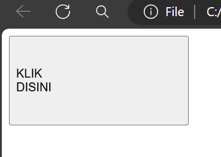

# Anatomi CSS


# Percobaan pertama
## Penjelasan
`<title>`: Menetapkan judul dokumen yang akan ditampilkan di tab browser.
`<style>`: Memulai blok kode CSS untuk mengatur tampilan elemen HTML.
`p { color: red; }`: Mengatur teks pada elemen paragraf `<p>` menjadi berwarna merah
`<p>Walcome CSS!</p>`: Dua paragraf dengan teks "Walcome CSS!" yang akan mewarisi gaya teks yang telah diatur dalam blok CSS sebelumnya.

## Kode program

```html
<!DOCTYPE html>
<html>
  <head>
    <title>Percobaan Pertama CSS</title>
    <style>
    p {
      color: red;
    }
    </style>
  </head>
  <body>
    <p>Walcome CSS!</p>
    <p>Walcome CSS!</p>
  </body>
</html>
```

## Hasil 


# Percobaan kedua
## kode CSS
```css
button {
  width:150px;
  height:50px;
  background-color: aqua;
  font-weight: bold;
  font-size: 30px;
  }
```
### background-color

**Before:**
![[Screenshot_2024-02-19-11-59-24-100_com.foxdebug.acodefree.png]]

**After:**
![[Screenshot_2024-02-19-12-00-25-435_com.foxdebug.acodefree.png]]


### font-weight

**Before:**
![[Screenshot_2024-02-19-11-59-24-100_com.foxdebug.acodefree 1.png]]

**After:**
![[IMG_20240219_120217.jpg]]

### font-size

**Before:**
![[Screenshot_2024-02-19-11-59-24-100_com.foxdebug.acodefree 1.png]]

**After:**
![[Screenshot_2024-02-19-12-02-52-802_com.foxdebug.acodefree.png]]


# Cara pemanggilan CSS
## Inline
Pemanggilan inline CSS adalah cara untuk menambahkan gaya langsung ke elemen HTML menggunakan atribut `style`. Ini memungkinkan Anda menentukan gaya khusus untuk elemen tertentu tanpa perlu membuat file CSS terpisah
### contoh kode program:

```html
<!DOCTYPE html>
<html>
  <head>
    <title>belajar panggilan css</title>
  </head>
  <body>
   <p style="color:red;">inline</p>
  </body>  
</html>
```

## Internal
Pemanggilan internal CSS adalah ketika Anda menulis gaya CSS di dalam tag `style` di bagian head dari dokumen HTML yang sama
### contoh kode program:

```html
<!DOCTYPE html>
<html>
  <head>
    <title>Percobaan Pertama CSS</title>
    <style>
    p {
      color: red;
    }
    </style>
  </head>
  <body>
    <p>Walcome CSS!</p>
    <p>Walcome CSS!</p>
  </body>
</html>
```

## External
Pemanggilan eksternal CSS adalah ketika Anda menyimpan gaya CSS dalam file terpisah dengan ekstensi css dan memanggilnya dalam dokumen HTML menggunakan tag `link`. Ini memungkinkan Anda untuk memisahkan struktur HTML dari gaya CSS, membuat kode lebih terorganisir dan mudah dikelola
### contoh kode program:
```html
<!DOCTYPE html>
<html>
<head>
  
  <title>CSS</title>
 <link rel="stylesheet" href="Contoh.css">
</head>
<body>

<p>menggunakan pemanggilan external</p>

</body>
</html>
```

# Selector
## Elemen selector 
Selector ini memilih semua elemen HTML dengan nama elemennya. Misalnya, jika Anda menggunakan `P` sebagai selector, maka semua elemen paragraf dalam dokumen HTML akan dipilih

## Class selector 
digunakan untuk menerapkan gaya pada elemen HTML yang memiliki kelas tertentu. Ini memungkinkan Anda untuk mengatur gaya tertentu untuk kelompok elemen yang memiliki kelas yang sama, tanpa harus merubah setiap elemen secara individual. Untuk menggunakan pemilih kelas, Anda menambahkan titik (.) diikuti oleh nama kelas yang ingin Anda targetkan dalam aturan gaya CSS Anda

## ID selector 
Memilih elemen berdasarkan ID uniknya. Untuk menggunakan selector ID, Anda harus menambahkan tanda pagar (#) di depan nama ID. Contoh: `#id`akan memilih elemen dengan ID "id"

# Materi Text
## Text-align

### Penjelasan:
Properti text-align menentukan perataan horizontal teks dalam sebuah elemen. 

`left`: Alirkan teks ke kiri. 
`right`: Alirkan teks ke kanan. 
`center`: Alirkan teks ke tengah.
`justify` : Meratakan teks ke kiri dan kanan, dengan menyesuaikan spasi antarkata untuk mengisi lebar elemen.
`justify-all`: Sama seperti justify, namun juga meratakan spasi antarkata pada baris terakhir.
### kode program:
```css
p{text-align: center;}
```
### Hasil:

### kesimpulan:
Dengan lima nilai yang umum digunakan, yaitu left, right, center, justify, dan justify-all,properti ini memberikan fleksibilitas dalam menyesuaikan posisi teks sesuai dengan kebutuhan desain halaman web.

## Text-decoration
### Penjelasan
Kode CSS p {text-decoration: underline;} digunakan untuk memberikan dekorasi garis bawah pada teks dalam elemen paragraf (p) di halaman web. Dengan demikian, semua teks di dalam elemen paragraf akan memiliki garis bawah.
### Kode program
```css
p{Text-decoration:underline;}
```
### Hasil

### Kesimpulan
Kesimpulannya, kode CSS `p {text-decoration: underline;}` digunakan untuk memberikan dekorasi garis bawah pada teks dalam elemen paragraf (`<p>`) di halaman web.

## Text-Tranform
### penjelasan
Kode CSS p {text-transform: lowercase;} digunakan untuk mengubah semua teks dalam elemen paragraf (p) menjadi huruf kecil (lowercase). Ini berarti semua huruf dalam teks akan ditampilkan dalam bentuk huruf kecil.
### program
```css
p{text-transform:lowercase;}
```
### hasil

### kesimpulan
Kesimpulannya, kode {text-transform:lowercase;} ini akan membuat semua teks di dalam elemen paragraf menjadi huruf kecil.

## Text-indent
### penjelasan
text-indent: Ini adalah properti CSS yang mengatur jarak indentasi awal dari teks dalam sebuah elemen. 50px: Ini adalah nilai indentasi yang diberikan dalam piksel. Dalam kasus ini, teks dalam semua elemen paragraf akan di-indentasi sejauh 50 piksel dari sisi kiri.
### program
```css
p{Text-indent:50px;}
```
### hasil

### kesimpulan
Kesimpulannya, kode tersebut mengatur indentasi awal teks dalam semua elemen paragraf sejauh 50 piksel dari sisi kiri.
## Letter-spacing
### penjelasan
{Letter-spacing: 20px;} mengatur jarak antara baris dalam elemen paragraf (p) menjadi 20 piksel. Ini berarti setiap baris teks dalam elemen paragraf akan memiliki jarak horizontal sebesar 20 piksel.
### program
```css
p{letter-spacing:20px}
```
### hasil

### kesimpulan
Kesimpulannya, kode CSS ini akan membuat jarak antara baris dalam elemen paragraf menjadi 20 piksel, menciptakan ruang horizontal yang lebih besar di antara setiap baris teks.

## Line-height
### penjelasan
line-height: Ini adalah properti CSS yang mengatur tinggi baris di dalam elemen. Di sini, nilainya adalah 50px, yang berarti jarak antara baris dalam paragraf akan setara dengan 50 piksel.
### program
```css
P{Line-height:50px;}
```
### hasil

### kesimpulan
kode Line-height:170px; mengatur tinggi baris untuk semua elemen paragraf menjadi 170 piksel.

## Word-Spacing
### penjelasan
word-spacing: Ini adalah properti CSS yang mengatur jarak antara kata-kata di dalam elemen. Di sini, nilainya adalah 50px, yang berarti jarak antara kata-kata dalam paragraf akan setara dengan 50 piksel.
### program
```css
P{Word-Spacing:50px;}
```
### hasil

### kesimpulan
kode Word-spacing:50px; mengatur jarak antara kata-kata di dalam semua elemen paragraf menjadi 50 piksel.

---
# Materi Font
## Font-Weight
### penjelasan
Font-weight: bold; adalah properti CSS yang digunakan untuk mengatur ketebalan teks. Dalam hal ini, nilai yang diberikan adalah "bold", yang membuat teks yang menggunakan properti ini untuk diatur dengan ketebalan yang lebih besar dari teks biasa.
### program
```css
p{Font-Weight:bold;}
```
### hasil

### kesimpulan
Properti CSS ini digunakan untuk mengatur ketebalan teks. Dalam hal ini, nilai yang diberikan adalah "bold".

## Font-Size
### penjelasan
Font-size: 50px; adalah properti CSS yang digunakan untuk mengatur ukuran font menjadi 50 piksel. Ini berarti teks yang diberikan akan ditampilkan dengan ukuran 50 piksel, membuatnya lebih besar dari ukuran font standar yang biasa digunakan dalam tata letak halaman web
### program
```css
P{Font-Size:50px;}
```
### hasil

### kesimpulan
Kode property bertujuan agar teks membuatnya lebih besar dari ukuran font standar yang biasa digunakan dalam tata letak halaman web.

## Font-Style
### penjelasan
Font-style: italic; adalah properti CSS yang digunakan untuk mengatur gaya teks menjadi miring (italic). Ini berarti teks yang diberikan akan miring, seperti yang sering kita lihat dalam gaya teks untuk menekankan kata-kata atau membuat teks menonjol.
### program
```css
p{Font-Style:italic;}
```
### hasil

### kesimpulan
Kode properti yang bertujuan untuk mengatur gaya teks yang dalam kasus ini menjadi miring (italic).

## Font-family
### penjelasan
Font-family: Times New Roman; adalah properti CSS yang digunakan untuk menentukan jenis font yang akan digunakan untuk menampilkan teks. Dalam hal ini, jenis font yang dipilih adalah "Times New Roman." Ini akan mengubah teks yang menggunakan properti ini untuk diatur dengan gaya huruf yang khas dari jenis font Times New Roman, yang sering kali terlihat formal dan terstruktur.
### program
```css
P{Font-family:Times-New-Roman;}
```
### hasil

### kesimpulan
Kode properti ini digunakan untuk menetapkan jenis font yang akan digunakan untuk menampilkan teks, di mana dalam kasus ini, jenis font yang dipilih adalah Times New Roman.

---
# Materi Back Ground
## Background-Size
### penjelasan
background-size: 200px;: Properti ini mengatur ukuran latar belakang. Di sini, latar belakang akan memiliki lebar 200 piksel, dengan tinggi yang disesuaikan agar proporsi aslinya tetap terjaga.
### program
```css
P{background-size:200px;}
```
### hasil

### kesimpulan
Kode property tersebut bertujuan mengatur ukuran gambar latar belakang dengan size pixel.

## Background-Repeat
### penjelasan
background-repeat: no-repeat;Properti ini menentukan apakah gambar latar belakang akan diulang atau tidak. Dalam kasus ini, gambar latar belakang tidak akan diulang.
### program
```css
P{background-repeat:no-repeat;}
```
### hasil

### kesimpulan
Kode property tersebut berguna agar gambar tidak akan ber ulang Dengan menggunakan value (no-repeat).

## Background-attachment
### penjelasan
background-attachment: fixed; Properti ini menentukan apakah latar belakang akan tetap diam atau akan bergulir bersama dengan isi elemen saat pengguna menggulir halaman. Dalam kasus ini, latar belakang akan tetap diam, artinya posisinya akan tetap konstan saat halaman digulir.
### program
```css
p{background-attachment:fixed;}
```
### hasil

### kesimpulan
Kode property tersebut akan mengatasi gambar yang bergulir akan diam dengan menggunakan value (fixed)

## Background-position
### penjelasan
background-position: top; Properti ini mengatur posisi latar belakang di dalam elemen. Di sini, latar belakang akan diposisikan di bagian atas elemen.
### program
```css
p
{Background-position:top;}
```
### hasil

### kesimpulan
Kode property tersebut akan menentukan posisi gambar latar belakang ke atas (top).

---
# Materi Box Model
## width-height
### penjelasan
Jadi width dan height ini akan mengatur tinggi dan lebarnya dari Bordernya.
### program
```css
button {
      width: 100px;
      height: 50px;
   }
```
### hasil

### kesimpulan
Kesimpulannya untuk tingginya (`height`) adalah 50px,dan lebarnya (`width`) adalah 100px

### Border-width
### penjelasan
Untuk mengatur lebar border pada button.
### program
```css
button {
  border-width:5px;
}
```
### hasil

### kesimpulan
mengatur lebar border 

## Border-radius
### penjelasan
`Border radius` adalah properti CSS yang digunakan untuk mengatur sudut lengkung pada sudut-sudut elemen yang memiliki batas (border).
### program
```css
button {
        Border-radius:10px 10px 10px;
   }
```
### hasil

### kesimpulan
memberi lengkungan pada border

## Border-style
### penjelasan
`Border style` adalah properti CSS yang digunakan untuk mengatur gaya garis batas (border) pada elemen HTML. 
Nilai yang dapat digunakan dalam properti `border-style` adalah sebagai berikut:
- `none`: Tidak ada garis batas yang ditampilkan.
- `solid`: Garis batas berupa garis lurus dan terus-menerus.
- `dashed`: Garis batas berupa garis putus-putus.
### program
```css
button {
        Border-style:dashed;
   }
```
### hasil

### kesimpulan
Kesimpulannya menggunakan `border-style dashed` akan memberikan garis putus" pada bagian Border button.

## Border color
### penjelasan
`Border color` adalah properti CSS yang digunakan untuk mengatur warna garis batas (border) pada elemen HTML.
### program
```css
button {
  Border-color:purple;
   }
```
### hasil

### kesimpulan
Memberikan warna pada Bordernya seperti warna purple.

## Padding
### Padding-left
#### penjelasan
`Padding-left` ini akan membuat bagian kosong di kiri.
#### program
```css
button {
      width: 200px ;
      height: 100px;
      padding-left: 170px;
   }
```
#### hasil

#### kesimpulan
Membuat bagian kosong dari button yang ada sebelah kiri

### Padding-right
#### penjelasan
`Padding-right` ini akan membuat bagian kosong di kanan.
#### program
```css
button {
    width: 200px ;
    height: 100px;
    padding-right: 170px;
 }
```
#### hasil

#### kesimpulan
Membuat bagian kosong dari button yang ada sebelah kanan.

# FLEXBOX
## Row
## Row
# position
## relative
## Absolute


