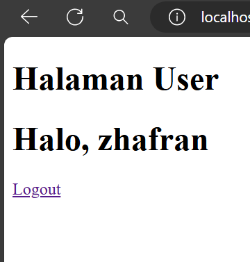

# KONEKSI DATABASE
## kode program

```php
<?php
//koneksi ke database
$koneksi = mysqli_connect('localhost', 'root', '', 'khusus');
if ($koneksi) {
 echo "<br> koneksi aman <br>";
} else {
 echo "error, tidak bisa koneksi ke database";
}
```
## hasil

## analisis

- Menggunakan fungsi `mysqli_connect()` untuk membuat koneksi ke database MySQL dengan parameter host ('localhost'), username ('root'), password (''), dan nama database ('siswa').
- Jika koneksi berhasil, maka pesan "koneksi aman" akan ditampilkan. Jika tidak, pesan "error, tidak bisa koneksi ke database" akan ditampilkan.
## kesimpulan
Program PHP dan SQL di atas bertujuan untuk melakukan koneksi ke database MySQL menggunakan fungsi `mysqli_connect()`. Setelah koneksi berhasil, pesan "koneksi aman" akan ditampilkan. Jika terdapat masalah dalam koneksi, maka pesan "error, tidak bisa koneksi ke database" akan ditampilkan. Namun, pada kode yang diberikan, tag pembuka PHP ditulis sebagai "<php" yang seharusnya "<php" (dengan tanda "?"). Pastikan untuk mengubahnya menjadi "<php" agar kode PHP dapat dieksekusi dengan benar.

# TAMPILKAN DATA
```php
//jalankan query seleksi

$select = mysqli_query($koneksi, "SELECT * FROM siswa");

//membuat array asosiatif dan memecah data berdasarkan kolomnya
$result = mysqli_fetch_assoc($select);

  

//menampilkan struktur array dari data tabel yang dijalankan di atas

//var_dump($result);

  

echo 'Berikut mobil-mobil beserta pemiliknya<br>';

  

$a = 1;

foreach ($select as $key => $data) {

    echo $a++ . ". " . $data['no_plat'] . " : " . $data['pemilik'] . '<br>';

}
```
# TAMBAHKAN DATA
## kode program
```php
<!DOCTYPE html>

<html lang="en">
<head>
    <title>Document</title>
</head>
<body>
    <h2>Tambah Data</h2>
    <?php
    include "koneksi.php";
    if (isset($_POST['simpan'])) {

        $nama = $_POST['nama'];

        $email = $_POST['email'];

        $jenis_kelamin = $_POST['jenis_kelamin'];

        $alamat = $_POST['alamat'];


        // * true / false

        $query = mysqli_query($koneksi, "INSERT into siswa(nama,email,jenis_kelamin,alamat)

        values ('$nama','$email','$jenis_kelamin','$alamat')");

        if ($query == true) {

            echo "<script>

            alert('Tambah data Berhasil')

            window.location.href='table.php'

            </script>";

        } else {

            echo '<script>alert("Tambah data gagal")</script>';

        }

    }


    ?>

    <form method="post" enctype="multipart/form-data">

        <table>

            <tr>

                <td>Nama</td>

                <td><input type="text" name="nama"></td>

            </tr>

            <tr>

                <td>Email</td>

                <td><input type="text" name="email"></td>

            </tr>

            <tr>

                <td>Jenis Kelamin</td>

                <td>>

                    <select name="jenis_kelamin">

                        <option>Laki-laki</option>

                        <option>Perempuan</option>

                    </select>

                </td>

            </tr>


            <tr>

                <td>Alamat</td>

                <td><input type="text" name="alamat"></td>

            </tr>


            <tr>

                <td></td>

                <td>

                    <button name="simpan" type="submit">Simpan</button>

                    <button type="reset">Reset</button>

                    <a href="table.php">Kembali</a>

                </td>

            </tr>

        </table>

    </form>

  

</body>

  

</html>
```
## hasil


### sesudah menambah data

## analisis
- **Include "koneksi.php"**: Memasukkan file eksternal untuk koneksi database.
- **Cek Form Submission**: Mengecek apakah form telah disubmit dengan mengecek `isset($_POST['nama'])`.
- **Mengambil Data dari Form**: Mengambil data dari input form dan menyimpannya dalam variabel.
- **Query Insert**: Menjalankan query `INSERT` untuk menambahkan data ke tabel `siswa`.
- **Error Handling**:
    - Jika query berhasil (`$query`), tampilkan pesan sukses dan arahkan pengguna ke halaman `table.php`.
    - Jika query gagal, tampilkan pesan gagal.
- **Form Tag**: Formulir menggunakan metode POST untuk mengirim data.
- **Input Fields**:
    - `Nama`: Input teks untuk nama.
    - `Email`: Input teks untuk email.
    - `Jenis Kelamin`: Dropdown untuk memilih jenis kelamin.
    - `Alamat`: Input teks untuk alamat.
- **Buttons**
    - `Simpan`: Tombol submit untuk menyimpan data.
    - `Reset`: Tombol reset untuk mengosongkan form.
    - `Kembali`: Link untuk kembali ke halaman `table.php`.
## kesimpulan
1. **Struktur HTML**: Kode HTML tersusun dengan baik, berisi form untuk memasukkan data.
2. **Koneksi Database**: File `koneksi.php` digunakan untuk menghubungkan ke database, namun perlu dipastikan file tersebut tersedia dan berfungsi.
3. **Form Handling**: Data form ditangani dengan mengecek apakah form telah disubmit, kemudian mengambil data dan menjalankan query `INSERT` untuk menambah data ke tabel `siswa`.
4. **Error Handling**: Pesan error ditampilkan jika query gagal, dan pesan sukses ditampilkan jika query berhasil.
5. **Keamanan**: Kode ini rentan terhadap SQL Injection karena data dari form langsung dimasukkan ke query SQL. Disarankan untuk menggunakan prepared statements atau fungsi `mysqli_real_escape_string` untuk mengamankan data.

# UBAH DATA
## kode program
```php
<!DOCTYPE html>

<html lang="en">

<head>

    <title>Document</title>

</head>

<body>

    <h2>Ubah Data</h2>

    <?php

    include "koneksi.php";

  

    $id = $_GET['id'];

  

    if(isset($_POST['nama'])) {

        $nama           = $_POST['nama'];

        $email          = $_POST['email'];

        $jenis_kelamin  = $_POST['jenis_kelamin'];

        $alamat         = $_POST['alamat'];

  

        $query = mysqli_query($koneksi, "UPDATE siswa SET nama='$nama', email='$email', jenis_kelamin='$jenis_kelamin', alamat='$alamat' WHERE id_siswa=$id");

        if($query) {

            echo "<script>

            alert('ubah data Berhasil')

            window.location.href='table.php'

            </script>";

        }else {

            echo '<script>alert("ubah data gagal")</script>';

        }

    }

  

    $query = mysqli_query($koneksi, "SELECT*FROM siswa where id_siswa=$id");

    $data = mysqli_fetch_array($query);

    ?>

    <form method="post" >

        <table>

            <tr>

                <td>Nama</td>

                <td><input type="text" value="<?= $data['nama'] ?>" name="nama"></td>

            </tr>

            <tr>

                <td>Email</td>

                <td><input type="text" value="<?= $data['email'] ?>" name="email"></td>

            </tr>

            <tr>

                <td>Jenis Kelamin</td>

                <td>>

                    <select name="jenis_kelamin">

                        <option <?php if($data['jenis_kelamin'] == "laki-laki") echo 'selected'; ?>>Laki-laki</option>

                        <option <?php if($data['jenis_kelamin'] == "perempuan") echo 'selected'; ?>>Perempuan</option>

                    </select>  

                </td>

            </tr>

  

            <tr>

                <td>Alamat</td>

                <td><input type="text" value="<?= $data['alamat'] ?>" name="alamat"></td>

            </tr>

  

            <tr>

                <td></td>

                <td>

                    <button type="submit">Ubah</button>

                    <button type="reset">Reset</button>

                    <a href="table.php">Kembali</a>

                </td>

            </tr>

        </table>

    </form>

</body>

</html>
```
## hasil

### sesudah mengubah data

## analisis
- **Form Tag**: Formulir menggunakan metode POST untuk mengirim data.
- **Input Fields**:
    - `Nama`: Input teks untuk nama yang diisi dengan nilai yang diambil dari database.
    - `Email`: Input email untuk email yang diisi dengan nilai yang diambil dari database.
    - `Jenis Kelamin`: Dropdown untuk memilih jenis kelamin, dengan nilai yang sesuai dari database yang ditandai sebagai `selected`.
    - `Alamat`: Input teks untuk alamat yang diisi dengan nilai yang diambil dari database.
- **Buttons**:
    - `Simpan`: Tombol submit untuk menyimpan data.
    - `Reset`: Tombol reset untuk mengosongkan form.
    - `Kembali`: Link untuk kembali ke halaman `table.php`.
## kesimpulan
1. **Struktur HTML**: Kode HTML tersusun dengan baik, berisi form untuk mengubah data siswa.
2. **Koneksi Database**: File `koneksi.php` digunakan untuk menghubungkan ke database, namun perlu dipastikan file tersebut tersedia dan berfungsi.
3. **Mengambil Data Siswa**: Data siswa diambil berdasarkan `id_siswa` yang diterima dari URL dan ditampilkan di form.
4. **Form Handling**: Data form ditangani dengan mengecek apakah form telah disubmit, kemudian mengambil data dan menjalankan query `UPDATE` untuk memperbarui data siswa.
5. **Error Handling**: Pesan error ditampilkan jika query gagal, dan pesan sukses ditampilkan jika query berhasil.
6. **Keamanan**: Kode ini rentan terhadap SQL Injection karena data dari form langsung dimasukkan ke query SQL. Disarankan untuk menggunakan prepared statements atau fungsi `mysqli_real_escape_string` untuk mengamankan data.

# HAPUS DATA
## kode program
```php
<?php
include('koneksi.php');
if(isset($_GET['id'])){
    $id = $_GET['id'];
    $query = mysqli_query($koneksi, "DELETE FROM siswa WHERE id_siswa = $id");
   if($query) {
            echo "<script>
            alert('Hapus data Berhasil')
            window.location.href='table.php'
            </script>";
        }else {
            echo '<script>alert("Hapus data gagal")</script>';
        }
}
?>
```
## hasil

### sesudah hapus data

## analisis
- Menggunakan fungsi `mysqli_connect()` untuk membuat koneksi ke database MySQL dengan parameter host ('localhost'), username ('root'), password (''), dan nama database ('siswa').
    - Jika koneksi berhasil, maka pesan "koneksi aman" akan ditampilkan. Jika tidak, pesan "Error, tidak bisa koneksi ke database" akan ditampilkan.
    - Menggunakan fungsi `mysqli_query()` untuk menjalankan query SQL yang melakukan seleksi data dari tabel "siswa" dalam database.
    - Hasil query disimpan dalam variabel `$select`
    - Menggunakan perulangan `foreach` untuk mengiterasi setiap baris data yang ditemukan dalam `$select`.
    - Menggunakan query SQL DELETE untuk menghapus data dari tabel daftar_mobil.
    - Data yang akan dihapus adalah baris dengan nomor plat yang sesuai dengan nilai variabel `$id`.
## kesimpulan
Program PHP dan SQL di atas berfungsi untuk melakukan koneksi ke database, menjalankan query seleksi, menampilkan data sebelum penghapusan, menghapus data dalam tabel "daftar_mobil", dan menampilkan data setelah penghapusan. Program ini akan menampilkan nama-nama pemilik mobil sebelum dan setelah penghapusan yang dilakukan.

# SESSION/LOGIN
## kode program
### session
```php
<?php

session_start();

if (isset ($_POST ['submit'])) {

  

   $username = $_POST['username'];

   $password = $_POST['password'];

   $koneksi = mysqli_connect('localhost', 'root', '', 'tugas') or die('error koneksi');

   $result = mysqli_query($koneksi, "SELECT * FROM user WHERE username = '$username' AND password = '$password'");

   $data = mysqli_fetch_assoc($result);

  

   if (isset ($data)) {

        $_SESSION['username'] = $data['username'];

        $_SESSION['nama'] = $data['nama'];

        $_SESSION['status'] = 'login';

        header('location:user.php');

     } else {

      echo "Username dan Password Salah";

   }

}

?>

<!DOCTYPE html>

<html>

<head>

<title>Login session</title>

</head>

<body>

 <form method="post">

 <label>username</label>

 <input type="text" name="username">

 <br><br>

 <label for="">password</label>

 <input type="password" name="password">

 <br>

 <button type="submit" name="submit">login</button>

 </form>

</body>

</html>
```
### user
```php
<?php

  

session_start();

if ($_SESSION['status'] == 'login' && $_SESSION['username'] == 'admin') {

 header("Location: admin.php");

}

if ($_SESSION['status'] != 'login') {

header('Location: session.php');

}

?>

<!DOCTYPE html>

<html lang="en">

<head>

     <title>Document</title>

  

</head>

<body>

  <h1>Halaman User</h1>

<h1>Halo, <?= $_SESSION['nama'] ?></h1>

<a href="logout.php">Logout</a>

</body>

</html>
```
### cek_user
```php
<?php

  

if ($_SESSION['status'] == 'login' && $_SESSION['username'] != 'admin') {

    header("Location: user.php");

} else if ($_SESSION['status'] == 'login' && $_SESSION['username'] == 'admin') {

    header("Location: admin.php");

}else{

    header("Location: session.php");

}

  

?>
```
### admin
```php
<?php

session_start();

  
  

if ($_SESSION['status'] == 'login' && $_SESSION['username'] != 'admin') {

    header("Location: user.php");

}

  

if ($_SESSION['status'] != 'login') {

    header('Location: session.php');

}

  

?>

<!DOCTYPE html>

<html lang="en">

  

<head>

    <title>Document</title>

</head>

  

<body>

    <h1>Halaman Admin</h1>

  

    <h1>Halo, <?= $_SESSION['nama'] ?></h1>

    <a href="logout.php">Logout</a>

  

</body>

  

</html>
```
## hasil



## analisis
- Terdapat sebuah form dengan metode POST.
- Form tersebut memiliki input field untuk username dan password.
- Terdapat tombol "Login" yang akan mengirimkan data form saat ditekan. Pada bagian Halaman PHP:
    - Program memulai session dengan menggunakan fungsi `session_start()`. Hal ini penting untuk memulai dan mengelola session di PHP.
    - Jika terdapat data yang dikirimkan melalui metode POST dengan nama "submit" (diperiksa menggunakan `isset($_POST['submit'])`), maka program akan melakukan proses login.
    - Data username dan password yang dikirimkan melalui form diambil menggunakan `$_POST['username']` dan `$_POST['password']`.
    - Dilakukan koneksi ke database MySQL menggunakan `mysqli_connect()` dengan parameter host, username, password, dan nama database.
    - Dilakukan query SQL untuk mencocokkan data username dan password yang diberikan dengan data di tabel "user" menggunakan perintah `mysqli_query()`.
    - Hasil query diambil menggunakan `mysqli_fetch_assoc()` dan disimpan dalam variabel `$data`.
    - Hasil dari `$data` ditampilkan menggunakan `var_dump()` untuk tujuan debugging.
    - Jika `$data` memiliki nilai (artinya username dan password cocok), maka session akan diset dengan variabel-variabel dari data tersebut, dan pengguna akan diarahkan ke halaman "user.php" menggunakan `header('Location: user.php')`.
    - Jika tidak ada data yang cocok, maka akan ditampilkan pesan "Username dan Password Salah".
## kesimpulan
File `session.php` adalah program PHP yang melakukan proses login menggunakan session. Program ini memeriksa apakah data username dan password yang diberikan cocok dengan data yang ada di database. Jika cocok, session akan diset dengan variabel-variabel dari data tersebut dan pengguna akan diarahkan ke halaman "user.php". Jika tidak cocok, pesan kesalahan akan ditampilkan. Namun, perlu diperhatikan bahwa file ini belum mengimplementasikan fitur keamanan seperti sanitasi input dan penggunaan prepared statement untuk mencegah serangan SQL Injection.

# UPLOAD
## kode program

## hasil
## analisis
## kesimpulan

# DOWNLOAD