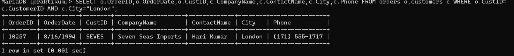
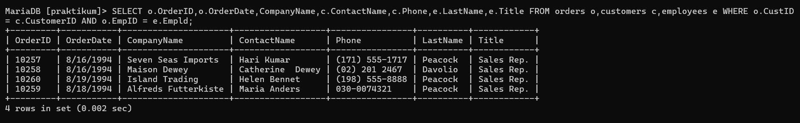
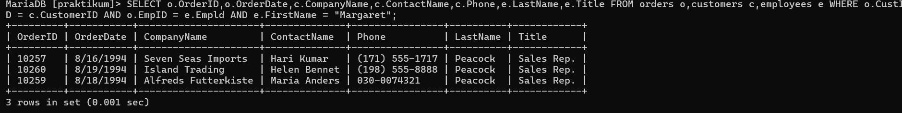

# 2 (Zhafran)
## query
```sql
SELECT o.OrderID,o.OrderDate,o.CustID,c.CompanyName,c.ContactName,c.City,c.Phone FROM orders o,customers c WHERE o.CustID=
c.CustomerID AND c.City="London";
```
## hasil

## analisis
- `SELECT` untuk memilih kolom mana saja yang ingin ditampilkan dan dari tabel mana kolom tersebut diambil.
- `o.orderID` o merupakan singkatan dari tabel orders, kolom orderID merupakan kolom dari tabel orders yang dipilih untuk ditampilakan.
- `o.orderDate`kolom orderDate merupakan kolom dari tabel o yaitu orders yang dipilih untuk ditampilkan.
- `o.custID` kolom custID merupakan kolom dari tabel o yaitu orders yang ingin untuk ditampilkan.
- `c.companyname` c merupakan singkatan dari tabel customers. kolom companyname merupakan kolom dari tabel customers yang dipilih untuk ditampilkan.
- `c.contactname` kolom contactname merupakan kolom dari tabel c yaitu customers yang dipilih unutk ditampilkan.
- `c.city` kolom city merupakan kolom dari tabel c yaitu customers yang dipilih untuk ditampilkan.
- `c.phone` kolom phone merupakan kolom dari tabel c yaitu customers yang dipilih untuk ditampilkan.
- `FROM orders o.customers c` untuk memilih dari tabel dimana saja yang kolomnya ingin dipilih untuk ditampilkan. `orders` adalah nama tabel yang dipilih untuk ditampilkan tapi disingkat jadi `o`, agar lebih muda dan cepat. `customers` adalah nama tabel yang dipilih untuk ditampilkan tapi disingkat jadi `c`.
- `WHERE` kondisi yang harus dipenuhi oleh suatu kolom data agar bisa ditampilkan.
- `(o.custID = c.customerID)` data pada kolom custID dalam tabel `o`(orders) harus sama dengan data pada kolom customerID dalam tabel `c`(customers).
- `AND` untuk meyeleksi dua data atau leih pada perintah `WHERE`.
- `(c.city = "London")` kondisi tambahan yang harus dipenuhi juga. Jadi pada kolom city dari tabel `c`(customers) datanya harus berisi data "London" agar bisa ditampilkan.
- hasilnya = Jadi hanya barisan data yang kolom city dari tabel customers mempunyai data "London" yang bisa tampil.

# 3
## query
```sql
SELECT o.OrderID,o.OrderDate,CompanyName,c.ContactName,c.Phone,e.LastName,e.Title FROM orders o,customers c,employees e WHERE o.CustID
= c.CustomerID AND o.EmpID = e.Empld;
```
## hasil

## analisis
- `SELECT` untuk memilih kolom mana saja yang ingin ditampilkan dari tabel mana kolom tersebut diambil.
- `o.orderID,o.orderDate` kolom orderID dan orderDate dari tabel `o`(orders) dipilih untuk ditampilkan.
- `c.companyname,c.contactname,c.phone` kolom-kolom companyname,contactname dan phone dari tabel `c`(customers) dipilih untuk ditampilkan.
- `e.Lastname,e.Title` kolom lastname dan title dari tabel `e`(employees) dipilih untuk ditampilkan.
- `FROM orders o,customers c,employees e` untuk memilih dari tabel mana saja yang kolomnya dipilih untuk ditampilkan. orders disingkat jadi `o` adalah nama tabel yang dipilih. customers disingkat jadi `c` adalah nama tabel yang dipilih. employees disingkat jadi `e` adalah nama tabel yang dipilh untuk ditampilkan.
- `WHERE` kondisi yang harus dipenuhi oleh suatu data agar bisa ditampilkan.
- `(o.custID = c.customerID)` data pada kolom custID dalam tabel `o`(orders) harus sama dengan data pada kolom customerID dalam tabel `c`(customers).
- `AND` untuk meyeleksi dua data atau lebih pada perintah `WHERE`.
- `(o.empID = e.EmpID)` data pada kolom EmpID dalam tabel `o`(orders) harus sama dengan data pada kolom EmpID dalam tabel `e`(employees).
- hasilnya = yang tampil adalah kolom yang memenuhi semua kondisi dari `WHERE`.

# 4
## query
```sql
SELECT o.OrderID,o.OrderDate,c.CompanyName,c.ContactName,c.Phone,e.LastName,e.Title FROM orders o,customers c,employees e WHERE o.CustID = c.CustomerID AND o.EmpID = e.Empld AND e.FirstName = "Margaret";
```
## hasil

## analisis
- `SELECT` untuk memilih kolom mana saja yang ingin ditampilkan dari tabel mana kolom tersebut diambil.
- `o.orderID,o.orderDate` kolom orderID dan orderDate dari tabel `o`(orders) dipilih untuk ditampilkan.
- `c.companyName, c.contactName, c. Phone` kolom company Name, Contactiame dan Phone dari tabel C (customers) dipilih untuk ditampilkan.
- `e.Lastname, e.Title` kolom LastName dan Title dari tabel e (employees) dipilih. untuk ditampilkan.
- `From orders o customers c, employees e` untuk memilih dari tabel mana s Yang kolamnya dipilih untuk ditampilkan. orders atau a adalah nama tabel Yang dipilih untuk ditampilkan. customers atau a adalah nama tabel Yang dipilih untuk ditampilkan. employees atau e adalah nama tabel yang dipilih untuk ditampilkan.
- `WHERE` kondisi Yang harus dipenuhi oleh suatu kolom data avar bisa ditampilkan
- `(O.CustID = c.customerID)` data Pada kolom astID dalam tabel o (orders) hors Sama denson data Pada kolom customerID dalam table (customers).
- `AND` untuk menyeleksi dua data atau lebih Pada Perintah `WHERE`.
-  `(o.EmpID = e.Empld)` data pada kolom EmpID dalam tabel orders harus sama dengan data pada kolom Empld dalam tabel employees.
- `AND` untuk menyeleksi dua data atau lebih Pada Perintah `WHERE`.
- `(e.FirstName ="Margaret")` data pada kolom FirstName dalam tabel employees harus berisi data "Margaret" agar bisa tampil.
- hasilnya = jadi barisan data yang sudah memenuhi kondisi `WHERE` akan tampil. Terutama kolom FirtsName dari tabel employees yang isinya "Margaret".