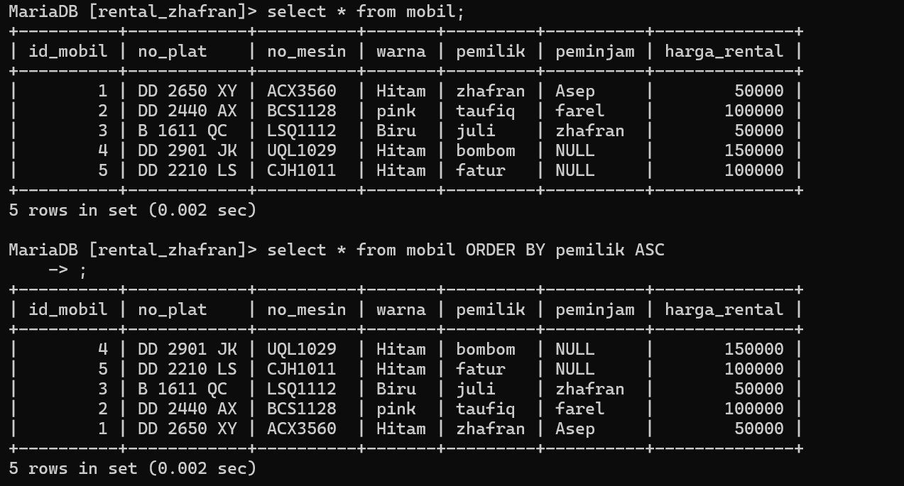

# penggunaan awal MySQL
## Query

```mysql
MySQL -u root
```

 
## hasil


## analisis

**MySQL** adalah perintah untuk mengakses Shell MySQL, yaitu antarmuka command line untuk berinteraksi dengan server MySQL

**"-u root"** adalah opsi yang digunakan saat Anda mengakses MySQL dari baris perintah (command line). Di sini, "-u" adalah singkatan dari "user", dan "root" adalah nama pengguna. Dengan menggunakan "-u root", Anda masuk ke MySQL sebagai pengguna "root", yang biasanya memiliki hak akses penuh ke semua fungsi MySQL. Pengguna "root" sering digunakan untuk melakukan tugas administratif dan konfigurasi yang memerlukan tingkat akses tertinggi.

### kesimpulan 

 **MySQL -u root** adalah bahwa Anda mengakses server MySQL dengan menggunakan opsi "-u" untuk menentukan pengguna (dalam hal ini, "root" yang merupakan pengguna dengan hak akses tertinggi). Dengan menggunakan "root", Anda memiliki kemampuan untuk melakukan tugas administratif dan konfigurasi yang memerlukan tingkat akses penuh ke server MySQL.

# DataBase
## Buat database

Untuk membuat database di MySQL, Anda dapat menggunakan perintah SQL `CREATE DATABASE [nama_database].`Gantilah "nama_database" dengan nama yang ingin Anda berikan pada database tersebut. 

### Hasil


## tampilkan database 

Untuk menampilkan semua database yang ada di MySQL, Anda dapat menggunakan perintah **databases**, Perintah ini akan menampilkan daftar semua database yang telah Anda buat atau yang sudah ada dalam server MySQL. 
### Hasil:


## hapus database

Untuk menghapus database di MySQL, Anda dapat menggunakan perintah **DROP DATABASE**. Gantilah "nama_database" dengan nama database yang ingin Anda hapus. Pastikan Anda memiliki izin yang cukup untuk menjalankan perintah ini.
### Hasil:

## gunakan/memilih database

Untuk memilih atau beralih ke suatu database tertentu dalam MySQL, Anda menggunakan perintah USE. Gantilah "nama_database" dengan nama database yang ingin Anda pilih. Setelah menjalankan perintah ini, Anda akan beralih ke database tersebut, dan semua operasi database selanjutnya akan berlaku untuk database yang dipilih. Perintah USE ini berguna saat Anda ingin bekerja dengan tabel atau data di dalam database tertentu. Misalnya, jika Anda ingin menjalankan perintah SELECT untuk mengambil data dari tabel di suatu database, Anda perlu menggunakan perintah USE terlebih dahulu untuk memilih database tersebut

### Hasil


## Membuat tabel
### query
```
CREATE TABLE [nama_tabel] ( 
Nama_kolom1 tipe_data(ukuran) (tipe_constrait) ,
Nama_kolom2 tipe_data(ukuran) (tipe_constrait) ,
Nama_kolom3 tipe_data(ukuran) (tipe_constrait) ,
);
```
### Contoh
```mysql
Create table pelanggan (id_pelanggan int(4) PRIMAY KEY NOT NULL,nama_depan varchar(25) NOT NULL,nama_belakang varchar(25)NOT NULL,no_telp char(12)UNIQUE);
```

### hasil


### analisis
1.`CREATE TABLE pelanggan (` : 
perintah untuk membuat sebuah tabel dengan nama "pelanggan".

2.`id_pelanggan int(4) PRIMARY KEY NOT NULL`: `id_pelanggan`sebagai nama kolom bilangan bulat dengan panjang maksimum 4 digit, `PRYMARY KEY` ditetapkan sebagai kunci utama  dan `NOT NULL`tidak boleh nol 

3.`nama_depan varchar(25) NOT NULL`: 
`nama_depan` sebagai nama/judul kolom `varchar`  variabel dengan panjang maksimum 25 karakter,`NOT NULL` tidak boleh kosong.

4.`nama_belakang varchar(25) NOT NULL` :
`nama_belakang` sebagai nama/judul kolom`varchar` Kolom karakter variabel dengan panjang maksimum 25 karakter,`NOT NULL`tidak boleh kosong. 

5.`no_telp char(12) UNIQUE` : 
Ini mendefinisikan kolom `no_telp` sebagai tipe data char (karakter) dengan panjang tepat 12 karakter. Kata kunci `UNIQUE` menandakan bahwa nilai di kolom ini harus unik untuk setiap baris dalam tabel.

### kesimpulan
Perintah-perintah tersebut digunakan untuk membuat tabel yang bernama `pelanggan` dalam basis data. Tabel ini memiliki kolom-kolom: `id_pelanggan` sebagai kunci utama dengan panjang maksimum 4 digit, `nama_depan` dengan panjang maksimum 25 karakter, `nama_belakang` dengan panjang maksimum 25 karakter, dan `no_telp` dengan panjang tepat 12 karakter yang harus unik  karena nomor pelanggan pasti berbeda.

## Tampilkan Struktur Tabel
### struktur query
```mysql
DESC nama_tabel;
```
### Contoh query
```mysql
DESC Pelanggan;
```
### hasil

### analisis
Kode "DESC pelanggan;" digunakan untuk mendapatkan deskripsi atau struktur dari tabel "pelanggan". Ini memberikan informasi tentang kolom-kolom dalam tabel beserta tipe data, dan constraint (jika ada).
### kesimpulan
Kesimpulan dari kode "DESC pelanggan;" adalah bahwa perintah tersebut bertujuan untuk menampilkan deskripsi atau struktur dari tabel dengan nama "pelanggan". Ini memberikan informasi tentang kolom-kolom yang ada dalam tabel, seperti nama kolom, tipe data, dan konstrain yang mungkin diterapkan.

## select
### struktur query
```
select * from [nama_tabel];
```
### contoh query
```sql
select * from Pelanggan;
```
### hasil

### analisis
- `SELECT` adalah kata kunci yang digunakan untuk memilih data dari database.
- `*`  yang berarti memilih semua kolom yang ada dalam tabel.
- `FROM` adalah kata kunci yang digunakan untuk menentukan tabel mana yang akan diambil datanya.
-  `Pelanggan` adalah nama dari tabel dalam database yang ingin Anda ambil datanya.
### kesimpulan
Perintah `SELECT * FROM Pelanggan` menampilkan keseluruhan  data yang tersimpan dalam tabel "Pelanggan".

## Update
### struktur query:
```
update [nama tabel] set kondisi where kondisi;
```
### contoh query:
```sql
update Pelanggan set no_telp="088705872069" where id_pelanggan="3";
```
### hasil:

### analisis:
- `UPDATE` adalah kata kunci yang digunakan untuk memperbarui data yang ada dalam tabel.
- `Pelanggan` adalah nama tabel yang datanya akan diperbarui.
- `SET` adalah kata kunci yang digunakan untuk menentukan kolom mana yang akan diubah dan nilai baru yang akan ditetapkan.
- `no_telp="088705872069"` berarti kolom `no_telp` akan diperbarui dengan nilai baru `"088705872069"`.
- `WHERE` adalah kata kunci yang digunakan untuk menetapkan kondisi yang harus dipenuhi oleh baris-baris yang akan diperbarui.
- `id_pelanggan="3"` adalah kondisi yang harus dipenuhi. Hanya baris dengan `id_pelanggan` bernilai `"3"` yang akan diperbarui.
### kesimpulan:
Perintah ini memastikan hanya data pada baris yang memenuhi kondisi tertentu yang akan diubah.

## Delete Tabel
### struktur query
```
drop table [nama_tabel];
```
### contoh query
```sql
drop table contoh;
```
### hasil

### analisis
- `DROP TABLE` adalah perintah yang digunakan untuk menghapus tabel dari database.
- `contoh` adalah nama tabel yang akan dihapus dari database.
### kesimpulan
Kode `drop table contoh` merupakan perintah SQL yang digunakan untuk menghapus tabel yang disebut "contoh" dari basis data. Hal ini akan menghapus seluruh struktur tabel beserta data yang terkandung di dalamnya secara permanen.

## AND
### Struktur query
```
select warna,pemilik from mobil where warna="" AND pemilik="";
```
### Contoh query
```sql
select warna,pemilik from mobil where warna="Biru" AND pemilik="juli";
```
### Hasil

### Analisis
- `WHERE` digunakan untuk menyaring baris-baris dalam tabel berdasarkan kondisi yang ditentukan.
- `warna = "Biru"`, yang berarti hanya baris dengan nilai kolom `warna` yang sama dengan "Biru" yang akan dipertimbangkan.
- `AND` digunakan untuk menggabungkan kedua kondisi ini, yang berarti hanya baris-baris yang memenuhi kedua kondisi tersebut (warna "Biru" dan pemilik "juli") yang akan disertakan dalam hasil query.
- `pemilik = "juli"`, yang berarti hanya baris dengan nilai kolom `pemilik` yang sama dengan "juli" yang akan dipertimbangkan.
### Kesimpulan
Perintah SQL ini akan menghasilkan sekumpulan data yang hanya berisi kolom `warna` dan `pemilik` dari tabel `mobil`, dengan ketentuan Kolom `warna` harus memiliki nilai "Biru". Kolom `pemilik` harus memiliki nilai "juli". Jika tidak ada baris yang memenuhi kedua kondisi tersebut, maka hasil query akan kosong.

## <=
### Struktur query
```
select * from [nama_tabel] where data 1 < = nilai 1;
```
### Contoh query
```sql
select * from mobil where harga_rental < = 100000;
```
### Hasil

### Analisis
- `select` Perintah ini digunakan untuk memilih semua kolom dari tabel yang ditentukan. Artinya, semua data dalam baris yang memenuhi syarat akan ditampilkan dalam hasil query.
- `FROM mobil` Bagian ini menentukan tabel `mobil` sebagai sumber data. Jadi, query ini akan mencari data dalam tabel `mobil`.
- `WHERE` digunakan untuk menyaring baris-baris dalam tabel berdasarkan kondisi yang ditentukan.
- Kondisi `harga_rental < = 100000` berarti hanya baris-baris dengan nilai `harga_rental` yang kurang dari atau sama dengan 100000 yang akan disertakan dalam hasil query.
### Kesimpulan
Perintah SQL ini akan menghasilkan sekumpulan data yang berisi semua kolom dari tabel `mobil`, dengan ketentuan Kolom `harga_rental` harus memiliki nilai yang kurang dari atau sama dengan 100000. Jika ada baris yang memenuhi syarat `harga_rental` kurang dari atau sama dengan 100000, baris-baris tersebut akan muncul dalam hasil query dengan semua kolom yang tersedia dalam tabel `mobil`. Jika tidak ada baris yang memenuhi syarat tersebut, maka hasil query akan kosong.

## !=
### Struktur query
```
select * from [nama_tabel] where data 1 != nilai 1;
```
### Contoh query
```sql
select * from mobil where harga_rental != 100000;
```
### Hasil

### Analisis
- `select` Perintah ini digunakan untuk memilih semua kolom dari tabel yang ditentukan. Artinya, semua data dalam baris yang memenuhi syarat akan ditampilkan dalam hasil query.
- `FROM mobil` Bagian ini menentukan tabel `mobil` sebagai sumber data. Jadi, query ini akan mencari data dalam tabel `mobil`.
- `WHERE` digunakan untuk menyaring baris-baris dalam tabel berdasarkan kondisi yang ditentukan.
- Operator `!=` digunakan untuk menyatakan "tidak sama dengan".
- Kondisi `harga_rental != 100000` berarti hanya baris-baris dengan nilai `harga_rental` yang tidak sama dengan 100000 yang akan disertakan dalam hasil query.
### Kesimpulan
Perintah SQL ini akan menghasilkan sekumpulan data yang berisi semua kolom dari tabel `mobil`, dengan ketentuan Kolom `harga_rental` harus memiliki nilai yang tidak sama dengan 100000. Jika ada baris yang memenuhi syarat `harga_rental` tidak sama dengan 100000, baris-baris tersebut akan muncul dalam hasil query dengan semua kolom yang tersedia dalam tabel `mobil`. Jika semua baris dalam tabel `mobil` memiliki `harga_rental` yang sama dengan 100000, maka hasil query akan kosong.

## IN

### Struktur query
```
select * from nama_tabel where data IN('nilai 1','nilai 2');
```
### contoh query
```sql
select * from mobil where warna in ("pink","biru");
```
### hasil

### analisis
- `select` Perintah ini digunakan untuk memilih semua kolom dari tabel yang ditentukan. Artinya, semua data dalam baris yang memenuhi syarat akan ditampilkan dalam hasil query.
- `FROM mobil` Bagian ini menentukan tabel `mobil` sebagai sumber data. Jadi, query ini akan mencari data dalam tabel `mobil`.
- `WHERE` digunakan untuk menyaring baris-baris dalam tabel berdasarkan kondisi yang ditentukan.
- Operator `IN` digunakan untuk memeriksa apakah nilai kolom `warna` ada dalam daftar nilai yang diberikan.
- Kondisi `warna IN ("pink", "biru")` berarti hanya baris-baris dengan nilai `warna` yang termasuk dalam daftar ("pink", "biru") yang akan disertakan dalam hasil query.
### kesimpulan
Perintah SQL ini akan menghasilkan sekumpulan data yang berisi semua kolom dari tabel `mobil`, dengan ketentuan Kolom `warna` harus memiliki nilai yang termasuk dalam daftar "pink" atau "biru" Jika ada baris yang memenuhi syarat `warna` adalah "pink" atau "biru", baris-baris tersebut akan muncul dalam hasil query dengan semua kolom yang tersedia dalam tabel `mobil`.

## IN + AND + OPERATOR

### Struktur query

```
select * from nama_tabel where data IN('nilai 1','nilai 2')AND data 2<nilai 1;
```
### contoh query
```sql
 select * from mobil where warna IN('pink','Biru')AND harga_rental<100000;
```
### Hasil

### Analisis
- `select` Perintah ini digunakan untuk memilih semua kolom dari tabel yang ditentukan. Artinya, semua data dalam baris yang memenuhi syarat akan ditampilkan dalam hasil query.
- `FROM mobil` Bagian ini menentukan tabel `mobil` sebagai sumber data. Jadi, query ini akan mencari data dalam tabel `mobil`.
- `WHERE` digunakan untuk menyaring baris-baris dalam tabel berdasarkan kondisi yang ditentukan.
- Kondisi `warna IN ('pink', 'Biru')` berarti hanya baris-baris dengan nilai `warna` yang sama dengan "pink" atau "Biru" yang akan dipertimbangkan.
- Operator `AND` digunakan untuk menggabungkan kedua kondisi ini, yang berarti hanya baris-baris yang memenuhi kedua kondisi tersebut yang akan disertakan dalam hasil query.
- Kondisi `harga_rental < 100000` berarti hanya baris-baris dengan nilai `harga_rental` yang kurang dari 100000 yang akan dipertimbangkan. Warna pink tidak akan tampil karena `harga_rental` harus kurang dari 100000.
### Kesimpulan
Perintah SQL ini akan menghasilkan sekumpulan data yang berisi semua kolom dari tabel `mobil`, dengan ketentuan Kolom `warna` harus memiliki nilai "pink" atau "Biru" Kolom `harga_rental` harus memiliki nilai kurang dari 100000 Jika ada baris yang memenuhi kedua syarat tersebut (warna "pink" atau "Biru" dan harga_rental kurang dari 100000), baris-baris tersebut akan muncul dalam hasil query dengan semua kolom yang tersedia dalam tabel `mobil`.

## Like (mencari awalan)
### Struktur query
```
select * from nama_tabel where data LIKE 'n%';
```
### contoh query
```sql
select * from mobil where pemilik LIKE 'z%';
```
### Hasil

### Analisis
- `select` Perintah ini digunakan untuk memilih semua kolom dari tabel yang ditentukan. Artinya, semua data dalam baris yang memenuhi syarat akan ditampilkan dalam hasil query.
- `FROM mobil` Bagian ini menentukan tabel `mobil` sebagai sumber data. Jadi, query ini akan mencari data dalam tabel `mobil`.
- `WHERE` digunakan untuk menyaring baris-baris dalam tabel berdasarkan kondisi yang ditentukan.
- Kondisi `pemilik LIKE 'z%'` menggunakan operator `LIKE` untuk memeriksa apakah nilai dalam kolom `pemilik` dimulai dengan huruf 'z'. Simbol '%' digunakan sebagai wildcard yang cocok dengan nol atau lebih karakter. Dengan demikian, kondisi ini akan mencocokkan semua nilai dalam kolom `pemilik` yang dimulai dengan huruf 'z', diikuti oleh nol atau lebih karakter lainnya.
### Kesimpulan
Perintah SQL ini akan menghasilkan sekumpulan data yang berisi semua kolom dari tabel `mobil`, di mana nilai dalam kolom `pemilik` dimulai dengan huruf 'z'. Jika ada baris yang memenuhi syarat tersebut, baris-baris tersebut akan muncul dalam hasil query dengan semua kolom yang tersedia dalam tabel `mobil`

## Like (mencari akhir)
### struktur query
```
select * from nama_tabel where data LIKE '%';
```
### contoh query
```sql
select * from mobil where pemilik LIKE '%m';
```
### hasil

### analisis
- `select` Perintah ini digunakan untuk memilih semua kolom dari tabel yang ditentukan. Artinya, semua data dalam baris yang memenuhi syarat akan ditampilkan dalam hasil query.
- `FROM mobil` Bagian ini menentukan tabel `mobil` sebagai sumber data. Jadi, query ini akan mencari data dalam tabel `mobil`.
- `WHERE` digunakan untuk menyaring baris-baris dalam tabel berdasarkan kondisi yang ditentukan.
- Kondisi `pemilik LIKE '%m'` menggunakan operator `LIKE` untuk memeriksa apakah nilai dalam kolom `pemilik` berakhir dengan huruf 'm'. Simbol `%` digunakan sebagai wildcard yang cocok dengan nol atau lebih karakter sebelum 'm'. Dengan demikian, kondisi ini akan mencocokkan semua nilai dalam kolom `pemilik` yang berakhir dengan huruf 'm'.
### kesimpulan
Perintah SQL ini akan menghasilkan sekumpulan data yang berisi semua kolom dari tabel `mobil`, di mana nilai dalam kolom `pemilik` berakhir dengan huruf 'm'. Jika ada baris yang memenuhi syarat tersebut, baris-baris tersebut akan muncul dalam hasil query dengan semua kolom yang tersedia dalam tabel `mobil`.

# ORDER BY & Limit
### struktur query
```
select * from nama_tabel ORDER BY kolom_tabel ASC;
```
### contoh query
```sql
select * from mobil ORDER BY pemilik ASC
```
### hasil

### analisis
- `SELECT * FROM mobil`: Ini adalah klausa SELECT yang digunakan untuk memilih semua kolom dari tabel "mobil".
- `ORDER BY pemilik ASC`: Ini adalah klausa ORDER BY yang digunakan untuk mengurutkan hasil berdasarkan kolom "pemilik" secara ascending (ASC). Ini berarti hasilnya akan disusun secara alfabetis berdasarkan nilai pada kolom "pemilik", dimulai dari nilai terkecil ke nilai terbesar.
### kesimpulan
kode SQL ini adalah bahwa kita ingin melihat data tentang mobil berdasarkan pemiliknya dan mengurutkannya secara alfabetis berdasarkan nama pemilik. Ini mungkin digunakan untuk melihat distribusi mobil antara berbagai pemilik atau untuk melakukan analisis berdasarkan kepemilikan mobil.

## Limit
### struktur query
```
SELECT * FROM nama_tabel WHERE nama_data = ”data” ORDER BY nama_data ASC LIMIT 2;
```
### contoh query
```sql
SELECT * FROM mobil WHERE warna = ”Hitam” ORDER BY harga_rental ASC LIMIT 2;
```
### hasil

### analisis
- `SELECT * FROM mobil WHERE warna = 'Hitam'`: Ini adalah klausa SELECT yang digunakan untuk memilih semua kolom dari tabel "mobil" di mana nilai pada kolom "warna" adalah 'Hitam'.
- `ORDER BY harga_rental ASC`: Ini adalah klausa ORDER BY yang digunakan untuk mengurutkan hasil berdasarkan kolom "harga_rental" secara ascending (ASC). Ini berarti hasilnya akan disusun secara numerik dari harga rental terendah ke tertinggi.
- `LIMIT 2`: Ini adalah klausa LIMIT yang digunakan untuk membatasi jumlah baris hasil query menjadi hanya dua baris.
### kesimpulan
Query tersebut adalah sebuah perintah SQL yang digunakan untuk mengambil data dari tabel "mobil" dimana nilai kolom "warna" adalah "Hitam". Hasilnya akan diurutkan berdasarkan kolom "harga" secara menaik (ASC) dan hanya akan menampilkan 2 baris data pertama yang memenuhi kriteria tersebut.

## MIN
### struktur query
```
SELECT MIN(nama_kolom) AS nilai_minimum FROM nama_tabel WHERE kondisi_opsional;
```
### contoh query
```sql
select MIN(harga_rental) AS minimal from mobil;
```
### Hasil

### Analisis
SELECT MIN(harga_rental) ini nama kolom yang akan di tampilkan AS MINIMAL FROM mobil; nama tabelnya, ini akan mengambil nilai terkecil dari kolom harga_rental dalam tabel mobil dan memberikan hasilnya dengan nama kolom MINIMAL.disini hasilnya yang tampil adalah 5000 karena 5000 adalah nilai yang paling rendah dari nilai lainnya.
### Kesimpulan
MIN ini akan menampilkan nilai yang paling rendah dalam sebuah kolom dari sebuah tabel.

---
## MAX
### struktur query
```
SELECT MAX(nama_kolom) AS nilai_maksimum FROM nama tabel
WHERE kondisi_opsional;
```
### contoh query
```sql
select MAX(harga_rental) AS minimal from mobil;
```
### Hasil

### Analisis
SELECT MAX (harga_rental) ini nama kolom yang akan di tampilkan AS MAXIMAL FROM mobil; nama tabelnya, ini akan mengambil nilai terkecil dari kolom harga_rental dalam tabel mobil dan memberikan hasilnya dengan nama kolom MINIMAL.disini hasilnya yang tampil adalah 15000 karena 15000 adalah nilai yang paling rendah dari nilai lainnya.
### Kesimpulan
MAX ini akan menampilkan nilai yang paling tinggi dalam sebuah kolom dari sebuah tabel.

---
## AVG
### struktur query
```
SELECT AVG(nama_kolom) AS rata_rata FROM nama_tabel
WHERE kondisi_opsional;

```
### contoh query
```sql
select AVG(harga_rental) AS RATA_RATA from mobil;
```
### Hasil

### Analisis
Select AVG (harga_rental) adalah nama kolom yang akan dihitung rata-rata harga rentalnya.Dengan menggunakan AVG kita dapat menghasilkan rata-rata harga rental mobil dari tabel mobil. Perintah SELECT AVG(harga_rental) menghitung nilai rata-rata dari kolom harga_rental. Hasil dari query ini akan memberikan rata-rata harga rental mobil di tabel mobil.hasil dari rata-rata harga mobil adalah 90000.0000.
### Kesimpulan
Kesimpulannya,akan menampilkan hasil dari rata-rata harga mobil pada kolom harga_rental.

# Menambahkan kolom

## struktur query
```
ALTER TABLE nama_tabel ADD batas_peminjaman varchar(10) AFTER nama_kolom;
```
## contoh query
```sql
ALTER TABLE mobil ADD batas_peminjaman varchar(10) AFTER peminjam;
```
## hasil


## analisis
- `ALTER TABLE`: Ini menunjukkan bahwa kita sedang memodifikasi struktur dari tabel yang sudah ada.
- `mobil`: Ini adalah nama tabel yang akan kita ubah.
-  `ADD batas_peminjam varchar(10)`: Ini berarti kita akan menambahkan kolom baru bernama `batas_peminjam` ke tabel `mobil`, dan kolom tersebut akan memiliki tipe karakter variabel dengan panjang maksimum 10 karakter.
- `AFTER peminjam`: Ini menunjukkan bahwa kolom baru `batas_peminjam` akan ditambahkan setelah kolom yang sudah ada yaitu `peminjam` di dalam tabel.
## kesimpulan
Pernyataan SQL tersebut menambahkan kolom baru dengan nama `batas_peminjam` ke tabel `mobil`dengan tipe data karakter variabel dan panjang maksimum 10 karakter, yang akan ditempatkan setelah kolom `peminjam` yang sudah ada di dalam tabel.

# Mengubah nama kolom
### struktur query
```
ALTER TABLE nama_tabel RENAME COLUMN nama_kolom TO nama_kolom baru;
```
### contoh query
```sql
ALTER TABLE mobil RENAME COLUMN batas_peminjaman TO deadline;
```
### hasil

### analisis
- `ALTER TABLE`: Ini menunjukkan bahwa kita sedang memodifikasi struktur dari sebuah tabel.
- `mobil`: Ini adalah nama tabel yang akan kita ubah.
- `RENAME COLUMN batas_peminjam TO deadline`: Ini berarti kita akan mengubah nama kolom yang sudah ada dari `batas_peminjam` menjadi `deadline` di dalam tabel `mobil`.
### kesimpulan
Pernyataan SQL tersebut mengubah nama kolom yang sudah ada dari `batas_peminjam` menjadi `deadline` di dalam tabel `mobil`.

# Mengubah tipe data kolom
### struktur query
```
ALTER TABLE nama_tabel MODIFY deadline DATE;
```
### contoh query
```sql
ALTER TABLE mobil MODIFY deadline DATE;
```
### hasil

### analisis
- `ALTER TABLE`: Ini adalah kata kunci yang menunjukkan bahwa kita akan melakukan perubahan pada struktur tabel.
- `mobil`: Ini adalah nama tabel yang akan diubah.
- `MODIFY`: Ini adalah kata kunci yang menunjukkan jenis perubahan yang akan dilakukan pada tabel. Dalam konteks ini, kita akan mengubah tipe data kolom.
- `deadline`: Ini adalah nama kolom yang akan diubah tipe datanya.
- `DATE`: Ini adalah tipe data baru yang akan diberikan kepada kolom "deadline". Dalam hal ini, tipe data DATE digunakan, yang cocok untuk menyimpan nilai tanggal.
### kesimpulan
pernyataan ALTER TABLE ini akan mengubah tipe data kolom "deadline" dalam tabel "mobil" menjadi DATE, yang akan memungkinkan kolom tersebut untuk menyimpan nilai tanggal.

# menghapus kolom 
### struktur query
```
ALTER TABLE nama_tabel DROP COLUMN;
```
### contoh query
```sql
ALTER TABLE mobil DROP COLUNM batas_peminjaman;
```
### hasil

### analisis
- `ALTER TABLE`: Ini adalah perintah SQL yang digunakan untuk mengubah struktur tabel.
- `mobil`: Ini adalah nama tabel yang ingin Anda ubah strukturnya.
- `DROP COLUMN batas_peminjaman`: Ini adalah bagian yang melakukan perubahan. Perintah ini menghapus kolom "`batas_peminjaman`" dari tabel "`mobil`". Ini berarti bahwa setelah perintah ini dijalankan, kolom "`batas_peminjaman`" beserta semua data yang ada di dalamnya akan dihapus dari tabel "`mobil`".
## kesimpulan
Perintah `ALTER TABLE mobil DROP COLUMN batas_peminjaman;` menghapus kolom "`batas_peminjaman`" dari tabel "`mobil`". Ini akan menghapus semua data yang terkait dengan kolom tersebut. Pastikan untuk membuat pencadangan data sebelum menjalankan perintah ini dan pastikan bahwa penghapusan kolom tersebut sesuai dengan kebutuhan apk anda.

# mengubah nama tabel
### struktur query
```
ALTER TABLE nama_tabel RENAME TO nama_kolom
```
### contoh query
```
ALTER TABLE mobil RENAME TO data_mobil;
```
### hasil

### analisis
- `ALTER TABLE`: Ini adalah perintah SQL yang digunakan untuk mengubah struktur tabel.
- `mobil`: Ini adalah nama tabel yang ingin Anda ubah.
- `RENAME TO data_mobil`: Ini adalah bagian yang melakukan perubahan. Perintah ini mengubah nama tabel "`mobil`" menjadi "`data_mobil`"..
## kesimpulan
Perintah `ALTER TABLE mobil RENAME TO data_mobil;` mengubah nama tabel "`mobil`" menjadi "`data_mobil`". Pastikan untuk memperbarui kode atau query yang menggunakan nama tabel lama setelah menjalankan perintah ini.

