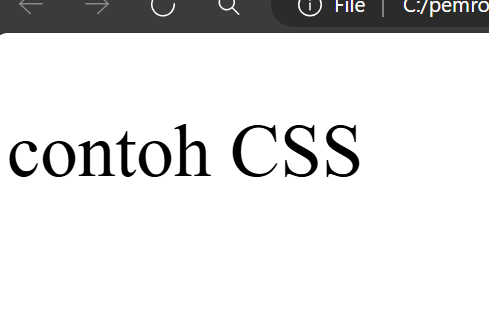
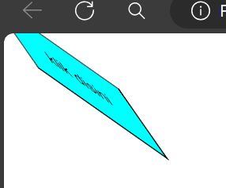

# Cara pemanggilan CSS
# Inlane
Pemanggilan inline CSS adalah cara untuk menambahkan gaya langsung ke elemen HTML menggunakan atribut `style`. Ini memungkinkan Anda menentukan gaya khusus untuk elemen tertentu tanpa perlu membuat file CSS terpisah
### contoh kode program

```html
<!DOCTYPE html>
<html>
  <head>
    <title>belajar panggilan css</title>
  </head>
  <body>
   <p style="color:red;">inline</p>
  </body>  
</html>
```
## Internal
Pemanggilan internal CSS adalah ketika Anda menulis gaya CSS di dalam tag `style` di bagian head dari dokumen HTML yang sama
### contoh kode program:

```html
<!DOCTYPE html>
<html>
  <head>
    <title>Percobaan Pertama CSS</title>
    <style>
    p {
      color: red;
    }
    </style>
  </head>
  <body>
    <p>Walcome CSS!</p>
    <p>Walcome CSS!</p>
  </body>
</html>
```
## External
Pemanggilan eksternal CSS adalah ketika Anda menyimpan gaya CSS dalam file terpisah dengan ekstensi css dan memanggilnya dalam dokumen HTML menggunakan tag `link`. Ini memungkinkan Anda untuk memisahkan struktur HTML dari gaya CSS, membuat kode lebih terorganisir dan mudah dikelola
### contoh kode program:
```html
<!DOCTYPE html>
<html>
<head>
  <title>CSS</title>
 <link rel="stylesheet" href="Contoh.css">
</head>
<body>
<p>menggunakan pemanggilan external</p>
</body>
</html>
```
---
# Selector
## Elemen selector 
Selector ini memilih semua elemen HTML dengan nama elemennya. Misalnya, jika Anda menggunakan `P` sebagai selector, maka semua elemen paragraf dalam dokumen HTML akan dipilih
## Class selector 
digunakan untuk menerapkan gaya pada elemen HTML yang memiliki kelas tertentu. Ini memungkinkan Anda untuk mengatur gaya tertentu untuk kelompok elemen yang memiliki kelas yang sama, tanpa harus merubah setiap elemen secara individual. Untuk menggunakan pemilih kelas, Anda menambahkan titik (.) diikuti oleh nama kelas yang ingin Anda targetkan dalam aturan gaya CSS Anda
## ID selector 
Memilih elemen berdasarkan ID uniknya. Untuk menggunakan selector ID, Anda harus menambahkan tanda pagar `#` di depan nama ID. Contoh: `#id`akan memilih elemen dengan ID "id"

---
# Text
## Text align
### penjelasan
`text-align:center;` digunakan untuk mengatur posisi teks ke tengah
### program
```css
  p{
    text-align: center;
  }
```
### hasil

### kesimpulan
Untuk mengatur posisi Text

## Text decoration
### penjelasan
`text-decoration` untuk memberi dekorasi pada text.
### program
```css
  p{
    text-decoration: underline;
  }
```
### hasil

### kesimpulan
`text-decoration: underline;` untuk memberi garis bawah.

## Text tranfrom
### penjelasan
untuk mengubah huruf dalam text, `lowercase` untuk memastikan semua text yang ditampilkan dengan huruf kecil
### program
```css
p{text-transform:lowercase;}
```
### hasil

### kesimpulan
mengubah text yang menggunakan huruf kapital menjadi huruf kecil

## Text indent
### penjelasan
Untuk mengatur jarak indentasi awal dari teks dalam sebuah elemen.
### program
```css
p{
Text-indent:50px;
}
```
### hasil

### kesimpulan
Kesimpulannya, kode tersebut mengatur indentasi awal teks dalam semua elemen paragraf sejauh 50 piksel dari sisi kiri.
## Letter-spacing
### penjelasan
mengatur jarak antara baris dalam elemen paragraf Ini berarti setiap baris teks dalam elemen paragraf akan memiliki jarak.
### program
```css
p{letter-spacing:20px}
```
### hasil

### kesimpulan
Kesimpulannya, kode CSS ini akan membuat jarak antara baris dalam elemen paragraf menjadi 20 piksel, menciptakan ruang horizontal yang lebih besar di antara setiap baris teks.

## Line-height
### penjelasan
Ini adalah properti CSS yang mengatur tinggi baris di dalam elemen.
### program
```css
P{Line-height:50px;}
```
### hasil

### kesimpulan
kode Line-height:170px; mengatur tinggi baris untuk semua elemen paragraf menjadi 170 piksel.

## Word-Spacing
### penjelasan
Ini adalah properti CSS yang mengatur jarak antara kata-kata di dalam elemen.
### program
```css
P{Word-Spacing:50px;}
```
### hasil

### kesimpulan
kode Word-spacing:50px; mengatur jarak antara kata-kata di dalam semua elemen paragraf menjadi 50 piksel.

# Font
## Font-Weight
### penjelasan
Font-weight: bold; adalah properti CSS yang digunakan untuk mengatur ketebalan teks.
### program
```css
p{Font-Weight:bold;}
```
### hasil

### kesimpulan
Properti CSS ini digunakan untuk mengatur ketebalan teks. Dalam hal ini, nilai yang diberikan adalah "bold".

## Font-Size
### penjelasan
Font-size: 50px; adalah properti CSS yang digunakan untuk mengatur ukuran font menjadi 50 piksel. Ini berarti teks yang diberikan akan ditampilkan dengan ukuran 50 piksel, membuatnya lebih besar dari ukuran font standar yang biasa digunakan dalam tata letak halaman web
### program
```css
P{Font-Size:50px;}
```
### hasil

### kesimpulan
Kode property bertujuan agar teks membuatnya lebih besar dari ukuran font standar yang biasa digunakan dalam tata letak halaman web.

## Font-Style
### penjelasan
Font-style: italic; adalah properti CSS yang digunakan untuk mengatur gaya teks menjadi miring (italic). Ini berarti teks yang diberikan akan miring, seperti yang sering kita lihat dalam gaya teks untuk menekankan kata-kata atau membuat teks menonjol.
### program
```css
p{Font-Style:italic;}
```
### hasil

### kesimpulan
Kode properti yang bertujuan untuk mengatur gaya teks yang dalam kasus ini menjadi miring (italic).

## Font-family
### penjelasan
Font-family: Times New Roman; adalah properti CSS yang digunakan untuk menentukan jenis font yang akan digunakan untuk menampilkan teks. Dalam hal ini, jenis font yang dipilih adalah "Times New Roman." Ini akan mengubah teks yang menggunakan properti ini untuk diatur dengan gaya huruf yang khas dari jenis font Times New Roman, yang sering kali terlihat formal dan terstruktur.
### program
```css
P{Font-family:Times-New-Roman;}
```
### hasil

### kesimpulan
Kode properti ini digunakan untuk menetapkan jenis font yang akan digunakan untuk menampilkan teks, di mana dalam kasus ini, jenis font yang dipilih adalah Times New Roman.

---
# Materi Back Ground
## Background-Size
### penjelasan
Properti ini mengatur ukuran latar belakang. Di sini, latar belakang akan memiliki lebar 200 piksel, dengan tinggi yang disesuaikan agar proporsi aslinya tetap terjaga.
### program
```css
P{background-size:200px;}
```
### hasil

### kesimpulan
Kode property tersebut bertujuan mengatur ukuran gambar latar belakang dengan size pixel.

## Background-attachment
### penjelasan
background-attachment: fixed; Properti ini menentukan apakah latar belakang akan tetap diam atau akan bergulir bersama dengan isi elemen saat pengguna menggulir halaman. Dalam kasus ini, latar belakang akan tetap diam, artinya posisinya akan tetap konstan saat halaman digulir.
### program
```css
p{background-attachment:fixed;}
```
### hasil

### kesimpulan
Kode property tersebut akan mengatasi gambar yang bergulir akan diam dengan menggunakan value (fixed)

## Background-position
### penjelasan
background-position: top; Properti ini mengatur posisi latar belakang di dalam elemen. Di sini, latar belakang akan diposisikan di bagian atas elemen.
### program
```css
p
{Background-position:top;}
```
### hasil

### kesimpulan
Kode property tersebut akan menentukan posisi gambar latar belakang ke atas (top).

---
# Materi Box Model
## width-height
### penjelasan
Jadi width dan height ini akan mengatur tinggi dan lebarnya dari Bordernya.
### program
```css
button {
      width: 100px;
      height: 50px;
   }
```
### hasil

### kesimpulan
Kesimpulannya untuk tingginya (`height`) adalah 50px,dan lebarnya (`width`) adalah 100px

### Border-width
### penjelasan
Untuk mengatur lebar border pada button.
### program
```css
button {
  border-width:5px;
}
```
### hasil

### kesimpulan
mengatur lebar border 

## Border-radius
### penjelasan
`Border radius` adalah properti CSS yang digunakan untuk mengatur sudut lengkung pada sudut-sudut elemen yang memiliki batas (border).
### program
```css
button {
        Border-radius:10px 10px 10px;
   }
```
### hasil

### kesimpulan
memberi lengkungan pada border

## Border-style
### penjelasan
`Border style` adalah properti CSS yang digunakan untuk mengatur gaya garis batas (border) pada elemen HTML. 
### program
```css
button {
        Border-style:dashed;
   }
```
### hasil

### kesimpulan
Kesimpulannya menggunakan `border-style dashed` akan memberikan garis putus" pada bagian Border button.

## Border color
### penjelasan
`Border color` adalah properti CSS yang digunakan untuk mengatur warna garis batas (border) pada elemen HTML.
### program
```css
button {
  Border-color:purple;
   }
```
### hasil

### kesimpulan
Memberikan warna pada Bordernya seperti warna purple.

## Padding
### Padding-left
#### penjelasan
`Padding-left` ini akan membuat bagian kosong di kiri.
#### program
```css
button {
      width: 200px ;
      height: 100px;
      padding-left: 170px;
   }
```
#### hasil

#### kesimpulan
Membuat bagian kosong dari button yang ada sebelah kiri

### Padding-right
#### penjelasan
`Padding-right` ini akan membuat bagian kosong di kanan.
#### program
```css
button {
    width: 200px ;
    height: 100px;
    padding-right: 170px;
 }
```
#### hasil

#### kesimpulan
Membuat bagian kosong dari button yang ada sebelah kanan.

### Padding-bottom
### penjelasan
ini akan membuat tulisan ke atas
### program
```css
button {

    width: 200px ;

    height: 100px;

    padding-bottom: 170px;

 }
```
### hasil

### kesimpulan
membuat bagian kosong pada bagian bawah

### Padding-top
### penjelasan
membuat tulisan ke bawah
### program
```css
button {

    width: 200px ;

    height: 100px;

    padding-top: 150px;

 }
```
### hasil

### kesimpulan
membuat bagian kosong pada bagian atas

## Margin
### penjelasan
digunakan untuk memberikan jarak pada button
### program
```css
 .button {

    width: 200px ;

    height: 100px;

    margin-left: 70px;

 }
```
### hasil

### kesimpulan
untuk memberikan jarak antar tepi pada button atau button lainnya.

---
# Transition
## penjelasan
Transition digunakan untuk mengendalikan perubahan pada sebuah elemen secara halus.
- `trasition-timing-function` menentukan bagaimana kecepatan perubahan nilai properti selama transisi. Seperti `ease` : lambat diawal, cepat di tengah, dan lambat di akhir `ease-in` : dimulai dengan lambat dan semakin cepat seiring waktu `ease-out` : cepat diawal dan lambat diakhir `ease-in-out` : Kombinasi dari ease-in dan ease- out, menciptakan efek transisi mulai lambat, cepat di tengah, dan melambat kembali `linear` : memberikan perubahan langsung secara konstan.
## program
```css
button {
  height: 50px;
  width: 100px;
  background-color: red;
} 

button:hover {
  height: 60px;
  width: 110px;
  background-color: tomato;
  transition: all 0.5s ease-in-out 0.3s;
}
```
## hasil
### before

### after

## kesimpulan
`Transition` digunakan untuk memberikan efek perubahan dalam sebuah elemen.

---

# Transform
## Scale
### Penjelasan
`scale` adalah bagian dari properti transform yang digunakan untuk mengubah ukuran elemen. Transformasi ini dilakukan tanpa mengubah posisi elemen tersebut dalam tata letak halaman.

### Kode Program 
```html
<!DOCTYPE html>

<html lang="en">

<head>

  <meta charset="UTF-8">

  <title>CSS</title>

  <link rel="stylesheet" href="style.css">

</head>

<body>

  <button>klik disini</button>

</body>

</html>
```

```css
 button {

  height: 40px;

  width: 111px;

  background-color: red;

}

  

button:hover {

  height: 60px;

  width: 130px;

  background-color: magenta;

  transform:scale(0.5);

}
```

### Hasil
#### Before

#### After


### Kesimpulan 
Transformasi `scale` dapat memperbesar atau memperkecil elemen secara horizontal, vertikal, atau keduanya.

---
## ScaleX
### Penjelasan 
`scaleX` dalam CSS adalah sebuah fungsi transformasi yang digunakan untuk mengubah ukuran elemen secara horizontal. Fungsi ini memungkinkan kita memperbesar atau memperkecil lebar elemen tanpa mengubah tingginya.
### Kode Program
```HTML
<!DOCTYPE html>

<html lang="en">

<head>

  <meta charset="UTF-8">

  <title>CSS</title>

  <link rel="stylesheet" href="style.css">

</head>

<body>

  <button>klik disini</button>

</body>

</html>
```

```css
button {

  height: 60px;

  width: 110px;

  background-color: red;

}

  

button:hover {

  height: 70px;

  width: 120px;

  background-color: aqua;

  transform:scaleX(0.5);

}
```
### Hasil
#### Before

#### After


### Kesimpulan
`scaleX` dalam CSS adalah alat yang berguna untuk mengubah ukuran elemen secara horizontal

---
## Rotate
### Penjelasan
`rotate` dalam CSS adalah fungsi transformasi yang digunakan untuk memutar elemen di sekitar titik pusatnya. Fungsi ini memutar elemen yang tegak lurus terhadap layar.

### Kode Program
```HTML
<!DOCTYPE html>

<html lang="en">

<head>

  <meta charset="UTF-8">

  <title>CSS</title>

  <link rel="stylesheet" href="style.css">

</head>

<body>

  <button>klik disini</button>

</body>

</html>
```

```css
button {

  height: 60px;

  width: 110px;

  background-color: red;

}

  

button:hover {

  height: 65px;

  width: 110px;

  background-color: aqua;

  transform:rotate(30deg);

}
```
### Hasil
#### Before

#### After 

### Kesimpulan
`rotate` ia akan berputar searah jarum jam jika nilai positif digunakan, dan berlawanan arah jarum jam jika nilai negatif digunakan

---
## SkewX
### Penjelasan
`SkewX` digunakan untuk memiringkan elemen sepanjang horizontal. Nilai `skewX` dinyatakan dengan derajat(deg).
### Kode Program 
```HTML
<!DOCTYPE html>

<html lang="en">

<head>

  <meta charset="UTF-8">

  <title>CSS</title>

  <link rel="stylesheet" href="style.css">

</head>

<body>

  <button>klik disini</button>

</body>

</html>
```

```css
button {

  height: 60px;

  width: 110px;

  background-color: red;

}

  

button:hover {

  height: 70px;

  width: 110px;

  background-color: aqua;

  transform:skewX(30deg);

}
```
### Hasil
#### Before

#### After 


### Kesimpulan
Properti `skewX` mengizinkan kita untuk menentukan sudut miring `(skew angle)` dalam derajat. Ketika kita menggunakan `skewX(angle)`, elemen akan dimiringkan sepanjang sumbu horizontal sebesar sudut yang ditentukan.

---
## Skew
### Penjelasan
`Skew` digunakan untuk memiringkan elemen baik secara horizontal maupun vertikal dalam satu nilai.
### Kode Program
```HTML
<!DOCTYPE html>

<html lang="en">

<head>

  <meta charset="UTF-8">

  <title>CSS</title>

  <link rel="stylesheet" href="style.css">

</head>

<body>

  <button>klik disini</button>

</body>

</html>
```

```css
button {

  height: 60px;

  width: 110px;

  background-color: red;

}

  

button:hover {

  height: 60px;

  width: 110px;

  background-color: aqua;

  transform:skew(35deg, 35deg);

}
```
### Hasil
#### Before

#### After 

### Kesimpulan
Properti `skew` memungkinkan kita untuk menentukan dua sudut miring
, satu untuk sumbu X dan satu untuk sumbu Y, dalam derajat.

---
## Translate
### Penjelasan
`Translate` digunakan untuk memindahkan elemen dari posisi awalnya. ketika pengguna mengarahkan kursor ke elemen button, elemen tersebut akan digeser 85 piksel ke kanan dan 40 piksel ke bawah.

### Kode Program
```HTML
<!DOCTYPE html>

<html lang="en">

<head>

  <meta charset="UTF-8">

  <title>CSS</title>

  <link rel="stylesheet" href="style.css">

</head>

<body>

  <button>klik disini</button>

</body>

</html>
```


```css
button {

  height: 60px;

  width: 110px;

  background-color: red;

}

  

button:hover {

  height: 60px;

  width: 110px;

  background-color: aqua;

  transform:translate(85px, 40px);

}
```
### Hasil
#### Before

#### After 

### Kesimpulan
Properti `translate` memungkinkan kita untuk menentukan pergeseran (offset) dalam piksel atau persentase terhadap ukuran elemen terkait.

---
## Matrix
### Penjelasan
`Matrix` adalah salah satu fungsi transformasi yang digunakan untuk mengubah tata letak elemen HTML.
Contoh property value nya seperti `matrix(1, -0.3, 0.6, 1, 50, 20)`. 
### Kode Program
```HTML
<!DOCTYPE html>

<html lang="en">

<head>

  <meta charset="UTF-8">

  <title>CSS</title>

  <link rel="stylesheet" href="style.css">

</head>

<body>

  <button>klik disini</button>

</body>

</html>
```

```css
button {

  height: 60px;

  width: 110px;

  background-color: red;

}

  

button:hover {

  height: 60px;

  width: 110px;

  background-color: aqua;

  transform: matrix(1, -0.3, 0.6, 1, 50, 20);

}
```
### Hasil
#### Before

#### After 

### Kesimpulan
Penggunaan `matrix` memungkinkan kita untuk mengontrol transformasi dengan tingkat kebebasan yang tinggi, tetapi sintaksnya memerlukan pemahaman tentang operasi matrikx dan pengaruhnya terhadap elemen yang ditransformasi.

---
# FlexBox
## FLEX CONTAINER 

### Display Flex
#### Penjelasan
`display: flex;` adalah sebuah properti CSS yang digunakan untuk mengatur sebuah container agar anak-anak elemennya (child elements) menjadi flex items dan mengaktifkan model layout Flexbox. Ini memberikan kontrol yang sangat fleksibel dalam pengaturan tata letak elemen di dalam container, baik secara horizontal maupun vertikal.
#### Kode Program
##### HTML
```html
<!DOCKTYPE html>
<html>
  <head>
    <title>flexbox</title>
     <link rel="stylesheet" href="style.css">
  </head>
  <body>
    <h3>contoh</h3>
  </body>
</html>
```

##### CSS
```css
      h3 {
        display: flex;
        justify-content: center;
        background-color: crimson;
      }
```
#### Hasil


#### Kesimpulan
`display: flex;` mengaktifkan model layout Flexbox di sebuah container CSS, yang memungkinkan pengaturan tata letak yang fleksibel untuk elemen-elemen di dalamnya.

---
### FLEX DIRECTION
#### Penjelasan 
`Flex direction` digunakan untuk mengatur arah tata letak elemen dalam sebuah flexbox container. 
 
Beberapa contoh property value nya :
- `row`: Flex item disusun dalam satu baris dari kiri ke kanan.
- `row-reverse`: Sama seperti `row`, tetapi urutan item dibalik, dari kanan ke kiri.
- `column`: Flex item disusun dalam satu kolom dari atas ke bawah.
- `column-reverse`: Sama seperti column, tetapi urutan item dibalik, dari bawah ke atas

#### Kode Program 
```HTML
<!DOCTYPE html>

<html lang="en">

<head>

  <meta charset="UTF-8">

  <title>CSS</title>

  <link rel="stylesheet" href="style.css">

</head>

<body>

  <div class="container">

    <div class="item">Box-1</div>

    <div class="item">Box-2</div>

    <div class="item">Box-3</div>

    <div class="item">Box-4</div>

  </div>

</body>

</html>
```

```css
.container {

  display: flex;

  flex-direction: column;

  border: 2px solid black;

  height: 200px;

  width: 400px;

}

  

.item {

  background-color: red;

  border: 2px solid black;

  height: 50px;

  width: 150px;

}
```
#### Hasil

#### Kesimpulan 
`Flex direction` berfungsi ketika kita ingin mengatur tataletak item yang berada didalam container.

---
### FLEX WRAP
#### Penjelasan 
`Flex wrap` dalam flexbox untuk mengontrol apakah item-item flexbox dalam sebuah container akan melintasi baris atau tidak ketika ruang yang tersedia tidak cukup untuk menampung semua item tersebut dalam satu baris atau kolom. 
#### Kode Program 
```HTML
<html>
  <head>
    <title>flexbox</title>
     <link rel="stylesheet" href="style.css">
  </head>
  <body>
    <div class="container">
      <div class="item">Box-1</div>
      <div class="item">Box-2</div>
      <div class="item">Box-3</div>
      <div class="item">Box-4</div>
    </div>
  </body>
</html>
```

```css
.container {

  display: flex;

  flex-wrap: wrap;

  border: 2px solid black;

  height: 200px;

  width: 400px;

}

  

.item {

  background-color: red;

  border: 2px solid black;

  height: 50px;

  width: 150px;

}
```
#### Hasil

#### Kesimpulan 
`Flex wrap` dominan digunakan ketika item yang berada dalam 1 baris sudah tidak cukup di tampung oleh container, maka item selanjutnya akan membuat baris baru.

---
### ALIGN ITEMS
#### Penjelasan 
`Align items` Property CSS yang digunakan untuk mengatur tataletak elemen secara vertikal dalam flex container.

Beberapa contoh Property Value nya :
- `Flex-start` item akan diletakkan di awal container 
- `Flex-end` item akan diletakkan di akhir container 
- `center` item akan diletakkan di tengah container 
- `stretch` item akan meregang mengisi seluruh tinggi container 
- `base-line` item akan diletakkan digaris dasar dari Text mereka.
#### Kode Program 
```HTML
<html>
  <head>
    <title>flexbox</title>
     <link rel="stylesheet" href="style.css">
  </head>
  <body>
    <div class="container">
      <div class="item">Taufiq</div>
    </div>

  </body>
</html>
```

```css
.container {

  display: flex;

  height: 200px;

  width: 150px;

  border: 2px solid black;

  align-items:stretch;

}

  

.item {

  background-color: red;

}
```
#### Hasil

#### Kesimpulan 
`Align items` digunakan untuk mengatur tataletak suatu elemen secara vertikal 

---
### JUSTIFY CONTENT 
#### Penjelasan 
`justify-content` adalah properti CSS yang digunakan untuk mengatur cara penempatan dan penyebaran ruang ekstra dari sebuah flex container secara horizontal. 
#### Kode Program 
```HTML
<html>
  <head>
    <title>flexbox</title>
     <link rel="stylesheet" href="style.css">
  </head>
  <body>
    <div class="container">
      <div class="item">Box-1</div>
      <div class="item">Box-2</div>
      <div class="item">Box-3</div>
      <div class="item">Box-4</div>
    </div>
  </body>
</html>
```

```css
   .container {
      display: flex;
      height: 200px;
      width: 400px;
      border: 2px solid black;
      justify-content:space-between;
    }
    
    .item {
      background-color: red;
      height: 50px;
      width: 70px;
    }
```
#### Hasil

#### Kesimpulan 
`Justify content` digunakan untuk mengatur jarak antar elemen secara horizontal atau baris

---
### ALIGN CONTENT
#### Penjelasan 
`Align-content` adalah properti CSS yang digunakan untuk mengatur cara konten dalam sebuah flex container disusun secara vertikal ketika ada ruang ekstra di dalam kontainer flex tersebut. 
#### Kode Program 
```HTML
<html>
  <head>
    <title>flexbox</title>
     <link rel="stylesheet" href="style.css">
  </head>
  <body>
    <div class="container">
      <div class="item">Box-1</div>
      <div class="item">Box-2</div>
      <div class="item">Box-3</div>
      <div class="item">Box-4</div>
    </div>

  </body>
</html>
```

```css
   .container {
      display: flex;
      height: 500px;
      width: 400px;
      border: 2px solid black;
      align-content:space-around;
      flex-wrap: wrap;
    }
    
    .item {
      background-color: red;
      height: 50px;
      width: 150px;
    }
```
#### Hasil

#### Kesimpulan 
`Align content` digunakan untuk mengatur jarak antar elemen secara vertikal 

---

## FLEX ITEM

###  ORDER
#### Penjelasan 
`Order` adalah Property CSS dalam flexbox yang digunakan untuk mengatur tataletak flex item dalam sebuah flex container, value yang di berikan kepada order adalah bilangan bulat.
#### Kode Program 
```Html
<html>
  <head>
    <title>flexbox</title>
     <link rel="stylesheet" href="style.css">
  </head>
  <body>
    <div class="container">
      <div class="item satu">Box-1</div>
      <div class="item dua">Box-2</div>
      <div class="item tiga">Box-3</div>
      <div class="item empat">Box-4</div>
    </div>
  </body>
</html>
```

```css
    .container {
      display: flex;
      flex-direction: row;
      border: 2px solid yellow;
      height: auto;
      width: 400px;
    }
    
    .item {
      background-color: red;
      border: 2px solid black;
      height: 50px;
      width: 150px;
      margin: 5px;
    }
    
    .satu { 
      order:4; 
    }
```
#### Hasil

#### Kesimpulan 
Order digunakan ketika kita ingin mengatur tataletak flex item dalam flex container 

---
### FLEX-GROW
#### Penjelasan 
`Flex-Grow` adalah Property CSS yang mengatur seberapa besar flex item akan memperluas dirinya dalam flex container relatif terhadap item-item lain di dalam container tersebut. Nilai dari `flex-grow` menentukan seberapa banyak ruang tambahan yang akan diambil oleh item flex dalam container jika ada ruang kosong yang tersedia setelah item-item lain telah menempati ruang mereka sendiri. 

#### Kode Program 
```HTML
<html>
  <head>
    <title>flexbox</title>
     <link rel="stylesheet" href="style.css">
  </head>

  <body>
    <div class="container">
      <div class="item satu">Box-1</div>
      <div class="item dua">Box-2</div>
      <div class="item tiga">Box-3</div>
      <div class="item empat">Box-4</div>
    </div>
  </body>
</html>
```

```css
.container {

  display: flex;

  flex-direction: row;

  border: 2px solid yellow;

  height: auto;

  width: 400px;

}

  

.item {

  display: flex;

  background-color: red;

  border: 2px solid black;

  height: 50px;

  margin: 5px;

}

  

.satu {

  flex-grow: 2;

}

  

.dua {

  flex-grow: 1;

}

  

.tiga {

  flex-grow: 1;

}

  

.empat {

  flex-grow: 1;

}
```
#### Hasil

#### Kesimpulan 
`Flex-Grow `digunakan ketika kita ingin memperluas salah satu flex item dalam sebuah flex container.

---
### FLEX-SHRINK
#### Penjelasan 
`flex-shrink` adalah properti dalam CSS yang digunakan dalam konteks Flexbox untuk mengontrol seberapa besar sebuah elemen fleksibel dapat menyusut jika tidak ada cukup ruang di dalam kontainernya. Properti ini mengatur tingkat penyusutan relatif dari elemen-elemen fleksibel dalam sebuah flex container.
#### Kode Program 
```html
<!DOCTYPE html>
<html lang="en">
<head>
<meta charset="UTF-8">
<meta name="viewport" content="width=device-width, initial-scale=1.0">
<title>Contoh Penggunaan flex-shrink</title>
  <link rel="stylesheet" href="style.css">
</head>
<body>

<div class="flex-container">
  <div class="flex-item item1">Elemen 1</div>
  <div class="flex-item item2">Elemen 2</div>
  <div class="flex-item item3">Elemen 3</div>
</div>

</body>
</html>

```

```css
.flex-container {

  display: flex;

}

  

.flex-item {

  flex: 1;

  padding: 10px;

  border: 1px solid black;

}

  

.item1 {

  flex-shrink: 1;

}

  

.item2, .item3 {

  flex-shrink: 2;

}
```
#### Hasil


#### Kesimpulan 
`Flex-shrink` mengatur ukuran item ketika ruang tidak cukup.

---
### FLEX-BASIS
#### Penjelasan 
`flex-basis` adalah properti CSS dalam desain tata letak flexbox yang menentukan ukuran awal (basis) dari item fleksibel sebelum penyesuaian ukuran fleksibel terjadi. 
#### Kode Program 
```html
<!DOCTYPE html>
<html lang="en">
<head>
<meta charset="UTF-8">
<meta name="viewport" content="width=device-width, initial-scale=1.0">
<title>Contoh Penggunaan flex-basis</title>
  <link rel="stylesheet" href="style.css">
</head>
<body>

<div class="flex-container">
  <div class="flex-item item1">Elemen 1</div>
  <div class="flex-item item2">Elemen 2</div>
  <div class="flex-item item3">Elemen 3</div>
</div>

</body>
</html>

```

```css
.flex-container {

  display: flex;

}

  

.flex-item {

  flex-grow: 1;

  border: 1px solid black;

  margin: 5px;

}

  

.item1 {

  flex-basis: 50px;

}

  

.item2 {

  flex-basis: 70px;

}

  

.item3 {

  flex-basis: 90px;

}
```
#### Hasil

#### Kesimpulan 
`flex-basis` menentukan ukuran awal elemen sebelum fleksbox membagikan ruang yang tersisa.

---
### ALIGN-SELF 
#### Penjelasan 
`align-self` adalah properti CSS yang digunakan dalam konteks Flexbox untuk mengontrol penempatan vertikal individu dari elemen flex dalam container. Properti ini mengatur penempatan vertikal elemen tunggal dalam halaman, mengesampingkan nilai align-items yang diterapkan pada container.
#### Kode Program 
```html
<!DOCTYPE html>
<html lang="en">
<head>
<meta charset="UTF-8">
<meta name="viewport" content="width=device-width, initial-scale=1.0">
<title>Contoh Penggunaan align-self</title>
  <link rel="stylesheet" href="style.css">
<style>
    .flex-container {
        display: flex;
        height: 200px; /* Tinggi kontainer */
        border: 1px solid black;
    }

    .flex-item {
        width: 100px;
        margin: 5px;
        background-color: lightblue;
    }

    .item1 {
        align-self: flex-start;
    }

    .item2 {
        align-self: center;
    }

    .item3 {
        align-self: flex-end;
    }
</style>
</head>
<body>
<div class="flex-container">
  <div class="flex-item item1">Elemen 1</div>
  <div class="flex-item item2">Elemen 2</div>
  <div class="flex-item item3">Elemen 3</div>
</div>
</body>
</html>

```

```css
    .flex-container {
        display: flex;
        height: 200px;
        border: 1px solid black;
    }

    .flex-item {
        width: 100px;
        margin: 5px;
        background-color: red;
    }

    .item1 {
        align-self: flex-start;
    }

    .item2 {
        align-self: center;
    }

    .item3 {
        align-self: flex-end;
    }
```
#### Hasil

#### Kesimpulan 
`Align self` mengatur penempatan item secara vertikal 

---
### FLEX
#### Penjelasan 
Properti `flex` memungkinkan Anda untuk secara singkat menentukan bagaimana elemen flex akan mengisi ruang dalam flex container. Dengan menggunakan flex, Anda dapat mengatur elemen flex untuk: `flex-grow, flex-shrink, dan flex-basis.`
#### Kode Program 
```html
<!DOCTYPE html>
<html lang="en">
<head>
<meta charset="UTF-8">
<meta name="viewport" content="width=device-width, initial-scale=1.0">
<title>Contoh Penggunaan flex</title>
<link rel="stylesheet" href="style.css">
</head>
<body>

<div class="flex-container">
  <div class="flex-item">Elemen 1</div>
  <div class="flex-item">Elemen 2</div>
  <div class="flex-item">Elemen 3</div>
</div>

</body>
</html>

```

```css
    .flex-container {
        display: flex;
    }

    .flex-item {
        flex: 1;
        border: 1px solid black;
        margin: 5px;
    }
```
#### Hasil

#### Kesimpulan 
`Flex` merupakan gabungan dri flex grow,flex shrink,flex basis.

---

# Position
## Position Relative
### Penjelasan 
`Position Relative` adalah posisi mirip seperti static position, dimana element akan ditempatkan sesuai normal flow, ketika elemen tersebut mau di pindahkan dia akan pindah dari posisi awalnya.
### Kode Program 
```HTML
<html>
  <head>
    <title>position</title>
  <link rel="stylesheet" href="style.css">
  </head>
  <body>
    <div class="container">
      <div class="item1"></div>
      <div class="item2"></div>
    </div>
  </body>
</html>
```

```css
.container {

  display: flex;

  flex-direction: row;

  width: 150px;

  height: 150px;

  background-color: red;

}

  

.item1 {

  width: 50px;

  height: 50px;

  background-color: blue;

}

  

.item2 {

  width: 50px;

  height: 50px;

  background-color: yellow;

  position: relative;

  left: 30px;

}
```
### Hasil

### Kesimpulan 
`Position relative` berpindah dari tempat awalnya yang akan menggangu posisi elemen lain.

---
## Position Absolute 
### Penjelasan 
`Posisi absolute` dalam CSS mengarahkan sebuah elemen untuk ditempatkan secara independen di dalam elemen tertentu, baik itu elemen yang berposisi relatif atau seluruh halaman (viewport) jika tidak ada elemen yang berposisi relatif.
### Kode Program 
```html
<html>
  <head>
    <title>position</title>
  <link rel="stylesheet" href="style.css">
  </head>
  <body>
    <div class="container">
      <div class="item1"></div>
      <div class="item2"></div>
    </div>
  </body>
</html>
```

```css
.container {

  display: flex;

  flex-direction: row;

  width: 150px;

  height: 150px;

  background-color: red;

}

  

.item1 {

  width: 50px;

  height: 50px;

  background-color: blue;

}

  

.item2 {

  width: 50px;

  height: 50px;

  background-color: yellow;

  position:absolute;

  left: 30px;

}
```
### Hasil

### Kesimpulan 
`Position absolute` dia berpindah mengikuti parentnya, tanpa mempengaruhi tata letak elemen-elemen lain.

---
## Position Fixed
### Penjelasan 
`Position Fixed` ketika suatu elemen memiliki properti position yang di atur menjadi fixed maka elemen Tersebut akan terus berada dalam viewport yang sudah di tentukan, bahkan saat halaman di gulir.
### Kode Program 
```html
<html>
  <head>
    <title>position</title>
 <link rel="stylesheet" href="style.css">
  </head>
  <body>
    <div class="container">FIXED</div>
    <div class="item"></div>
    <div class="item2"></div>
  </body>
</html>
```

```css
.container {

  width:100vw;

  height: 150px;

  background-color: red;

  border: 4px solid black;

  position: fixed;

}

  

.item {

  width:100vw;

  height:300px;

  background-color: aqua;

}

  

.item2 {

  width:100vw;

  height:300px;

  background-color: black;

}
```
### Hasil

### Kesimpulan 
`Position Fixed` digunakan ketika ada elemen, kita ingin dia berada dalam viewport terus.

---
## Position Sticky
### Penjelasan 
`Position Sticky` gabungan dari `relative` dan `Fixed`, elemen yang di berikan position Sticky akan berperilaku relative sampe dengan titik yang ditentukan baru berubah menjadi fixed.
### Kode Program 
```html
<!DOCTYPE html>

<html lang="en">

<head>

  <meta charset="UTF-8">

  <title>CSS</title>

  <link rel="stylesheet" href="style.css">

</head>

<body>

  <body>

    <h2>PERCOBAAN1</h2>

    <h2>PERCOBAAN2</h2>

    <h2 class="sticy">CONTOH</h2>

    <h2>PERCOBAAN3</h2>

  </body>

</body>

</html>
```

```css
.sticy {

  background-color: aqua;

  width: 100vw;

  position:sticky;

  top: 50px;

}
```
### Hasil


### Kesimpulan 
`Sticky` digunakan ketika ada suatu elemen yang terdapat dalam baris, akan tetapi kita mau dia berada dalam viewport terus menerus tanpa harus ikut ke scroll.

---
