# Struktur dasar
tag <`doctype html>`memberitahukan web browser bahwa dokumen HTML adalah versi 5
- tag pembuka `<html>` menandai awal sebuah dokumen HTML sampai dengan tag penutup `<html>`
- tag pembuka `<head>` berisi informasi tentang halaman html sampai dengan tag penutup `</head>`, biasanya dalam tag head terdapat tag `<title>` untuk memberikan informasi judul halaman html
- adapun tag yang berada di antara tag pembuka `<body>` Sampai dengan tag penutup `</body>` akan tampil di web browser.
## kode program
```html
<!DOCTYPE html>
<html>
<head>
<title>ini adalah judul</title>
</head>
<body>
<p>pilihan hanya ada 2, tempe dan tahu</p>
<p>kesuksesan itu seperti banyak nya tempe</p>
<p>tidak ada yang tau</p>
</body>
</html>
```
## Hasil
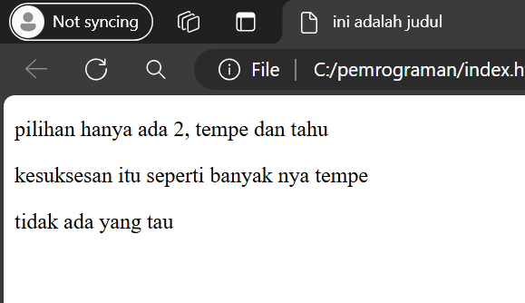
- tag <`doctype html>`memberitahukan web browser bahwa dokumen HTML adalah versi 5
- tag pembuka `<html>` menandai awal sebuah dokumen HTML sampai dengan tag penutup `<html>`
- tag pembuka `<head>` berisi informasi tentang halaman html sampai dengan tag penutup `</head>`, biasanya dalam tag head terdapat tag `<title>` untuk memberikan informasi judul halaman html
- adapun tag yang berada di antara tag pembuka `<body>` Sampai dengan tag penutup `</body>` akan tampil di web browser.


# Tag Dasar
## Heading
## penjelasan
Tag heading dalam HTML digunakan untuk menandai teks sebagai judul atau heading, dan HTML menyediakan beberapa level heading yang dapat digunakan, yaitu `<h1>` hingga `<h6>`. Setiap level heading mewakili tingkat kepentingan yang berkurang seiring peningkatan nomor heading.
## kode program
```html
<!DOCTYPE html>
<html>
<head>
<title>HTML</title>
</head>
<body>
  <h1>senin</h1>
  <h2>selasa</h2>
  <h3>rabu</h3>
  <h4>kamis</h4>
  <h5>jumat</h5>
  <h6>sabtu</h6>
</body>
</html>
```
## hasil


## Paragraf
## penjelasan
`<p></p>`: Tag ini digunakan untuk membuat paragraf pada dokumen HTML. Isi teks di antara tag ini akan ditampilkan sebagai sebuah paragraf, jika ingin buat paragraf terpisah kita harus buat tag `<p></p>` baru lagi.
## kode program
```html
<!DOCTYPE html>
<html>
<head>
  <title>HTML</title>
</head>
<body>
  <p>nama kamu</p>
  <p>tanggal lahir</p>
  <p>tempat tinggal</p>
</body>
</html>
```
## hasil
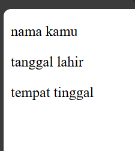

## BR
## penjelasan
Tag ini digunakan untuk membuat jeda baris, sehingga teks akan ditampilkan di baris berikutnya, jika ingin membuat jeda baris lebih jauh kita harus mengulang penggunaan tag `<br>`.
## kode program
```html
<!DOCTYPE html>

<html>

<head>

  <title>HTML</title>

</head>

<body>

  <p>nama kamu</p><br>

  <p>tanggal lahir</p>

  <p>tempat tinggal</p>

</body>

</html>
```
## hasil
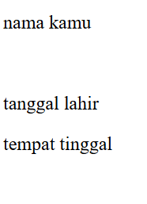

## Align
## penjelasan
digunakan untuk mengatur perataan elemen dalam dokumen web.
## kode program
```html
<!DOCTYPE html>
<html>
<head>

  <title>HTML</title>

</head>

<body>

  <p align="left">

    contoh.</p>

    <p align="right">

    contoh</p>

    <p align="center">

    contoh</p>

    <p align="justify">

    contoh</p>

</body>

</html>
```
## hasil
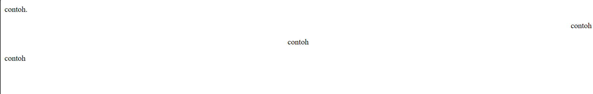
## List
### List tak ber urut
#### penjelasan
- Tag `<ul>` digunakan untuk membuat daftar tak berurutan (unordered list), di mana item-itemnya biasanya ditandai dengan bullet atau simbol lainnya. Ini digunakan ketika urutan item tidak penting, seperti daftar belanjaan.
- Tag `<li>` digunakan untuk mendefinisikan setiap item dalam daftar, baik itu dalam `<ol>` maupun `<ul>`. Setiap item daftar harus ditempatkan di antara tag `<li>`.
#### kode program
```html
<!DOCTYPE html>

<html>

<head>

  <title>HTML</title>

</head>

<body>

  <ul>

    <li>Sapu</Li>

    <li>pel</Li>

    <li>dispenser</Li>

    <li>kipas</Li>

    <li>gelas</Li>

    </ul>

</body>

</html>
```
#### hasil
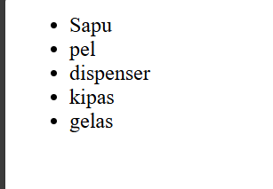
### List ber urut
#### penjelasan
**Tag `<ol>`** digunakan untuk membuat daftar berurutan (ordered list), di mana item-itemnya diberi nomor secara otomatis oleh browser. Ini digunakan ketika urutan item penting, seperti langkah-langkah dalam instruksi.
#### kode program
```html
<!DOCTYPE html>

<html>

<head>

  <title>HTML</title>

</head>

<body>

  <ol>

    <li>Ini kalimat pertama</Li>

    <li>ini kalimat kedua</Li>

    <li>ini kalimat ketiga</Li>

    <li>ini kalimat ke empat</Li>

    <li>ini kalimat ke lima</Li>

    </ol>

</body>

</html>
```
#### hasil
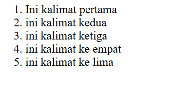

## link
## penjelasan
Link dapat ditemukan di hampir semua halaman web. Link/Tautan memungkinkan sebuah teks yang ketika di-klik akan pindah ke halaman lainnya. HTML Menggunakan tag `<a>` untuk keperluan ini. Link ditulis dengan `<a>` yang merupakan singkatan dari anchor (jangkar).

Setiap tag `<a>` setidaknya memiliki sebuah atribut `href` Dimana `href` berisi alamat yang dituju. `href` adalah singkatan dari hypertext reference.
## kode program
```html
<!DOCTYPE html>

<html>

<head>

  <title>HTML</title>

</head>

<body>

  <a href ="https://www.google.com" target="_blank">klik disini untuk ke google</a>

</body>

</html>
```
## hasil
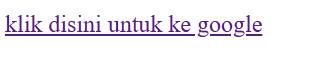

 ---

# Multi Media
## Gambar
### penjelasan
Tag `` dalam HTML digunakan untuk menyisipkan gambar ke dalam halaman web. Atribut `src` (source) menentukan URL atau path dari gambar yang ingin ditampilkan.
### kode program
```html
<!DOCTYPE html>

<html>

<head>

  <title>HTML</title>

</head>

<body>

  

</body>

</html>
```
### hasil
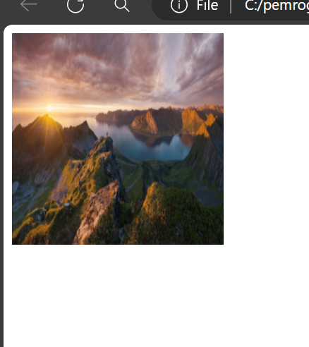


## Video
### penjelasan
Tag `<video>` dalam HTML digunakan untuk menyisipkan video ke dalam halaman web. 
### kode program
```html
<video src="point blank.mp4" controls width="100%" height="500"></video>
```
### hasil
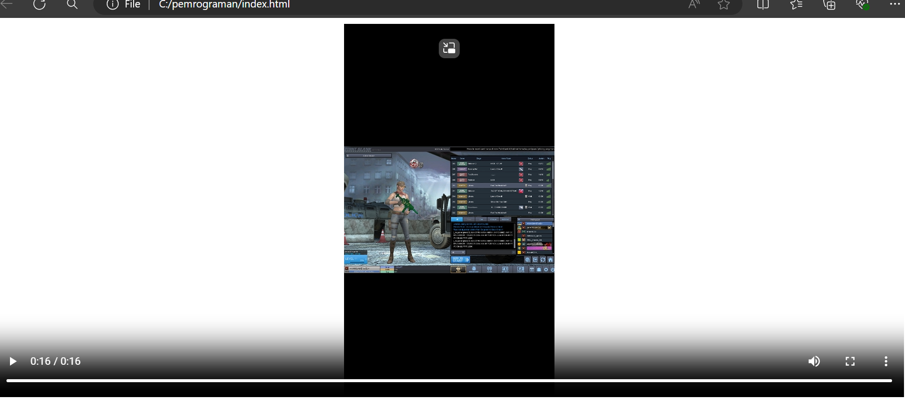

## Table
### penjelasan
Tabel dalam HTML didefinisikan dengan tag `<table>`.

- Setiap baris tabel didefinisikan dengan tag `<tr>`.
- Header/judul tabel didefinisikan dengan tag `<th>`.Secara default, header tabel memiliki teks tebal dan berada di tengah.
- Data tabel/sel didefinisikan dengan tag `<td>`karena sel merupakan bagian terkecil dari tabel maka dari itu tag ini selalu berada di dalam tag `<tr>`.

#### Atribut Table
Selain itu, terdapat pula beberapa atribut tabel yang penting untuk diketahui yaitu:

- rowspan merupakan atribut HTML yang berfungsi untuk menggabungkan beberapa baris (ke bawah).
- colspan atau colomn span merupakan atribut html yang berfungsi untuk menggabungkan beberapa kolom (ke samping).
- width berfungsi untuk mengatur lebar kabel yang nilainya didefinisikan dalam satuan pixel secara default.
- height berfungsi untuk mengatur tinggi tabel yang nilainya didefinisikan dalam satuan pixel secara default.
- Align berfungsi untuk mengatur perataan teks pada tabel.nilai atribut yang dapat diberikan yaitu left untuk perataan teks kekiri,right untuk teks ke kanan dan,center untuk perataan teks ke tengah.
### kode program
```html
  <table Border="1">

    <tr>

    <th>nama</th>

    <th>Asal institusi</th>

    </tr>

    <tr>

    <td>asep</td>

    <td>fajar tv</td>

    </tr>

    <tr>

      <td>Zhafran</td>

      <td>fajar tv</td>

    </tr>
```
### hasil
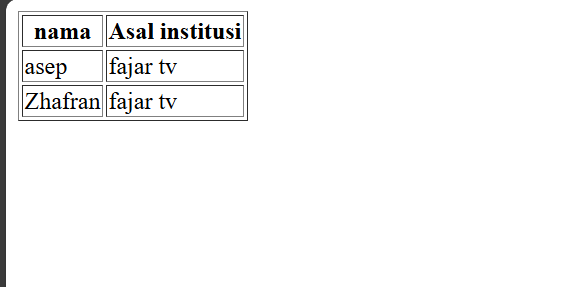

## Form
Elemen `<form>` HTML digunakan untuk mendefinisikan form yang digunakan untuk mengumpulkan inputan dari pengguna website. Tag ini digunakan untuk mengkoleksi inputan dari user, konsep ini sama seperti konsep formulir di dunia nyata.

>[!info]- Dengan kata lain tag `<form>` merepresentasikan sebuah "formulir" di mana formulir bisa memiliki banyak kolom isian.


Form HTML berisikan elemen-elemen `form` lainnya. Elemen `<form>` digunakan untuk menampung macam-macam elemen yang berkaitan dengan sebuah form, seperti `text` `fields`, `checkbox`, `radio button`, tombol `submit`, dan banyak lagi yang dapat diedit kemudian ditulis untuk dikirim pada sebuah server untuk selanjutnya diproses guna mendapatkan informasi tertentu dari atau untuk user.

Umumnya, sebuah website selalu memiliki fitur form, contoh paling umum yang sering kita temui adalah seperti form login, form sign up, form komentar di suatu blog/media.

### input
Elemen `<input>`adalah elemen `form` yang paling penting. Elemen `<input>`dapat ditampilkan dalam beberapa cara, tergantung pada nilai atribut `type` yang digunakan. Request Berikut adalah beberapa contoh nilai dari atribut `type` :

- `text` digunakan untuk mengambil isian berupa teks. Contohnya seperti nama.

- `password` digunakan untuk mengambil isian berupa kata sandi atau sesuatu yang bersifat rahasia. Tipe ini akan mengubah semua karakter yang diketikkan ke dalam karakter bulat.

- `Radio` digunakan sebagai kolom isian bertipe pilihan yang menawarkan beberapa opsi kepada user namun tetapi hanya satu opsi saja yang boleh dipilih. Contohnya seperti jenis kelamin atau agama.


>[!info]- Perlu diperhatikan bahwa untuk penggunaan tipe `radio` yang berkategori set pilihan yang sama mengharuskan nilai `nama`-nya juga sama.


Opsi default dapat dilakukan dengan menambahkan atribut `checked`pada elemen opsi yang dijadikan sebagai opsi default.

- `checkbox` digunakan untuk memberikan **daftar pilihan dalam satu set opsi**. User dapat memilih satu atau bahkan lebih dari satu pilihan pada tipe ini. Hal ini berbeda dengan tipe sebelumnya yaitu `radio` yang hanya memungkinkan user untuk memilih satu pilihan saja. Contoh penggunaan `checkbox` seperti daftar makanan kesukaan, daftar olahraga yang tidak disukai, dan yang semisalnya.


>[!info]- Perlu diperhatikan bahwa untuk penggunaan tipe checkbox yang berkategori set pilihan yang sama mengharuskan nilai name -nya juga sama.


- `Number` digunakan untuk membatasi isian user hanya pada karakter numerik saja. Browser akan menambahkan dua buah tombol atas dan bawah untuk mengubah angka isian.

Beberapa atribut untuk tipe `number`:

- `min` menentukan angka minimal

- `max` menentukan angka maksimal

- `step`-smenentukan kelipatan (nilai yang tidak sesuai kelipatan tidak bisa di-input, dan default dari atribut ini adalah 1)

- `Date` digunakan untuk memberikan isian berupa tanggal. Atribut `min` dan `max` dapat pula difungsikan pada tipe ini untuk mengatur tanggal minimal dan tanggal maksimal yang diinginkan. Nilai `min` dan `max` tersebut ditulis dengan format: `YYYY-em-dd`.

- `File` digunakan untuk memungkinkan pengguna memuat file. Atribut `accept` juga dapat disisipkan pada tipe ini dengan maksud untuk mengatur file apa saja yang boleh di-upload. Beberapa contoh value dari atribut `accept` yaitu:

- `accept-"image/png,inage/jpg.Image/jpeg` - untuk file gambar seperti `png`. `jpg`. atau `jpeg`

- `accept="pdf"` - untuk file pdf

- `accept="pdf"` - untuk file pdf

- `accept-".doc, docx"` - untuk file `doc` atau `docx`

- `accept-".ppt, pptx"` untuk file `ppt` atau `pptx`

- `submit` ditampilkan dalam bentuk tombol untuk mengirim data pada `<form>` yang menjadi pembungkusnya. Atribut `value` digunakan untuk mengisi teks yang ingin ditampilkan pada tombol.

- `reset` berguna untuk **mengembalikan state (keadaan) atau data dari suatu form ke nilai awalnya**. Jika nilai awal sebuah input adalah kosong, maka ketika direset ia akan kembali kosong. Tapi jika nilai awalnya sudah terisi sesuatu, maka ketika direset datanya akan kembali seperti yang sudah diset sebelumnya.

- `button` berguna untuk membuat inputan berupa sebuah tombol. Tombol ini nantinya bisa difungsikan sesuai dengan keinginan dari pengembang web

### Label
Elemen `<label>` memiliki fungsi khusus untuk melabeli sebuah kolom inputan. Ketika screen reader membaca konten halaman HTML, lalu menemukan sebuah inputan, ia akan membaca label yang bersangkutan. 
Fungsi lain dari tag `<label>` adalah ketika kita mengklik label, maka browser akan meletakkan fokus pada kolom isian yang terhubung dengannya. Syarat yang perlu diperhatikan yaitu dengan menghubungkan sebuah `<label>` dan `<input>` dengan atribut for untuk label, dan atribut id pada `<input>` dengan nilai untuk kedua atribut tersebut mesti sama persis.

### Select
Elemen `<select>` berguna dalam mendefinisikan sebuah tombol dropdown yang dimana user dapat memilih salah satu dari banyak pilihan.
>[!note] - Elemen `<select>` nantinya berperan sebagai kontainer atau pembungkus dari elemen `<option>` yang berperan sebagai daftar pilihan atau opsi. 

 Elemen `<select>` hampir mirip fungsinya dengan `<input type ="radio">` akan tetapi baiknya elemen `<select>` digunakan untuk memilih satu pilihan yang terdapat banyak opsi di dalamnya, sedangkan `<input type ="radio">` lebih baiknya untuk digunakan jika user diarahkan memilih hanya satu pilihan yang opsi pilihannya tidak terlalu banyak. Contoh penggunaan elemen ini seperti memasukkan pilihan berupa asal daerah atau yang semisalnya.
Penting untuk diketahui bahwasanya opsi yang aktif secara default adalah adalah opsi yang pertama. Akan tetapi, kita bisa mengatur opsi mana yang aktif secara default dengan menambahkan atribut selected pada suatu `<option>` yang ingin dijadikan sebagai opsi default.

### Text Area
Elemen `<textarea>` berguna untuk mengambil inputan user berupa teks yang dapat memuat lebih dari satu baris. Jika dibandingkan dengan elemen `<input>` teks biasa, elemen `<textarea>` memiliki ukuran tinggi yang lebih besar. Element `<textarea>` bisa diisi lebih dari satu baris dengan menekan enter.
Atribut yang dapat digunakan untuk mengatur kuran dari textarea yaitu rows untuk jumlah baris, sedangkan atribut cols untuk lebarnya.

### Button
Elemen `<button>` yang berada di dalam sebuah `form` akan otomatis dianggap sama fungsinya seperti `<input type="submit">`. Jika ingin membuat tombol biasa yang tidak men-submit `<form>` dapat dilakukan dengan menambahkan atribut `type="button"`.
contoh : 
```html
	<h1>Formulir Pendaftaran</h1>
	<form action="">
	  <div>
	    <label for="nama-lengkap"><b>Nama Lengkap:</b></label
    >	<br />
	    <input
	      type="text"
	      id="nama-lengkap"
	      name="nama_lengkap"
	      placeholder="Masukkan nama lengkap"
	      required
	    />
	  </div>
	  
	  <div>
	    <label for="password"><b>Password:</b></label
    >	<br />
	    <input
	      type="password"
	      id="password"
	      name="password"
	      placeholder="Masukkan password"
	      required
	    />
	  </div>
	  
	  <div>
	    <b>Jenis Kelamin:</b><br />
	    <input id="lk" type="radio" name="jenis_kelamin" checked />
	    <label for="lk">Laki-Laki</label>
	    <input id="pr" type="radio" name="jenis_kelamin" />
	    <label for="pr">Perempuan</label>
	  </div>
	  
	  <div>
	    <label for="isian-usia"><b>Usia:</b></label
    >	<br />
	    <input
	      type="number"
	      id="isian-usia"
	      name="usia"
	      min="17"
	      max="25"
	      value="19"
	      required
	    />
	    Tahun
	  </div>
	  <div>
	    <label for="tgl-ijazah"><b>Tanggal Ijazah:</b></label> <br />
	    <input
	      type="date"
	      id="tgl-ijazah"
	      name="tgl_ijazah"
	      min="2021-01-01"
	      value="2023-06-20"
	      required
	    />
	  </div>
	  <div>
	    <label for="opsi-agama"><b>Agama:</b></label
    >	<br />
	    <select id="opsi-agama" name="agama" required>
	      <option disabled>---Pilih Agama----</option>
	      <option value="islam">Islam</option>
	      <option value="kristen">Kristen</option>
	      <option value="katolik">Katolik</option>
	      <option value="hindu">Hindu</option>
	      <option value="buddha">Buddha</option>
	      <option value="atheis" disabled>Atheis</option>
	    </select>
	  </div>
	  <div>
	    <label for="alamat"><b>Alamat:</b></label> <br />
	    <textarea
	      id="alamat"
	      name="alamat"
	      cols="25"
	      rows="5"
	      placeholder="Harap masukkan alamat secara lengkap"
	      required
    >	</textarea>
	  </div>
	  <div>
	    <b>Kemampuan Berbahasa Asing:*</b><br />
	    <input type="checkbox" id="inggris" name="bahasa_asing" />
	    <label for="inggris">Inggris</label>
	    <input type="checkbox" id="arab" name="bahasa_asing" />
	    <label for="arab">Arab</label>
	    <input type="checkbox" id="jepang" name="bahasa_asing" />
	    <label for="jepang">Jepang</label>
	  </div>
	  <div>
	    <label for="isian-foto"><b>Foto 4x6:*</b></label
    >	<br />
	    <input
	      type="file"
	      id="isian-foto"
	      name="foto"
	      accept="image/png,image/jpg,image/jpeg"
	    />
	  </div>
	  <br />
	  <input type="submit" value="Kirim" />
	  <input type="reset" value="Batal" />
	  <i>*opsional (tidak wajib diisi)</i>
	</form>
```

### Hasil
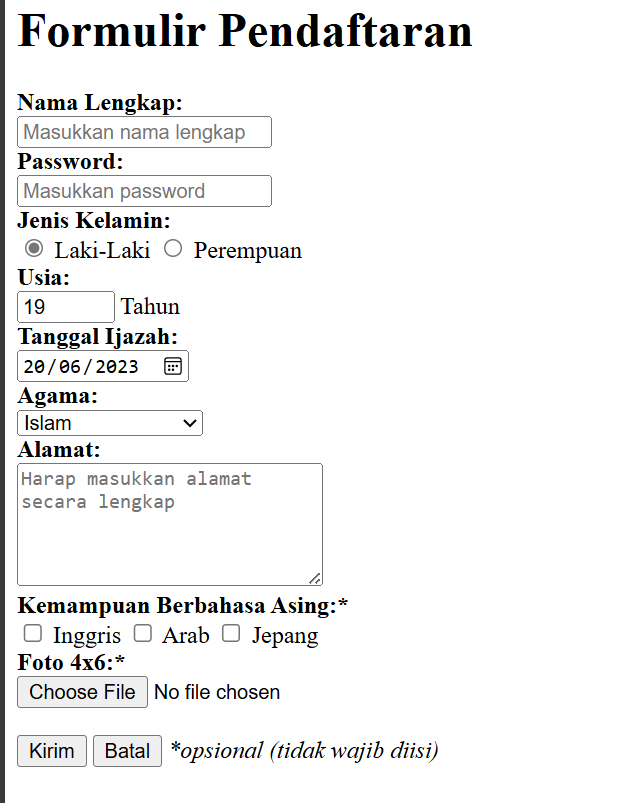

Beberapa atribut yang digunakan pada contoh di atas yang perlu untuk diperjelas yaitu sebagai berikut:
- `name` digunakan sebagai nama variabel yang akan diproses oleh web server (contoh menggunakan PHP).
- `required` digunakan untuk memastikan bahwa pengguna harus memasukkan nilai pada input tersebut sebelum dapat melakukan proses submit formulir.
- `placeholder` menuliskan teks pada elemen input. Placeholder sangat bermanfaat untuk memberikan teks bantuan kepada user untuk inputan form yang kompleks.
- `value` menentukan nilai awal dari sebuah elemen input.
- `disabled` digunakan untuk menonaktifkan inputan pada elemen yang diberi atribut ini.