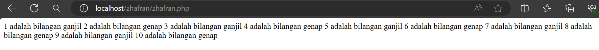

# Echo & Komentar
`echo` adalah perintah yang digunakan untuk menampilkan teks atau nilai dari ekspresi tertentu ke dalam halaman web atau output PHP lainnya. Ini sangat berguna untuk menampilkan pesan, variabel, atau hasil operasi matematika langsung ke pengguna.

```php
$nama = "Zhafran";
  echo "Halo, " . $nama . "!";
```


"komentar' digunakan untuk menambahkan catatan atau penjelasan di dalam kode PHP. Komentar ini tidak akan dieksekusi oleh server web, sehingga mereka tidak mempengaruhi keluaran yang dihasilkan oleh skrip PHP.

```php
 $nama = "Zhafran";
  echo "Halo, " . $nama . "!"; //ini adalah contoh komentar
```

# Variabel & Konstanta
Variabel dalam PHP digunakan untuk menyimpan dan memanipulasi data. Di PHP, variabel dapat dideklarasikan dengan menggunakan tanda dollar ($) diikuti dengan nama variabelnya.

```php
$meja = 30;
$tk_kelas = "XI";
$ketua_kelas = "july";
$wali_kelas = "saleh";
$ketua_gang = "bombom";
```

"konstanta" adalah nilai yang tidak berubah sepanjang waktu eksekusi skrip. Mereka mirip dengan variabel, tetapi nilainya tidak dapat diubah setelah dideklarasikan sekali. Konstanta biasanya digunakan untuk menyimpan nilai-nilai yang tidak boleh berubah, seperti nilai-nilai konfigurasi, konstanta matematis, atau pengaturan aplikasi yang penting.

```php
const KEPSEK = "HERWELISS";
define('kelas', 'RPL 1');
```

# Operator
## Aritmatika

### Penjelasan
- Program ini menggunakan operator aritmatika dasar seperti penjumlahan, pengurangan, perkalian, pembagian, sisa bagi, dan pangkat.
- Nilai $a dan $b diinisialisasi dengan nilai masing-masing.
- Kemudian, operasi aritmatika dilakukan menggunakan operator yang sesuai.
- Hasil dari setiap operasi ditampilkan ke layar.
### Struktur
```php
<?php
// Program Operator Aritmatika dalam PHP
// 1. Inisialisasi Variabel Input
$a = 200;
$b = 25;
// 2. Operasi Aritmatika
$penjumlahan = $a + $b;
$pengurangan = $a - $b;
$perkalian = $a * $b;
$pembagian = $a / $b;
$sisa_bagi = $a % $b;
$pangkat = $a ** $b;
// 3. Output Hasil
echo "Hasil Penjumlahan: " . $penjumlahan . "\n";
echo "Hasil Pengurangan: " . $pengurangan . "\n";
echo "Hasil Perkalian: " . $perkalian . "\n";
echo "Hasil Pembagian: " . $pembagian . "\n";
echo "Sisa Bagi: " . $sisa_bagi . "\n";
echo "Hasil Pangkat: " . $pangkat . "\n";
?>
```
### Program
```php
$a = 200;
$b = 25;
$penjumlahan = $a + $b;
$pengurangan = $a - $b;
$perkalian = $a * $b;
$pembagian = $a / $b;
$sisa_bagi = $a % $b;
$pangkat = $a ** $b;
echo "Hasil Penjumlahan: " . $penjumlahan . "\n";
echo "Hasil Pengurangan: " . $pengurangan . "\n";
echo "Hasil Perkalian: " . $perkalian . "\n";
echo "Hasil Pembagian: " . $pembagian . "\n";
echo "Sisa Bagi: " . $sisa_bagi . "\n";
echo "Hasil Pangkat: " . $pangkat . "\n";
?>

```
### Hasil

### Analisis
- Program ini sangat sederhana dan hanya menggunakan operator aritmatika dasar.
- Input nilai $a dan $b dapat diubah sesuai kebutuhan.
- Operasi aritmatika dilakukan secara berurutan dengan operator yang sesuai.
- Tidak ada penanganan kesalahan (error handling) atau validasi input dalam program ini.
- Output ditampilkan langsung ke layar tanpa penyisipan pesan atau format tambahan.
### Kesimpulan Program
- Program ini merupakan contoh sederhana dari penggunaan operator aritmatika dalam PHP.
- Meskipun sederhana, program ini mencakup operasi dasar seperti penjumlahan, pengurangan, perkalian, dan lain-lain, yang merupakan fondasi bagi pemrograman komputer.
- Kekurangan dari program ini adalah kurangnya penanganan kesalahan dan validasi input, yang dapat menyebabkan program gagal jika input tidak sesuai.
- Program ini dapat dijadikan sebagai dasar untuk memahami cara menggunakan operator aritmatika dalam PHP dan dapat diperluas dengan penanganan kesalahan atau validasi input sesuai kebutuhan.

# Array
## Array 1 dimensi
### Penjelasan
array satu dimensi adalah kumpulan nilai yang disusun dalam satu baris. Setiap nilai dalam array memiliki indeks numerik yang dimulai dari nol. Ini memungkinkan Anda untuk menyimpan beberapa nilai dalam satu variabel dan mengaksesnya dengan mudah menggunakan indeksnya.
### Struktur
```php
$namaArray = array(nilai1, nilai2, nilai3, ...)
```
### Program
```php
$a = ['honda','yamaha','suzuki'] ;
 echo $a [0]
```
### Hasil

### Analisis
- `$a = ['honda','yamaha','suzuki'];`: Baris ini mendeklarasikan sebuah array dengan nama `$a` yang memiliki tiga elemen string: 'honda', 'yamaha', dan 'suzuki'. Ini adalah sintaks untuk mendeklarasikan dan menginisialisasi sebuah array di PHP.
- Ketika kode dieksekusi, PHP akan mencari elemen dengan indeks `0` dalam array `$a`.
- Elemen dengan indeks `0` adalah `'honda'`.
- `echo` akan mencetak `'honda'` ke layar/output.
### Kesimpulan Program
- Kode tersebut dengan benar mendeklarasikan sebuah array dan mengakses elemen pertama dari array tersebut. Saat kode dieksekusi, output yang dihasilkan adalah `honda`.

# Var_dump
## penjelasan
- Fungsi var_dump mengambil satu atau lebih variabel sebagai argumen dan mencetak informasi tentang tipe dan nilai dari setiap variabel tersebut.
- Informasi yang dicetak mencakup tipe data (misalnya, integer, string, array), panjang (jika berlaku), dan nilai variabel.
## struktur
```php
// 1. Inisialisasi Variabel
$angka = ;
$kata = " ";
$array = array(1, 2, 3);

// 2. Pemanggilan var_dump
var_dump($angka);
var_dump($kata);
var_dump($array);

// 3. Pesan Output (Opsional)
echo "Ini adalah contoh penggunaan var_dump";

```
## program
```php
<?php
$angka = 10;
$kata = "Hello";
$array = array(1, 2, 3);

var_dump($angka);
var_dump($kata);
var_dump($array);
echo "Ini adalah contoh penggunaan var_dump";
?>

```
## hasil

## analisis
- Program ini menginisialisasi beberapa variabel, yaitu $angka, $kata, dan $array.
- Fungsi var_dump dipanggil untuk masing-masing variabel, yang akan mencetak informasi rinci tentang tipe dan nilai dari setiap variabel tersebut.
- Setelah itu, pesan "Ini adalah contoh penggunaan var_dump" ditampilkan.
## kesimpulan
Program ini menggunakan fungsi var_dump untuk mencetak informasi detail tentang variabel-variabel yang diberikan. Hal ini berguna untuk debug dan analisis kode, karena memberikan informasi yang lebih lengkap tentang variabel-variabel tersebut.

## For
### Penjelasan
"for" digunakan untuk membuat sebuah perulangan (loop). Ini memungkinkan Anda untuk menjalankan serangkaian pernyataan secara berulang berdasarkan kondisi tertentu.
### Struktur
```php
for (inisialisasi; kondisi; perubahan) {
  // kode yang akan diulang
}

```
### Program
```php
for ($i = 1; $i <= 8; $i++) {
  echo $i . " ";
}
```
### Hasil

### Analisis
- Inisialisasi: Variabel `$i` diinisialisasi dengan nilai 1.
- Kondisi: Loop akan terus berjalan selama nilai `$i` kurang dari atau sama dengan 8.
- Perubahan: Setiap kali loop selesai dieksekusi, nilai `$i` akan ditambah satu.
- Hasilnya akan mencetak angka 1 sampai 8, dipisahkan oleh spasi.
### Kesimpulan Program
Program menggunakan perulangan "for" dalam PHP untuk mencetak angka dari 1 hingga 8 ke layar. Variabel `$i` diinisialisasi dengan nilai 1, dan loop akan terus berjalan selama nilai `$i` kurang dari atau sama dengan 8. Setiap iterasi loop, nilai `$i` akan ditambah satu. Hasilnya adalah pencetakan angka 1 sampai 5 ke layar, dipisahkan oleh spasi.

# Function
## penjelasan
Fungsi dalam PHP adalah blok kode yang dapat dipanggil berulang kali di dalam program untuk melakukan tugas tertentu. Fungsi memungkinkan untuk mengorganisir kode secara lebih baik, mengurangi duplikasi kode, dan membuat kode lebih mudah dipahami.

## struktur
```php
// Fungsi untuk mengecek apakah sebuah bilangan adalah genap
function isEven($number) {
    return $number % 2 == 0;
}
// Menggunakan fungsi untuk mengecek beberapa bilangan
$numbers = [1, 2, 3, 4, 5, 6, 7, 8, 9, 10];
foreach ($numbers as $num) {
    if (isEven($num)) {
        echo "$num adalah bilangan genap\n";
    } else {
        echo "$num adalah bilangan ganjil\n";
    }
}

```
## program
```php
function isEven($number) {
    return $number % 2 == 0;
}
$numbers = [1, 2, 3, 4, 5, 6, 7, 8, 9, 10];
foreach ($numbers as $num) {
    if (isEven($num)) {
        echo "$num adalah bilangan genap\n";
    } else {
        echo "$num adalah bilangan ganjil\n";
    }
}

```
## hasil

## anlisis
1. **Fungsi isEven**:
- Fungsi ini mengecek apakah sebuah bilangan adalah genap dengan memeriksa apakah sisa hasil bagi bilangan tersebut dengan 2 adalah 0. Jika iya, fungsi mengembalikan true, menandakan bilangan tersebut adalah genap.
2. *Array Bilangan*:
- Array $numbers berisi daftar bilangan yang akan dicek apakah masing-masing bilangan adalah genap atau ganjil.
3. **Perulangan foreach**:
- Perulangan ini mengiterasi setiap elemen dalam array $numbers. Pada setiap iterasi, fungsi isEven digunakan untuk mengecek apakah bilangan saat ini adalah genap.
- Jika bilangan tersebut genap, pesan bilangan adalah bilangan genap" dicetak. Jika tidak, pesan bilangan adalah bilangan ganjil" dicetak.
4. Output:
- Program ini akan mencetak hasil pengecekan genap atau ganjil untuk setiap bilangan dalam array, dengan format yang mudah dibaca.

## kesimpulan
1. *Pemisahan Logika ke dalam Fungsi*:
- Fungsi isEven secara efektif memisahkan logika pengecekan bilangan genap dari logika utama program. Ini membuat kode lebih modular, terorganisir, dan mudah untuk digunakan kembali.
2. *Efisiensi Pengecekan*:
- Fungsi isEven menggunakan operator modulus (%) untuk menentukan apakah sebuah bilangan adalah genap. Ini adalah metode yang sederhana dan efisien untuk melakukan pengecekan ini.
3. **Penggunaan Perulangan foreach**:
- Perulangan foreach digunakan untuk mengiterasi array $numbers. Ini membuat kode lebih bersih dan lebih mudah dibaca dibandingkan dengan menggunakan perulangan for tradisional, terutama ketika bekerja dengan array.
4. *Output yang Jelas dan Terstruktur*:
- Program ini mencetak hasil pengecekan dalam format yang jelas dan mudah dibaca, menunjukkan apakah masing-masing bilangan adalah genap atau ganjil.
5. *Kemudahan Pengembangan dan Pemeliharaan*:
- Struktur program yang modular dan terorganisir mempermudah pengembangan lebih lanjut dan pemeliharaan kode. Misalnya, fungsi isEven dapat dengan mudah diperluas atau dimodifikasi tanpa mengubah logika utama program.
6. *Contoh Praktis Penggunaan Fungsi*:
- Program ini adalah contoh praktis bagaimana fungsi dapat digunakan untuk tugas-tugas spesifik dalam pemrograman PHP, memberikan gambaran yang baik tentang bagaimana memanfaatkan fungsi untuk membuat kode lebih terstruktur dan modular.

# PHPForm
## GET Method
### Penjelasan
Metode GET adalah salah satu dari dua metode HTTP yang umum digunakan untuk mengirimkan data dari klien ke server. Ketika metode GET digunakan, data dikirim sebagai bagian dari URL. Ini adalah metode yang sering digunakan untuk mengambil data dari server, misalnya, ketika mengirimkan data formulir seperti dalam contoh program di atas.
### Struktur
```php
<!DOCTYPE html>
<html lang="en">
<head>
    <meta charset="UTF-8">
    <meta name="viewport" content="width=device-width, initial-scale=1.0">
    <title>GET Method</title>
</head>
<body>
    <h2>GetMethod</h2>
    <form action="php.php" method="get">
        <label for="name">Name:</label><br>
        <input type="text" id="name" name="name"><br>
        <label for="email">Email:</label><br>
        <input type="text" id="email" name="email"><br><br>
        <input type="submit" value="Submit">
    </form>
    <?php
    // Mengecek apakah ada data yang dikirim melalui metode GET
    if (isset($_GET['name']) && isset($_GET['email'])) {
        $name = $_GET['name'];
        $email = $_GET['email'];
        echo "<h2>Proses Data</h2>";
        echo "Name: $name <br>";
        echo "Email: $email";
    } else {
        echo "<p>Tidak ada data</p>";
    }
    ?>
</body>
</html>

```
### Program
```php
<!DOCTYPE html>
<html lang="en">
<head>
    <meta charset="UTF-8">
    <meta name="viewport" content="width=device-width, initial-scale=1.0">
    <title>GET Method</title>
</head>
<body>
    <h2>GetMethod</h2>
    <form action="php.php" method="get">
        <label for="name">Name:</label><br>
        <input type="text" id="name" name="name"><br>
        <label for="email">Email:</label><br>
        <input type="text" id="email" name="email"><br><br>
        <input type="submit" value="Submit">
    </form>
    <?php
    // Mengecek apakah ada data yang dikirim melalui metode GET
    if (isset($_GET['name']) && isset($_GET['email'])) {
        $name = $_GET['name'];
        $email = $_GET['email'];
        echo "<h2>Proses Data</h2>";
        echo "Name: $name <br>";
        echo "Email: $email";
    } else {
        echo "<p>Tidak ada data</p>";
    }
    ?>
</body>
</html>

```
### Hasil

### Analisis
1. Program di atas adalah halaman web sederhana yang memiliki formulir HTML dengan dua input: "Name" dan "Email".
2. Form tersebut memiliki atribut method="get", yang berarti data formulir akan dikirimkan melalui metode GET.
3. Ketika pengguna mengisi formulir dan menekan tombol "Submit", data yang dimasukkan akan dikirimkan sebagai bagian dari URL ke halaman "Php.php".
4. Di dalam kode PHP di halaman "Php.php", program memeriksa apakah ada data yang diterima melalui metode GET.
5. Jika ada data yang diterima, program akan mengambil nilai "Name" dan "Email" dari URL dan menampilkannya sebagai "Processed Data".
6. Jika tidak ada data yang diterima, program akan menampilkan pesan "No data received".

### Kesimpulan Program
Program ini adalah contoh sederhana penggunaan metode GET dalam pemrosesan formulir web. Pengguna dapat mengisi formulir dengan nama dan email, kemudian data tersebut dikirimkan melalui URL ke halaman PHP untuk diproses. Setelah itu, halaman PHP menampilkan kembali data yang telah diproses. Dengan demikian, pengguna dapat melihat kembali data yang telah mereka masukkan ke dalam formulir.


---
## POST Method
### Penjelasan
Metode POST adalah salah satu dari dua metode HTTP yang umum digunakan untuk mengirimkan data dari klien (biasanya browser web) ke server web. Ketika metode POST digunakan, data dikirimkan dalam badan permintaan HTTP, bukan sebagai bagian dari URL seperti pada metode GET. Ini membuat metode POST lebih cocok untuk mengirim data yang lebih sensitif atau data yang memiliki ukuran yang besar.
### Struktur
```php
<!DOCTYPE html>
<html lang="en">
<head>
    <meta charset="UTF-8">
    <meta name="viewport" content="width=device-width, initial-scale=1.0">
    <title>POST Method</title>
</head>
<body>
    <h2>PHP Form POST</h2>
    <form action="Php.php" method="post">
        <label for="name">Name:</label><br>
        <input type="text" id="name" name="name"><br>
        <label for="email">Email:</label><br>
        <input type="text" id="email" name="email"><br><br>
        <input type="submit" value="Submit">
    </form>
    <?php
    // Mengecek apakah ada data yang dikirim melalui metode POST
    if ($_SERVER["REQUEST_METHOD"] == "POST") {
        if (!empty($_POST['name']) && !empty($_POST['email'])) {
            $name = $_POST['name'];
            $email = $_POST['email'];
            echo "<h2>Processed Data</h2>";
            echo "Name: $name <br>";
            echo "Email: $email";
        } else {
            echo "<p>Please fill in all fields</p>";
        }
    }
    ?>
</body>
</html>

```
### Program
```php
<!DOCTYPE html>
<html lang="en">
<head>
    <meta charset="UTF-8">
    <meta name="viewport" content="width=device-width, initial-scale=1.0">
    <title>POST Method</title>
</head>
<body>
    <h2>PHP Form POST</h2>
    <form action="Php.php" method="post">
        <label for="name">Name:</label><br>
        <input type="text" id="name" name="name"><br>
        <label for="email">Email:</label><br>
        <input type="text" id="email" name="email"><br><br>
        <input type="submit" value="Submit">
    </form>
    <?php
    // Mengecek apakah ada data yang dikirim melalui metode POST
    if ($_SERVER["REQUEST_METHOD"] == "POST") {
        if (!empty($_POST['name']) && !empty($_POST['email'])) {
            $name = $_POST['name'];
            $email = $_POST['email'];
            echo "<h2>Processed Data</h2>";
            echo "Name: $name <br>";
            echo "Email: $email";
        } else {
            echo "<p>Please fill in all fields</p>";
        }
    }
    ?>
</body>
</html>

```
### Hasil

### Analisis
1. Fungsionalitas: Program ini berfungsi sebagai halaman web yang memungkinkan pengguna untuk mengisi formulir dengan nama dan email. Setelah pengguna mengisi formulir dan mengirimkannya, program akan memproses data yang dikirimkan dan menampilkannya kembali sebagai "Processed Data" jika formulir diisi dengan benar.
    
2. Kode HTML: Program menggunakan HTML untuk membangun struktur halaman web dan formulir. Formulir tersebut memiliki atribut action yang menunjuk ke halaman Php.php, yang artinya data akan dikirimkan ke halaman tersebut untuk diproses. Penggunaan tag <`label`> dan `<input>` membuat formulir lebih mudah dipahami oleh pengguna.
    
3. Metode Pengiriman Data: Program menyediakan dua versi: satu dengan metode GET dan satu dengan metode POST. Metode GET mengirimkan data sebagai bagian dari URL, sementara metode POST mengirimkan data dalam badan permintaan HTTP. Penggunaan metode POST lebih disukai untuk mengirim data sensitif seperti kata sandi karena data tidak terlihat di URL.
    
4. Kode PHP: Di dalam kode PHP, program melakukan pemeriksaan terhadap data yang diterima. Jika data yang diterima valid, program akan menampilkan kembali data tersebut sebagai "Processed Data". Namun, jika ada input yang kosong, program akan menampilkan pesan kesalahan yang sesuai.
    
5. Validasi Data: Program melakukan validasi sederhana untuk memastikan bahwa kedua input, yaitu nama dan email, tidak kosong sebelum memprosesnya. Ini membantu memastikan bahwa data yang dikirimkan ke server valid sebelum diproses lebih lanjut.
    
6. Tampilan Responsif: Program juga memiliki tampilan yang responsif dengan menggunakan tag `<meta name="viewport" content="width=device-width, initial-scale=1.0">`. Ini membantu agar halaman web dapat ditampilkan dengan baik di berbagai perangkat.
    
7. Keamanan: Penggunaan metode POST untuk mengirim data membantu meningkatkan keamanan formulir karena data tidak terlihat langsung di URL. Namun, program ini tidak memberikan perlindungan penuh terhadap serangan seperti SQL injection atau cross-site scripting (XSS), sehingga diperlukan tindakan tambahan untuk melindungi formulir dari serangan tersebut.
### Kesimpulan Program
Program ini adalah contoh penggunaan metode POST dalam formulir web untuk mengumpulkan dan memproses data dari pengguna. Dengan menggunakan metode POST, data formulir dikirimkan secara aman dan tidak terlihat langsung di URL. Ini meningkatkan keamanan formulir, terutama jika data yang dikirimkan sensitif seperti kata sandi.

# PHP MYSQL
# KONEKSI DATABASE
## kode program

```php
<?php
//koneksi ke database
$koneksi = mysqli_connect('localhost', 'root', '', 'khusus');
if ($koneksi) {
 echo "<br> koneksi aman <br>";
} else {
 echo "error, tidak bisa koneksi ke database";
}
```
## hasil

## analisis

- Menggunakan fungsi `mysqli_connect()` untuk membuat koneksi ke database MySQL dengan parameter host ('localhost'), username ('root'), password (''), dan nama database ('siswa').
- Jika koneksi berhasil, maka pesan "koneksi aman" akan ditampilkan. Jika tidak, pesan "error, tidak bisa koneksi ke database" akan ditampilkan.
## kesimpulan
Program PHP dan SQL di atas bertujuan untuk melakukan koneksi ke database MySQL menggunakan fungsi `mysqli_connect()`. Setelah koneksi berhasil, pesan "koneksi aman" akan ditampilkan. Jika terdapat masalah dalam koneksi, maka pesan "error, tidak bisa koneksi ke database" akan ditampilkan. Namun, pada kode yang diberikan, tag pembuka PHP ditulis sebagai "<php" yang seharusnya "<php" (dengan tanda "?"). Pastikan untuk mengubahnya menjadi "<php" agar kode PHP dapat dieksekusi dengan benar.

# TAMPILKAN DATA
```php
//jalankan query seleksi

$select = mysqli_query($koneksi, "SELECT * FROM siswa");

//membuat array asosiatif dan memecah data berdasarkan kolomnya
$result = mysqli_fetch_assoc($select);

  

//menampilkan struktur array dari data tabel yang dijalankan di atas

//var_dump($result);

  

echo 'Berikut mobil-mobil beserta pemiliknya<br>';

  

$a = 1;

foreach ($select as $key => $data) {

    echo $a++ . ". " . $data['no_plat'] . " : " . $data['pemilik'] . '<br>';

}
```
# TAMBAHKAN DATA
## kode program
```php
<!DOCTYPE html>

<html lang="en">
<head>
    <title>Document</title>
</head>
<body>
    <h2>Tambah Data</h2>
    <?php
    include "koneksi.php";
    if (isset($_POST['simpan'])) {

        $nama = $_POST['nama'];

        $email = $_POST['email'];

        $jenis_kelamin = $_POST['jenis_kelamin'];

        $alamat = $_POST['alamat'];


        // * true / false

        $query = mysqli_query($koneksi, "INSERT into siswa(nama,email,jenis_kelamin,alamat)

        values ('$nama','$email','$jenis_kelamin','$alamat')");

        if ($query == true) {

            echo "<script>

            alert('Tambah data Berhasil')

            window.location.href='table.php'

            </script>";

        } else {

            echo '<script>alert("Tambah data gagal")</script>';

        }

    }


    ?>

    <form method="post" enctype="multipart/form-data">

        <table>

            <tr>

                <td>Nama</td>

                <td><input type="text" name="nama"></td>

            </tr>

            <tr>

                <td>Email</td>

                <td><input type="text" name="email"></td>

            </tr>

            <tr>

                <td>Jenis Kelamin</td>

                <td>>

                    <select name="jenis_kelamin">

                        <option>Laki-laki</option>

                        <option>Perempuan</option>

                    </select>

                </td>

            </tr>


            <tr>

                <td>Alamat</td>

                <td><input type="text" name="alamat"></td>

            </tr>


            <tr>

                <td></td>

                <td>

                    <button name="simpan" type="submit">Simpan</button>

                    <button type="reset">Reset</button>

                    <a href="table.php">Kembali</a>

                </td>

            </tr>

        </table>

    </form>

  

</body>

  

</html>
```
## hasil


### sesudah menambah data

## analisis
- **Include "koneksi.php"**: Memasukkan file eksternal untuk koneksi database.
- **Cek Form Submission**: Mengecek apakah form telah disubmit dengan mengecek `isset($_POST['nama'])`.
- **Mengambil Data dari Form**: Mengambil data dari input form dan menyimpannya dalam variabel.
- **Query Insert**: Menjalankan query `INSERT` untuk menambahkan data ke tabel `siswa`.
- **Error Handling**:
    - Jika query berhasil (`$query`), tampilkan pesan sukses dan arahkan pengguna ke halaman `table.php`.
    - Jika query gagal, tampilkan pesan gagal.
- **Form Tag**: Formulir menggunakan metode POST untuk mengirim data.
- **Input Fields**:
    - `Nama`: Input teks untuk nama.
    - `Email`: Input teks untuk email.
    - `Jenis Kelamin`: Dropdown untuk memilih jenis kelamin.
    - `Alamat`: Input teks untuk alamat.
- **Buttons**
    - `Simpan`: Tombol submit untuk menyimpan data.
    - `Reset`: Tombol reset untuk mengosongkan form.
    - `Kembali`: Link untuk kembali ke halaman `table.php`.
## kesimpulan
1. **Struktur HTML**: Kode HTML tersusun dengan baik, berisi form untuk memasukkan data.
2. **Koneksi Database**: File `koneksi.php` digunakan untuk menghubungkan ke database, namun perlu dipastikan file tersebut tersedia dan berfungsi.
3. **Form Handling**: Data form ditangani dengan mengecek apakah form telah disubmit, kemudian mengambil data dan menjalankan query `INSERT` untuk menambah data ke tabel `siswa`.
4. **Error Handling**: Pesan error ditampilkan jika query gagal, dan pesan sukses ditampilkan jika query berhasil.
5. **Keamanan**: Kode ini rentan terhadap SQL Injection karena data dari form langsung dimasukkan ke query SQL. Disarankan untuk menggunakan prepared statements atau fungsi `mysqli_real_escape_string` untuk mengamankan data.

# UBAH DATA
## kode program
```php
<!DOCTYPE html>

<html lang="en">

<head>

    <title>Document</title>

</head>

<body>

    <h2>Ubah Data</h2>

    <?php

    include "koneksi.php";

  

    $id = $_GET['id'];

  

    if(isset($_POST['nama'])) {

        $nama           = $_POST['nama'];

        $email          = $_POST['email'];

        $jenis_kelamin  = $_POST['jenis_kelamin'];

        $alamat         = $_POST['alamat'];

  

        $query = mysqli_query($koneksi, "UPDATE siswa SET nama='$nama', email='$email', jenis_kelamin='$jenis_kelamin', alamat='$alamat' WHERE id_siswa=$id");

        if($query) {

            echo "<script>

            alert('ubah data Berhasil')

            window.location.href='table.php'

            </script>";

        }else {

            echo '<script>alert("ubah data gagal")</script>';

        }

    }

  

    $query = mysqli_query($koneksi, "SELECT*FROM siswa where id_siswa=$id");

    $data = mysqli_fetch_array($query);

    ?>

    <form method="post" >

        <table>

            <tr>

                <td>Nama</td>

                <td><input type="text" value="<?= $data['nama'] ?>" name="nama"></td>

            </tr>

            <tr>

                <td>Email</td>

                <td><input type="text" value="<?= $data['email'] ?>" name="email"></td>

            </tr>

            <tr>

                <td>Jenis Kelamin</td>

                <td>>

                    <select name="jenis_kelamin">

                        <option <?php if($data['jenis_kelamin'] == "laki-laki") echo 'selected'; ?>>Laki-laki</option>

                        <option <?php if($data['jenis_kelamin'] == "perempuan") echo 'selected'; ?>>Perempuan</option>

                    </select>  

                </td>

            </tr>

  

            <tr>

                <td>Alamat</td>

                <td><input type="text" value="<?= $data['alamat'] ?>" name="alamat"></td>

            </tr>

  

            <tr>

                <td></td>

                <td>

                    <button type="submit">Ubah</button>

                    <button type="reset">Reset</button>

                    <a href="table.php">Kembali</a>

                </td>

            </tr>

        </table>

    </form>

</body>

</html>
```
## hasil

### sesudah mengubah data

## analisis
- **Form Tag**: Formulir menggunakan metode POST untuk mengirim data.
- **Input Fields**:
    - `Nama`: Input teks untuk nama yang diisi dengan nilai yang diambil dari database.
    - `Email`: Input email untuk email yang diisi dengan nilai yang diambil dari database.
    - `Jenis Kelamin`: Dropdown untuk memilih jenis kelamin, dengan nilai yang sesuai dari database yang ditandai sebagai `selected`.
    - `Alamat`: Input teks untuk alamat yang diisi dengan nilai yang diambil dari database.
- **Buttons**:
    - `Simpan`: Tombol submit untuk menyimpan data.
    - `Reset`: Tombol reset untuk mengosongkan form.
    - `Kembali`: Link untuk kembali ke halaman `table.php`.
## kesimpulan
1. **Struktur HTML**: Kode HTML tersusun dengan baik, berisi form untuk mengubah data siswa.
2. **Koneksi Database**: File `koneksi.php` digunakan untuk menghubungkan ke database, namun perlu dipastikan file tersebut tersedia dan berfungsi.
3. **Mengambil Data Siswa**: Data siswa diambil berdasarkan `id_siswa` yang diterima dari URL dan ditampilkan di form.
4. **Form Handling**: Data form ditangani dengan mengecek apakah form telah disubmit, kemudian mengambil data dan menjalankan query `UPDATE` untuk memperbarui data siswa.
5. **Error Handling**: Pesan error ditampilkan jika query gagal, dan pesan sukses ditampilkan jika query berhasil.
6. **Keamanan**: Kode ini rentan terhadap SQL Injection karena data dari form langsung dimasukkan ke query SQL. Disarankan untuk menggunakan prepared statements atau fungsi `mysqli_real_escape_string` untuk mengamankan data.

# HAPUS DATA
## kode program
```php
<?php
include('koneksi.php');
if(isset($_GET['id'])){
    $id = $_GET['id'];
    $query = mysqli_query($koneksi, "DELETE FROM siswa WHERE id_siswa = $id");
   if($query) {
            echo "<script>
            alert('Hapus data Berhasil')
            window.location.href='table.php'
            </script>";
        }else {
            echo '<script>alert("Hapus data gagal")</script>';
        }
}
?>
```
## hasil

### sesudah hapus data

## analisis
- Menggunakan fungsi `mysqli_connect()` untuk membuat koneksi ke database MySQL dengan parameter host ('localhost'), username ('root'), password (''), dan nama database ('siswa').
    - Jika koneksi berhasil, maka pesan "koneksi aman" akan ditampilkan. Jika tidak, pesan "Error, tidak bisa koneksi ke database" akan ditampilkan.
    - Menggunakan fungsi `mysqli_query()` untuk menjalankan query SQL yang melakukan seleksi data dari tabel "siswa" dalam database.
    - Hasil query disimpan dalam variabel `$select`
    - Menggunakan perulangan `foreach` untuk mengiterasi setiap baris data yang ditemukan dalam `$select`.
    - Menggunakan query SQL DELETE untuk menghapus data dari tabel daftar_mobil.
    - Data yang akan dihapus adalah baris dengan nomor plat yang sesuai dengan nilai variabel `$id`.
## kesimpulan
Program PHP dan SQL di atas berfungsi untuk melakukan koneksi ke database, menjalankan query seleksi, menampilkan data sebelum penghapusan, menghapus data dalam tabel "daftar_mobil", dan menampilkan data setelah penghapusan. Program ini akan menampilkan nama-nama pemilik mobil sebelum dan setelah penghapusan yang dilakukan.

# SESSION/LOGIN
## kode program
### session
```php
<?php

session_start();

if (isset ($_POST ['submit'])) {

  

   $username = $_POST['username'];

   $password = $_POST['password'];

   $koneksi = mysqli_connect('localhost', 'root', '', 'tugas') or die('error koneksi');

   $result = mysqli_query($koneksi, "SELECT * FROM user WHERE username = '$username' AND password = '$password'");

   $data = mysqli_fetch_assoc($result);

  

   if (isset ($data)) {

        $_SESSION['username'] = $data['username'];

        $_SESSION['nama'] = $data['nama'];

        $_SESSION['status'] = 'login';

        header('location:user.php');

     } else {

      echo "Username dan Password Salah";

   }

}

?>

<!DOCTYPE html>

<html>

<head>

<title>Login session</title>

</head>

<body>

 <form method="post">

 <label>username</label>

 <input type="text" name="username">

 <br><br>

 <label for="">password</label>

 <input type="password" name="password">

 <br>

 <button type="submit" name="submit">login</button>

 </form>

</body>

</html>
```
### user
```php
<?php

  

session_start();

if ($_SESSION['status'] == 'login' && $_SESSION['username'] == 'admin') {

 header("Location: admin.php");

}

if ($_SESSION['status'] != 'login') {

header('Location: session.php');

}

?>

<!DOCTYPE html>

<html lang="en">

<head>

     <title>Document</title>

  

</head>

<body>

  <h1>Halaman User</h1>

<h1>Halo, <?= $_SESSION['nama'] ?></h1>

<a href="logout.php">Logout</a>

</body>

</html>
```
### cek_user
```php
<?php

  

if ($_SESSION['status'] == 'login' && $_SESSION['username'] != 'admin') {

    header("Location: user.php");

} else if ($_SESSION['status'] == 'login' && $_SESSION['username'] == 'admin') {

    header("Location: admin.php");

}else{

    header("Location: session.php");

}

  

?>
```
### admin
```php
<?php

session_start();

  
  

if ($_SESSION['status'] == 'login' && $_SESSION['username'] != 'admin') {

    header("Location: user.php");

}

  

if ($_SESSION['status'] != 'login') {

    header('Location: session.php');

}

  

?>

<!DOCTYPE html>

<html lang="en">

  

<head>

    <title>Document</title>

</head>

  

<body>

    <h1>Halaman Admin</h1>

  

    <h1>Halo, <?= $_SESSION['nama'] ?></h1>

    <a href="logout.php">Logout</a>

  

</body>

  

</html>
```
## hasil


## analisis
- Terdapat sebuah form dengan metode POST.
- Form tersebut memiliki input field untuk username dan password.
- Terdapat tombol "Login" yang akan mengirimkan data form saat ditekan. Pada bagian Halaman PHP:
    - Program memulai session dengan menggunakan fungsi `session_start()`. Hal ini penting untuk memulai dan mengelola session di PHP.
    - Jika terdapat data yang dikirimkan melalui metode POST dengan nama "submit" (diperiksa menggunakan `isset($_POST['submit'])`), maka program akan melakukan proses login.
    - Data username dan password yang dikirimkan melalui form diambil menggunakan `$_POST['username']` dan `$_POST['password']`.
    - Dilakukan koneksi ke database MySQL menggunakan `mysqli_connect()` dengan parameter host, username, password, dan nama database.
    - Dilakukan query SQL untuk mencocokkan data username dan password yang diberikan dengan data di tabel "user" menggunakan perintah `mysqli_query()`.
    - Hasil query diambil menggunakan `mysqli_fetch_assoc()` dan disimpan dalam variabel `$data`.
    - Hasil dari `$data` ditampilkan menggunakan `var_dump()` untuk tujuan debugging.
    - Jika `$data` memiliki nilai (artinya username dan password cocok), maka session akan diset dengan variabel-variabel dari data tersebut, dan pengguna akan diarahkan ke halaman "user.php" menggunakan `header('Location: user.php')`.
    - Jika tidak ada data yang cocok, maka akan ditampilkan pesan "Username dan Password Salah".
## kesimpulan
File `session.php` adalah program PHP yang melakukan proses login menggunakan session. Program ini memeriksa apakah data username dan password yang diberikan cocok dengan data yang ada di database. Jika cocok, session akan diset dengan variabel-variabel dari data tersebut dan pengguna akan diarahkan ke halaman "user.php". Jika tidak cocok, pesan kesalahan akan ditampilkan. Namun, perlu diperhatikan bahwa file ini belum mengimplementasikan fitur keamanan seperti sanitasi input dan penggunaan prepared statement untuk mencegah serangan SQL Injection.
